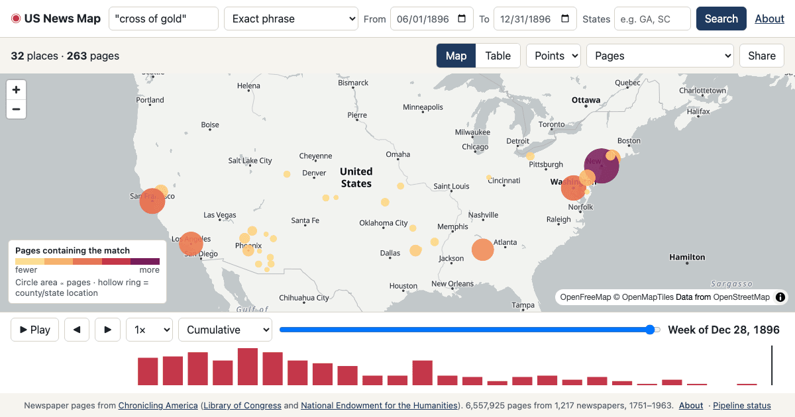

# US News Map

[](https://github.com/tgoodyear/usnewsmap.com/actions/workflows/ci.yml)
[](LICENSE)

**[usnewsmap.com](https://usnewsmap.com)** searches 23 million pages of historical American newspapers and maps every match by where and when it was printed. Play the timeline to watch a word, a name or a story spread across the country.

[](https://usnewsmap.com)

The pages come from [Chronicling America](https://www.loc.gov/collections/chronicling-america/), the Library of Congress and National Endowment for the Humanities collection of digitized newspapers, 1736–1963. This is a rebuild of the original US News Map (2015–2016, Georgia Tech Research Institute and eHistory.org at the University of Georgia), whose code is preserved at [`tgoodyear/usnewsmap`](https://github.com/tgoodyear/usnewsmap).

## What it does

- Phrase, all-words, any-word and proximity search over the OCR text, with filters by date, state and language.
- Complete counts for every matching page, by place and time, in one cacheable response; playback and cumulative views run in the browser.
- A relative-rate view: how much more or less a place printed a term than its digitized pages predict.
- Snippets with a link to each page at the Library of Congress, a table view, keyboard playback, and a shareable URL for every search.
- A public JSON API under `/v1`, the same one the site uses ([design doc 06](docs/design/06-api-design.md)).

## How it's built

```
Browser (React + MapLibre/deck.gl) ──GET /v1/…──► Rust API ──localhost──► Quickwit searcher
                                                     │                          │
                                                     ▼                          ▼
                                    Azure Blob Storage: search indexes · curated corpus · reference data
                                                     ▲
                    Ingest jobs: Chronicling America batches → curated Parquet → indexes → a published version
```

A Rust API ([axum](https://github.com/tokio-rs/axum)) and a [Quickwit](https://quickwit.io/) searcher run side by side in one Azure Container App, and the API also serves the site. A Rust ingest pipeline, run as Container Apps jobs, turns the Library of Congress's bulk OCR into curated Parquet on Blob Storage, builds the search indexes from it and publishes versioned snapshots. Everything is defined in Bicep, every service signs in with an Entra ID managed identity rather than a key, and there are no servers to maintain. The [architecture overview](docs/design/03-architecture-overview.md) has the details.

## Quick start

Needs a stable Rust toolchain (`rust-toolchain.toml`) and Node.js 24. No Azure account or newspaper data: the API serves a small synthetic corpus from `fixtures/`.

```sh
cargo run -p usnm-api                 # the API on http://localhost:8080
cd web && npm ci && npm run dev       # the site on http://localhost:5173
```

`cargo test --workspace` runs the unit and API tests against the same fixtures. The [development guide](docs/development.md) covers running against Quickwit, the ingest pipeline and the local Azure stand-ins.

## Repository layout

| Path | What |
|------|------|
| `crates/` | The Rust workspace: `usnm-core` (domain types and the query language), `usnm-search` (search backends), `usnm-store` (Blob Storage), `usnm-api` (the API, which also serves the site) and `usnm-ingest` (the pipeline) |
| `web/` | The web app: React, MapLibre GL and deck.gl ([README](web/README.md)) |
| `infra/` | The Azure infrastructure in Bicep, one deployment stack per environment, and the Quickwit configs ([README](infra/README.md)) |
| `ja-ocr/` | The Japanese OCR job (Python, NDLOCR-Lite) |
| `scripts/` | Stand an environment up, deploy and tear it down; read its logs; local Azure stand-ins; load tests |
| `fixtures/` | A small synthetic corpus for development and tests ([README](fixtures/README.md)) |
| `ops/` | Saved log queries and the history of published index versions |
| `docs/` | Guides and the design documents ([index](docs/README.md)) |

## Documentation

- [Development](docs/development.md): running and testing locally.
- [Configuration](docs/configuration.md): the API's settings.
- [Operations](docs/operations.md): running the ingest pipeline in Azure.
- [Infrastructure](infra/README.md): what the Bicep deploys and how to stand an environment up.
- [Design documents](docs/design/README.md) and [architecture decision records](docs/design/adr/README.md): what was built and why.

## Contributing and security

See [CONTRIBUTING.md](CONTRIBUTING.md). To report a vulnerability, follow [SECURITY.md](SECURITY.md) and don't open a public issue.

## Credits

- Newspaper pages, OCR text and title records, the source of most place coordinates: [Chronicling America](https://www.loc.gov/collections/chronicling-america/), from the [National Digital Newspaper Program](https://www.loc.gov/ndnp/) of the National Endowment for the Humanities and the Library of Congress.
- The original US News Map (2016): [eHistory.org](https://ehistory.org/) at the University of Georgia (Claudio Saunt and Steve Berry) and the [Georgia Tech Research Institute](https://gtri.gatech.edu/) (Trevor Goodyear, David Ediger and Zach Suffern).
- Basemap: [OpenFreeMap](https://openfreemap.org/), with map data from [OpenStreetMap](https://www.openstreetmap.org/copyright) contributors.
- Built on [Quickwit](https://quickwit.io/), [MapLibre GL JS](https://maplibre.org/) and [deck.gl](https://deck.gl/).

## License

The code is released under the [MIT License](LICENSE). The newspaper content belongs to its sources: see the Library of Congress's [rights and access statement](https://www.loc.gov/collections/chronicling-america/about-this-collection/rights-and-access/) for Chronicling America.
