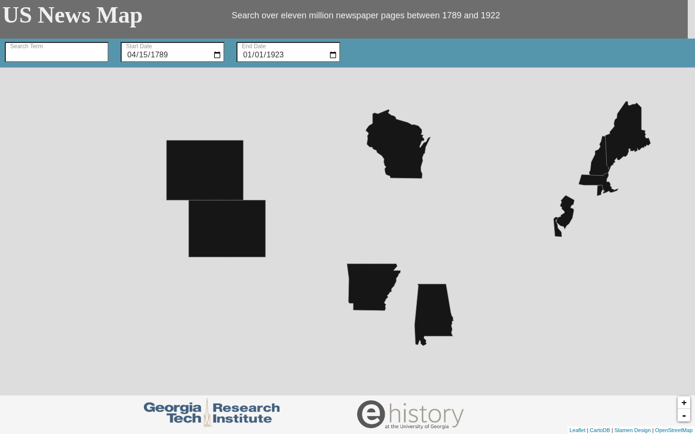

# 01: Background & Legacy Analysis

## 1.1 Project history

| When | Event |
|------|-------|
| 2015 | Georgia Tech Research Institute (GTRI, Information & Communications Lab) and eHistory.org (University of Georgia, Prof. Claudio Saunt) build US News Map on top of the Library of Congress / NEH *Chronicling America* collection. |
| Mar 2016 | Public launch, announced on H-Net and Reddit r/history. The Washington Post's *The Intersect* includes it in "The secret, pre-Internet history of 'viral' memes". |
| Apr 2016 | The Library of Virginia's *UncommonWealth* blog recommends it for tracking "how coverage traveled over time and geographically." |
| 2016 | UGA / Newswise publish "What going viral looked like 120 years ago", a study of how William Jennings Bryan's 1896 "Cross of Gold" speech spread, run on the tool. |
| Jul 2016 | Wins a prize in the NEH **Chronicling America Data Challenge** for using digital humanities to explore and exhibit untold stories found in the Chronicling America database. |
| Jun 2017 | Reviewed in the *Journal of American History* (Jason A. Heppler). |
| 2016–2018 | Scheduled outages and fixes: the maintenance page says "check back Tuesday, August 21"; commits mention "Revert to using internal GTRI IP addresses for Solr" and "Changed servers to HAProxy". The coverage headline is extended from "1789–1922" to "1789–1964". |
| Later | The site goes offline once institutional support ends. |

## 1.2 What the press tells us about intended use

The press coverage is our best evidence of what users valued, so the requirements in [02](02-product-requirements.md) are traced back to it.

| Source | Key points |
|--------|------------|
| **Newswise / UGA** ("What going viral looked like 120 years ago") | Researchers traced Bryan's "Cross of Gold" speech: it started in **Chicago**, moved to the **populous East Coast**, **jumped to the West Coast**, and then filled in less populated areas. Main use: **tracking diffusion over space and time.** Corpus described as "more than 10 million newspapers" [pages], 1836–1924. |
| **Washington Post** (Dewey, 2016) | Placed the tool in the story of 19th-century "viral" content: editors reprinted each other freely, in columns such as "Nuts to Crack," "Sunbeams," and "Flashes of Fun." Main use: **showing that virality predates the internet**, as public-facing history. |
| **UGA NEH prize story / NEH** | Example searches: **"miscegenation"** (coined in 1863 by a Democratic operative to exploit fears about Lincoln) and **"scalawag"** (gained currency after 1869). Suggested uses: **regional differences in language, the paths of epidemics, changes in political discourse.** The premise is that newspapers capture public discourse better than other sources because they were published quickly. |
| **Library of Virginia UncommonWealth** | Aimed at state newspaper projects and librarians: "search words or terms and then track how coverage traveled over time and geographically." Corpus "over 10 million pages and nearly 2,000 newspapers." |
| **RICIGS** (genealogy society) | Recommended to **genealogists** for finding which local papers mention a surname, place or event, then going straight to the page image. |
| **JAH review** (Heppler, 2017) | "A keyword search function reveals every location where the term appears… points of lighter or darker hues depending on the number of hits… Clicking on points presents a date-sorted list of newspapers with direct links to the digitized articles." |
| **Reddit r/history** (Mar 2016) | Launch thread, "Web application allows users to search historic [newspapers]…". The thread itself could not be retrieved from the build environment. Its title and timing confirm a general-public history audience at launch. |

> **Note on screenshots.** Press screenshots (e.g. `ehistory.org/storage/elements/USnews.jpg`, the `og:image`) could not be fetched from the build environment. The UI description below is reconstructed from the legacy source and checked against a local render of the legacy frontend: see `images/legacy-ui-local-render.png`. In that render the CartoDB `dark_all` basemap tiles and the Font Awesome icon font do not load offline, so the background shows grey instead of the production near-black and the header icons are missing.

*The legacy UI rendered locally from `web/index.html`. It shows the header, the search bar (term, start date, end date), states with no digitized papers masked in black, and the GTRI and eHistory footer. In production the basemap was CartoDB `dark_all`.*

## 1.3 Legacy UI and features (reconstructed from source)

The layout is a full-screen Leaflet map with translucent bars stacked at the top and a logo footer. There are four toggle icons in the header: **? (info)**, **search**, **play**, **history (timeline)**.

1. **Search bar** (teal): search term, start date (min 1789-01-01), end date (max 1925-01-01), and a submit arrow. It shows "Showing N of M results" with a **"Load 500 More"** button. The code has a *Literal vs Fuzzy* toggle (fuzzy = Solr `complexphrase` with `~` on each term) and help text for Boolean logic, but both are **commented out**, so users only got an exact phrase search.
2. **Playback bar** (lighter teal):
   - **Playback date** picker
   - **Cumulative** vs **Last N years** window, with N adjustable
   - **Year slider** covering 1789–1923, with ◀ ▶ step buttons
   - **Playback interval**: Year, Month, Week or Day
   - **Play/Pause** button; the spacebar also toggles play
3. **Timeline strip** (lightest teal): a Flot line chart of **hits per year divided by total pages that year**. The denominator is a hard-coded `globalFreq` table covering 1789–1929, so this is a *relative frequency*.
4. **Map markers**: one marker per **city** (hash = city + state). Each is a circle showing the hit count, colored in five classes (tiny/small/medium/large/huge) based on how far the count is from the mean in standard deviations.
5. **City results panel**: click a marker to see "*City*, *N results*" and a list of hits: `[PDF]` plus "date · newspaper name · page N". Each links to the Chronicling America page viewer with the search words highlighted (`#words=…&proxtext=…`). Newspaper names come from `/news_meta`.
6. **Coverage mask**: a GeoJSON layer paints states with **no digitized newspapers** black (AL, AK, AR, CO, DE, ME, MA, NH, NJ, RI, WI, WY; Georgia was later removed from the list as data arrived). Clicking one shows "No digitized newspapers available for X." This is how the site distinguished *no data* from *no mentions*.
7. **Embed support**: a `?disableScroll` URL flag turns off scroll-wheel zoom so the page can be embedded in articles.
8. **Analytics**: Google Analytics (UA) events for searches, load-more, playback, marker clicks and paper clicks, plus response timing.
9. **Info panel**: credits, sponsor text and a contact address.

## 1.4 Legacy architecture

```mermaid
flowchart LR
  subgraph Browser
    A[AngularJS 1.x SPA<br/>Leaflet + Flot + Bootstrap 3]
  end
  subgraph "GTRI / UGA servers"
    H[Apache + mod_wsgi<br/>/loc_api]
    F[Flask API<br/>Python 2]
    M[(MongoDB 'loc'<br/>users · locations · newspapers · log)]
    HP[HAProxy]
    S[(Solr cluster 'loc' core<br/>text · date_field · sn · ed · seq)]
  end
  subgraph "Offline scripts"
    G[get_batch.py / get_missing_batches.py]
    D[deposit_to_solr.py]
    L[get_sn_locations.py<br/>Google Places geocoding]
  end
  LOC[(chroniclingamerica.loc.gov<br/>batches · issues · ocr.txt · lccn.json)]

  A -- "POST /get_data, /update, /news_meta" --> H --> F
  F --> M
  F --> HP --> S
  G --> LOC
  G --> S
  D --> S
  L --> M
  G --> M
```

### 1.4.1 Components

| Component | Implementation | Notes |
|-----------|----------------|-------|
| Frontend | AngularJS 1.x, angular-leaflet-directive, Leaflet 0.7, Flot, Bootstrap 3, jQuery 2.1, lodash, moment | All vendored into the repo (~1,000 files, mostly third-party). No build step. |
| API | Flask + flask-restplus + flask-cors on Apache/mod_wsgi (`.htaccess`), Python 2 | 3 endpoints. Solr host is hard-coded (`violetwaffle08.icl.gtri.org:10125`). |
| Search | Apache Solr, single core `loc`, one document per **page** | Fields: `text`, `text_loose`, `date_field`, `sn` (LCCN), `ed`, `seq`, plus earlier `city`/`state`/`location`, and a `random_*` dynamic sort field. |
| Metadata DB | MongoDB `loc` | `newspapers` (raw LCCN JSON from LoC), `locations` (sn → city/state/lat/long), `users` (per-session result state), `log` (every search, with IP, cookies and headers). |
| Ingest | Python 2 multiprocessing scripts (pools of 50–120) | Crawl batch → issue → page JSON, check Solr for each page, fetch `ocr.txt`, POST to Solr. Or bulk-load from local disk (`deposit_to_solr.py`). |
| Geocoding | Google Places Text Search on `place_of_publication` | Output in `town_ref.csv` (~1,795 titles, 757 distinct city/state pairs). |

### 1.4.2 Request flow and algorithm

`POST /get_data` with `{search, startDate, endDate, start, user_id, date}`:

1. Builds a Solr query `date_field:[start TO end] text:"<phrase>"`, `rows=500`, `sort=random_<user_uuid> desc`. The result is a **random sample of 500 pages** in a stable per-user order.
2. For each hit, looks up the location in Mongo (**N+1 queries**: one per hit) and builds a "mark". Hits without coordinates are silently dropped.
3. On "Load more" (`start > 0`), reads the user's saved list from Mongo and appends to it.
4. Builds a `HashList`, a linked list sorted by date plus a hash table keyed by city, so it can move forward and backward through time incrementally. The whole structure is **persisted to Mongo per user** (`users` collection).
5. Separately calls Solr for a **yearly range facet** and divides by the hard-coded `globalFreq` table to get the timeline.
6. Returns the city → marks hash table as JSON.

`POST /update {user_id, date}` is **called on every slider tick and every playback frame** (every 400 ms during playback). Each call loads the user's `HashList` from Mongo, moves the cursor, saves it back, and returns the whole hash table.

`POST /news_meta {sn:[…]}` returns newspaper metadata by LCCN.

### 1.4.3 Why it failed: root-cause analysis

| # | Problem | Consequence |
|---|---------|-------------|
| 1 | **Hosted on institutional servers** (GTRI internal hostnames, 10.x IPs, UGA storage paths) with hand-configured Solr, Mongo, HAProxy and Apache | No portability. When the people and machines went away, the service went too. No infrastructure-as-code. |
| 2 | **Stateful server session per user** (Mongo `users` + `/update` on every frame) | Playback cost one round-trip plus two Mongo writes per 400 ms frame per user. Poor scaling, fragile under load, and a comment in the code admits a race condition ("if you click the search button too quickly you will get duplication…"). |
| 3 | **Sampling (500 random hits per request)** | The map showed a *sample*, not the distribution. Researchers could not trust the counts, and the site encouraged many "load more" round-trips. |
| 4 | **N+1 metadata lookups, no caching** | Latency grew with result size. Identical searches recomputed everything. |
| 5 | **Python 2, AngularJS 1.x, Leaflet 0.7, vendored libraries** | All end-of-life. Rebuilding would take effort, and there were security holes nobody patched. |
| 6 | **Ingest was hand-run crawling** of `chroniclingamerica.loc.gov` page by page, with recursive retries | Slow, heavy load on LoC, not idempotent, no record of what had been indexed. That legacy API was **retired in 2025** (see [04](04-data-sources-and-ingestion.md)). |
| 7 | **Hard-coded normalization** (`globalFreq` 1789–1929) | Went stale as LoC added content; made relative frequencies wrong. |
| 8 | **Single-location geocoding** via Google Places at city level, with spaces stripped from city names | Some wrong matches. Titles without a matched city were silently dropped. |
| 9 | **Costs and ownership were unclear** | Nobody owned a budget, a runbook or the domain renewal. |

### 1.4.4 Security & privacy findings in the legacy repo

These must not carry over. Anything that is still live should be revoked.

- **A Google Places API key is committed** in `python/get_sn_locations.py`, and a **Mapbox public token** in `web/js/map.js` (commented out). Both should be **revoked or rotated in their consoles** now, whether or not they still work. The new repository must use secret scanning (GitHub push protection) and keep no keys in source.
- **Logging of personal data**: `log_metadata` stored the client IP, cookies and all request headers for every search in MongoDB, with no retention limit. The new application never logs raw IPs, cookies or headers. The only raw IPs that can exist are in optional platform access logs, kept at most 30 days for abuse handling (see [09](09-operations-security-cost.md)).
- **Solr query injection**: user input was concatenated into Solr URLs after stripping only double quotes. Local-params syntax (e.g. `{!…}`) and field syntax could be injected. The new API parses queries into an AST and never forwards raw syntax to the engine.
- **Plain HTTP** for the API and for LoC links. There was no TLS enforcement.
- **CORS `*`** on the API. The new API allows only the site's origin, for GET requests without credentials.

## 1.5 What to keep

The legacy design had several good product ideas worth keeping:

- **Page-level documents with LCCN, date, edition and sequence** are the right unit of retrieval. They map one-to-one onto LoC page URLs.
- **Relative frequency** (hits ÷ pages published) is essential for honest interpretation, because the corpus grows about 1,000× from 1790 to 1910.
- **Cumulative vs trailing-window playback** and the **Year/Month/Week/Day step** controls were distinctive and well liked.
- **The no-data mask** tells users that absence on the map may mean absence of digitized papers. The new design generalizes it into a time-aware coverage layer.
- **Links straight to the LoC page viewer with the search terms highlighted**, so LoC remains the canonical viewer and we don't need to host images.
- **Embed mode** for use in articles and lectures.
