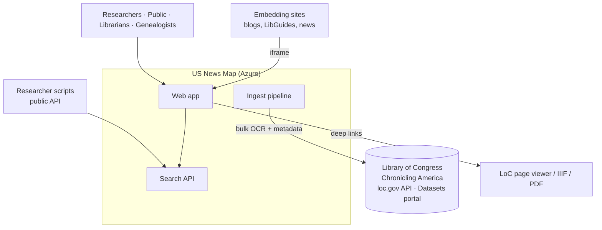
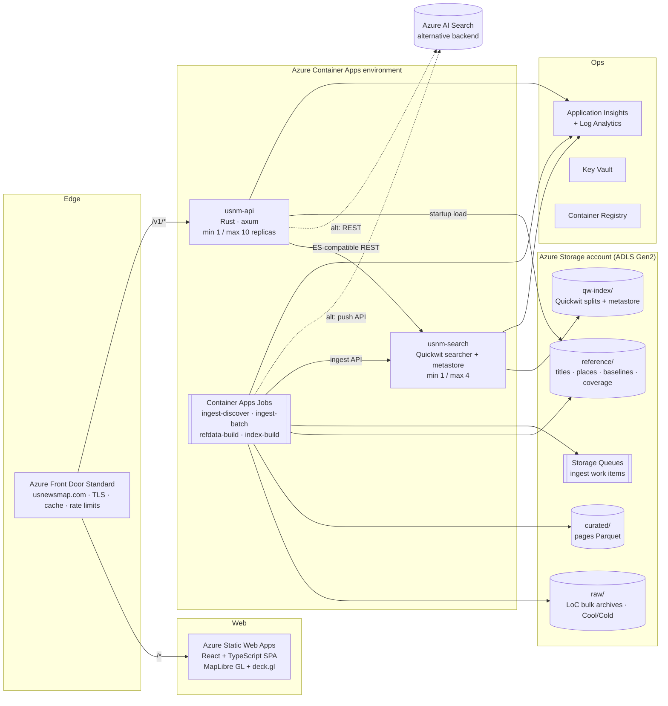
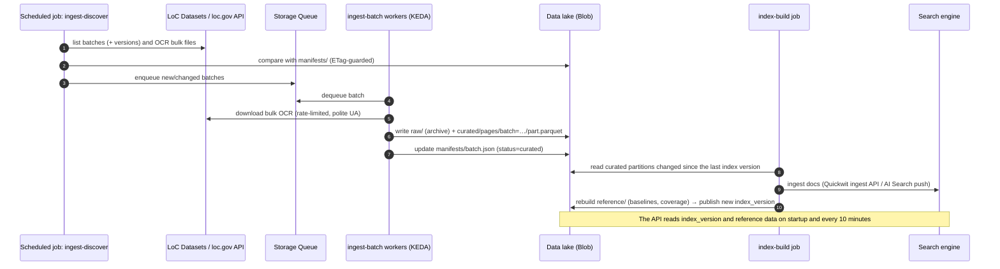

# 03: Architecture Overview

## 3.1 Architectural drivers

Ranked in order. Where drivers conflict, the higher one wins.

1. **Sustainability.** Low fixed cost, no servers to patch, reproducible from code. The system must not die again for lack of support.
2. **Correctness.** Complete aggregates, honest normalization, stable citations.
3. **Performance.** The map should feel instant, with smooth playback on commodity laptops and phones.
4. **Lean on Azure PaaS.** Use managed services for storage, compute, edge, identity and observability.
5. **Evolvability.** The search engine can be swapped, the article-level corpus added later, and semantic search layered on.

## 3.2 System context



## 3.3 Container view (target)



### 3.3.1 Component responsibilities

| Component | Tech | Responsibility | Scales by |
|-----------|------|----------------|-----------|
| **Front Door** | Azure Front Door Standard | TLS for `usnewsmap.com`; routes `/v1/*` to the API and everything else to SWA; **caches GET API responses** (queries are deterministic); rate-limit rules; compression | Managed |
| **Web app** | React 19 + TypeScript + Vite; MapLibre GL JS; deck.gl; uPlot; TanStack Query | UI, URL state, **client-side playback** from aggregate cubes, accessibility views | Static/CDN |
| **Search API** | Rust, axum/tokio, reqwest, moka | Parse and validate queries → backend DSL; run aggregate, hit and snippet queries; join with reference data; normalize; encode responses; cache; guardrails; OpenAPI | HTTP concurrency (KEDA) |
| **Search engine** | **Quickwit** (Rust, Apache-2.0) *or* Azure AI Search | Inverted index with positions; phrase, proximity and fuzzy; nested *terms × date_histogram* aggregations; snippets | Replicas; splits on Blob |
| **Reference data** | Parquet/JSON artifacts on Blob | Titles (LCCN → name, place, dates, language), places (lat/lon, county, state), baselines (pages per title per month), coverage | Loaded into API memory (a few MB) |
| **Ingest jobs** | Rust CLI in Container Apps Jobs; Storage Queues; KEDA queue scaler | Discover LoC batches; download bulk OCR; normalize to curated Parquet; build reference data; (re)index | Queue length |
| **Data lake** | ADLS Gen2 (Blob) | System of record for the corpus and all derived artifacts | Managed |
| **Observability** | App Insights via the Container Apps managed OpenTelemetry agent; Log Analytics | Traces, metrics, logs, availability tests, alerts | Managed |

## 3.4 Key runtime flows

### 3.4.1 Search → map → playback (the main flow)

```mermaid
sequenceDiagram
  autonumber
  participant B as Browser
  participant FD as Front Door
  participant API as Rust API
  participant SE as Search engine
  B->>FD: GET /v1/aggregate?q="cross of gold"&from=1896-06-01&to=1896-12-31&bucket=week
  alt cache hit
    FD-->>B: 200 (cached, ~50–150 ms)
  else miss
    FD->>API: forward
    API->>API: parse → AST → validate → canonicalize (cache key)
    API->>SE: query + aggs: terms(place_id) → date_histogram(bucket) ; date_histogram(bucket) ; min(date) per place
    SE-->>API: nested buckets
    API->>API: join places / baselines, compute relative freq, first-appearance, build sparse cube
    API-->>FD: 200 application/json (or ?format=arrow), Cache-Control: public, max-age=86400, ETag=index_version+query
    FD-->>B: 200
  end
  B->>B: build per-bucket prefix sums; playback, cumulative and trailing windows computed locally at 60 fps
  B->>FD: GET /v1/hits?q=...&place=P123&cursor=...  (on marker click)
  FD->>API: (cache miss) → SE: top-N by date with highlights
  API-->>B: page list with KWIC snippets + LoC links
```

**Why this fixes the legacy problems:** there is one request per search instead of one per animation frame; there is no server session; responses can be cached by URL; and the counts are complete.

### 3.4.2 Ingestion (weekly and on demand)



## 3.5 Cross-cutting design decisions

| Decision | Choice | ADR |
|----------|--------|-----|
| Search engine | Quickwit on Container Apps + Blob (recommended); Azure AI Search (managed alternative); both behind the Rust `SearchBackend` trait | [0001](adr/0001-search-engine.md) |
| System of record | Curated Parquet in ADLS Gen2; indexes are disposable | [0002](adr/0002-blob-data-lake-system-of-record.md) |
| API shape | Stateless, GET, aggregate-first, CDN-cacheable; client-side temporal playback | [0003](adr/0003-stateless-aggregate-first-api.md) |
| API language | Rust (axum) | [0004](adr/0004-rust-api.md) |
| Operating constraints | ≤ $500/mo, no VMs, IaC, single-maintainer operable | [0005](adr/0005-sustainability-constraints.md) |
| Unit of retrieval | **Page** at launch (matches LoC URLs and the legacy); article level later (American Stories) | [04](04-data-sources-and-ingestion.md) |
| Geography | Place = title's place of publication (point), resolved from LoC metadata and GNIS; state and county from the same source | [04](04-data-sources-and-ingestion.md) |
| Cache invalidation | `index_version` is included in every ETag and cache key; a new index version means new URLs (the version is embedded in the response and in `/v1/meta`) | [06](06-api-design.md) |
| Identity | Managed identities everywhere; no connection strings in app config | [08](08-azure-infrastructure.md) |

## 3.6 Repository layout (proposed for `usnewsmap.com`)

```
usnewsmap.com/
├─ docs/design/                 ← this document set
├─ web/                         ← React + TS SPA (Vite)
├─ crates/
│  ├─ usnm-core/               ← domain types, query AST/parser, normalization, cube encoding
│  ├─ usnm-search/             ← SearchBackend trait + quickwit + azure_ai_search adapters
│  ├─ usnm-api/                ← axum service (bin)
│  ├─ usnm-ingest/             ← ingest CLI: discover, batch, refdata, index (bin)
│  └─ usnm-refdata/            ← titles/places/baselines builders, gazetteer matching
├─ search/
│  ├─ quickwit/                ← index config YAML, node config
│  └─ azure-ai-search/         ← index JSON schema, analyzers
├─ infra/                      ← Bicep modules + azd environment files
├─ .github/workflows/          ← CI (fmt, clippy, test, build, scan), CD (azd deploy)
└─ ops/runbooks/               ← reindex, restore, incident, cost-spike
```
