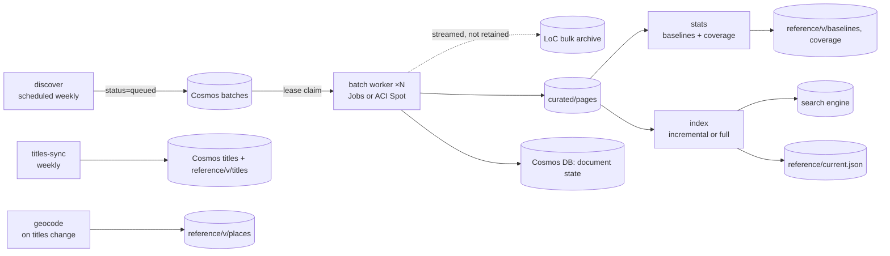

# 04: Data Sources & Ingestion

## 4.1 Source landscape (as of September 2026)

The legacy crawler targeted `chroniclingamerica.loc.gov` JSON endpoints (`/batches/…json`, `/lccn/{sn}/{date}/ed-{n}.json`, `/…/ocr.txt`, `/lccn/{sn}.json`). **Those endpoints are gone.** On **4 August 2025** the Library of Congress moved Chronicling America onto loc.gov. The legacy domain now permanently redirects there, and the collection is reachable **only through the loc.gov API**. Since then LoC has launched a **Chronicling America Datasets portal** with batch data and **bulk OCR downloads for 3,000+ batches and 23M+ pages**. It is also re-OCRing pre-2012 content with its open-source **NDNP-Open-OCR** pipeline (Tesseract with layout detection; 425k+ pages reprocessed as of August 2026).

| Source | What we take | Access pattern | Notes |
|--------|--------------|----------------|-------|
| **Chronicling America Datasets portal** (`loc.gov/collections/chronicling-america/datasets`) | Batch list and versions; **bulk OCR text** per batch | Bulk download, rate-limited (historically 10 bulk requests per 10 min per IP) | **Primary corpus source.** One archive per batch is far cheaper for LoC and for us than per-page fetches. |
| **loc.gov JSON API** (`?fo=json`) | **Title metadata** (LCCN, title, place, county, state, language, ethnicity, dates); page `resource` URLs; small top-ups | Paginated JSON; requests limited; searches over 100k results must be split by facets | Used for reference data and for reconciling page URLs. Not used to pull text for the bulk corpus. |
| **NDNP-Open-OCR outputs** | Replacement OCR for reprocessed pages | Show up as new batch versions / dataset updates | Triggers re-ingestion of affected pages (§4.7). |
| **USGS GNIS Domestic Names** (public domain) + **Census TIGER** county/state shapes | Coordinates for places of publication; county centroids as fallback; state polygons | One-time download, refreshed yearly | Replaces the legacy Google Places geocoding and its committed key. |
| **Legacy `town_ref.csv`** | 1,795 LCCN → city/state/lat/lon rows | One-time | **Cross-check only** for geocoding QA. |
| *American Stories* (Dell et al., Harvard; Hugging Face) | Article-level segmentation of ~20M scans, 438M articles, 1774–1963 | Parquet download | **Phase 3** option for article-level results and reprint detection (F-33/F-34). |
| *Mirrors* (e.g. the `biglam/chronicling-america-bulk-ocr` bucket on Hugging Face) | Same bulk OCR | S3-style bulk | Optional **backfill accelerator** to reduce load on LoC. Check provenance and checksums against LoC manifests before use. |

### 4.1.1 Spike S-1 findings (September 2026)

- **The batch list is machine-readable.** The collection JSON (`https://www.loc.gov/collections/chronicling-america/?fo=json&c=1`) carries a `datasets` array: one entry per batch with `batch` (e.g. `vi_elgar_ver02`), `url` (`https://chroniclingamerica.loc.gov/data/ocr/{batch}.tar.bz2`), `sha256`, `size`, `page_count`, `issue_count` and `lccns`. `usnm-ingest enqueue` reads it directly (its default `--list`). The Datasets HTML page itself answers scripted clients with 403, so the JSON is the interface.
- **Size:** 2,997 batches, **23.7M pages**, **2.47 TB of `tar.bz2`** (largest 3.8 GB). Versions run `_ver01` (2,307) to `_ver08`.
- **Archive layout:** `{lccn}/{yyyy}/{mm}/{dd}/ed-{n}/seq-{n}/ocr.txt` plus ALTO `ocr.xml`, exactly the historical layout the reader expected. The XML is ~35× the text and is skipped, so most of the download is discarded.
- **Text volume:** a 1900s weekly batch (`vi_elgar_ver02`: 1,605 pages) averages **33.7 KB of text per page**; its curated Parquet is 3.2× smaller than the raw text. That fits the 450–800 GB raw / 150–300 GB curated estimate in §4.3.1.
- **Throughput:** the download ran at ~80 MB/s (but see §4.1.2: that rate may only hold when the CDN has the archive cached). Curation is bound by single-threaded bzip2 at **~3.9 MB/s of archive per worker** (54 s for 208 MB), so the full 2.47 TB is ~175 worker-hours: about 22 hours with 8 workers if CPU were the limit. It isn't: LoC's bulk limit paces the backfill to ~2.5 days (§4.4). Run one worker process per vCPU.
- **Scratch disk:** the worker downloads the whole archive before parsing (to verify the sha256 first), so its disk must hold the largest archive (3.8 GB).
- **Titles:** `https://www.loc.gov/item/{lccn}/?fo=json` returns the title record with `location_city/county/state`, **`latlong`**, `dates_of_publication`, `number_first_issue`/`number_last_issue` and `languages`. LoC's own coordinates can seed `geocode`, with GNIS as the cross-check.
- **Access:** everything above is anonymous HTTPS. A real archive (`dlc_zurich_ver04`, 58 KB) is checked into `crates/usnm-ingest/tests/data/` as a layout regression test.

### 4.1.2 Local trial findings (September 2026)

A trial ran the pipeline end to end on 6 real batches (40,452 pages: `dlc_zurich_ver04`, `vi_elgar_ver02`, `iune_mallard_ver08`, `ncu_cane_ver01`, `nn_nelson_ver01`, and `dlc_nosebleed_ver01`, the largest archive at 3.8 GB). It ran on an 8-core laptop over a residential 1 Gbps link, with Azurite standing in for Blob Storage and a stand-in for Cosmos DB.

- **Downloads depend on the CDN cache.** `chroniclingamerica.loc.gov` is served through Cloudflare. When the archive was already cached (`cf-cache-status: HIT`), downloads ran at 20–45 MB/s. On a miss they ran at **0.3–1.2 MB/s per connection**: `iune_mallard_ver08` (318 MB) took about 15 minutes. Range requests work (`accept-ranges: bytes`), but on a miss, 8 parallel ranges did not add up to much: one ran fast and most stalled. S-1's ~80 MB/s was measured on `vi_elgar_ver02`, which may already have been cached. Few people download these archives, so most of a backfill will be cache misses. **These rates were measured from a residential link, not from Azure.** Measure a cache-miss download from Azure before sizing the backfill. If misses are just as slow from Azure, downloading is what limits the backfill, not curation CPU. For example, 8 parallel batches at 0.3–1.2 MB/s each is about 2.4–10 MB/s, or 3–12 days for 2.47 TB.
- **LoC's listing counts are not exact.** In 5 of the 6 batches, the curated pages matched the listing's `page_count`. `ncu_cane_ver01` held 11,100 pages in 2,509 issues, while the listing said 10,550 pages in 2,365 issues. There were no empty or duplicate pages. So `page_count` and `issue_count` can't be used to check that a batch curated completely. The checks stay the archive's sha256 and our own counts.
- **Memory:** a curate worker peaked at 500 MB on the 3.8 GB archive. A 4-batch `run` (curate, `titles-sync`, release) peaked at 650 MB. That leaves plenty of room in 1 vCPU / 2 GiB.
- **Quickwit ingest is rate limited per shard.** The writer node has one shard per index. Quickwit 0.9 allows ~50 MiB in a burst and then 5 MB/s per shard (20 MB/s at most, with `ingest_api.shard_throughput_limit`). Past the burst it answers `503 no shards available`. The release now retries on 503 and runs its writer at 20 MB/s. **The index build is slower than §4.4 planned.** A full release of the 40,452 trial pages took 72 s end to end on the laptop, about 560 pages/s. At that rate, 23.7M pages take about 12 hours. On the job's 2 vCPU it will be slower; this has not been measured yet. `caj-usnm-ingest` has `replicaTimeout: 86400` (24 h) and no retry, so measure the build rate on the job's size before the first full backfill.

**Good-citizen policy:** identify ourselves with a descriptive User-Agent and contact address; prefer bulk over per-page requests; schedule off-peak; back off exponentially on 429/5xx; never parallelize beyond published limits; cache everything in our lake so we fetch each object **once**.

## 4.2 Canonical identifiers

- **Page key** (human-readable and stable): `{lccn}/{yyyy-mm-dd}/ed-{n}/seq-{n}`, e.g. `sn84026749/1896-07-10/ed-1/seq-1`. This is the same tuple the legacy code used (`sn, date, ed, seq`) and the one LoC uses for resource paths.
- **Doc id** (engine key): the page key itself, with `/` replaced by `_` (e.g. `sn84026749_1896-07-10_ed-1_seq-1`). It is **collision-free by construction**, reversible, and uses only characters valid in AI Search keys (letters, digits, `_`, `-`). A 64-bit hash was rejected: at 23M pages the chance of at least one collision is ~1.4×10⁻⁵, and a collision would silently merge two pages and break exact counts.
- **Place id**: `P` + a stable integer assigned once and never reused (e.g. `P00412`). Ids stay stable across reference snapshots; the registry is carried forward from one `reference/{index_version}/places` snapshot to the next. One place can serve many titles, since cities had several papers.
- **Index version**: `pages-v{YYYYMMDD}-{n}`. It is recorded in `reference/current.json` and appears in every API ETag.

## 4.3 Data lake layout (Blob Storage, flat namespace, one storage account)

```
raw/                                   (lean profile: NOT retained; LoC is the source of record)
  loc-api/titles/{date}/…json.zst       raw title metadata snapshots only (small)
curated/                               (Cool; the system of record; versioned + soft delete)
  pages/{batch}/v{NN}/{attempt}/part-{nnnn}.parquet
                                        written once, never overwritten; the Cosmos `batches` item
                                        points at the committed attempt (the atomic "commit")
  pages/{batch}/v{NN}/{attempt}/counts.json
                                        pages per (lccn, day), all text statuses: baselines are
                                        built from these without re-reading the parts
  ocr-ja/targets-v2.jsonl               the Japanese pages to OCR (§4.8), one JSON object per page
  ocr-ja/pages/{lccn}_{date}_ed-{n}[.{k}].parquet
                                        our OCR of an issue's Japanese pages, an overlay keyed by
                                        doc_id: page identity (doc_id, page_key, lccn, date,
                                        edition, seq, batch), ocr_source = usnm-ndlocr-lite,
                                        ocr_engine, loc_text (empty, short, garbled), image_url,
                                        ocred_at, text_status, text, text_chars, text_sha256. The
                                        release joins it to the curated row for everything else.
                                        Written only when every page it was asked for has text; a
                                        page is done when its doc_id is in a part (.2, .3, ... for
                                        pages added to the targets after the issue's first part)
  ocr-ja/claims/{targets}/{issue}.json  which replica took the issue (create-only)
reference/                             (Hot; small; loaded by API; IMMUTABLE per index version)
  catalog/titles.json, places.json      the working catalog (titles-sync + geocode; hand-written
                                        until those land). Titles and places carry stable ordinals
  {index_version}/                      = pages-v{YYYYMMDD}-{n}
    titles.json  places.json            the catalog as published with this version (only titles
                                        and places that have pages in it)
    baselines.json                      pages published per place: {place_id: [[day, pages], …]}
    title_pages.json                    pages published per title: {lccn: pages}, the same pages as the
                                        baselines summed by title (the status page's pages by
                                        language). Snapshots from before it was added don't have it
    language_baselines.json             the same pages as baselines.json, split by the languages
                                        their title lists: {sets: [{languages: ["eng", "ger"],
                                        baselines: {place_id: [[day, pages], …]}}, …]}, one set per
                                        distinct language list, sorted. A page is in exactly one set,
                                        so any selection of languages sums the sets that share one
                                        of them without counting a page twice. Titles that list no
                                        language are left out (no language filter matches them).
                                        Snapshots from before it was added don't have it
    batches.json                        the batches the version was built from, each with its full
                                        curation record (parts, counts path, pages, lccns, sha256).
                                        The release reads the published version's list to find new
                                        batches; the Cosmos index_runs item only points at it
    manifest.json                       { index_version, files: [{path, sha256, bytes}], built_from: {batches} }
  raw/titles.json                       the fields titles-sync keeps from each LoC title record
  current.json                          { index_version, backend, indexes: [base, delta…] (sealed), reference: "{index_version}", bounds, previous_version, published_at, synthetic }
(document state, meaning per-title, per-batch, per-issue and per-index-run status, lives in Cosmos DB, not here; see 05 §5.9.1)
cache/{index_version}/                 (Hot) persistent API response cache, zstd JSON keyed by canonical-query hash
qw-index/                              (Hot; Quickwit splits + file-backed metastore)
```

### 4.3.1 Curated page schema (Parquet, zstd)

| Column | Type | Notes |
|--------|------|-------|
| `doc_id` | string | `page_key` with `/`→`_` (unique) |
| `page_key` | string | `lccn/date/ed-n/seq-n` |
| `lccn` | string | |
| `date` | date32 | Publication date. Pre-1970 dates are normal; ~1756 onward. |
| `year`, `month` | int16, int8 | Denormalized for partition pruning |
| `edition`, `seq` | int16 | |
| `front_page` | bool | `seq == 1` |

| `batch`, `batch_version` | string, int16 | Provenance |
| `ocr_source` | enum | `ndnp-original` \| `ndnp-open-ocr` |
| `text_status` | enum | `ok` \| `short` \| `empty` (§4.5) |
| `text` | large_string (nullable) | Normalized OCR text (§4.5); null unless `text_status = ok` |
| `text_chars`, `word_count` | int32 | QA and baselines |
| `text_sha256` | fixed_binary(32) | Change detection |
| `resource_url` | string | Canonical loc.gov page URL |
| `ingested_at` | timestamp | |

Curated rows hold only **immutable page facts**. Title-derived attributes (`place_id`, `state`, `language`) are **not stored here**. The `index` and `stats` jobs join them from the versioned titles snapshot, so a corrected title record never leaves stale copies in the system of record.

**Size estimate.** The legacy sample of 1879 *Daily Review* (Towanda, PA) pages averages about **10.6 KB** of OCR text per page. Later eight-column broadsheets carry 2–5× more. We plan for **20–35 KB per page average × ~23M pages ≈ 450–800 GB of raw text**, or about **150–300 GB as zstd Parquet**. This is validated in Spike S-1 ([10](10-roadmap-and-risks.md)).

## 4.4 Pipeline

All stages are subcommands of one Rust binary (`usnm-ingest`, in `crates/usnm-ingest`), packaged as one container image (`Dockerfile.ingest`: the binary on the pinned Quickwit image).

**Implemented so far:** `enqueue` (from LoC's collection JSON `datasets` listing by default, or any batch list), `curate` (the `batch` stage), and `release` (the `index` stage, with the reference snapshot built from each batch's `counts.json`; `stats` is folded in). `run` chains all three for the weekly job. State lives in Cosmos over its REST API, or in a local JSON file for development. `titles-sync` and `geocode` build the catalog from LoC's title records (§4.6), and `run` calls `titles-sync` before releasing, so every curated title has a catalog entry. **Still to come:** garbage collection of uncommitted attempts and unpublished indexes (the janitor), and the GNIS/Census cross-check in `geocode`. The ingest and backfill Container Apps Jobs are in `infra/modules/ingestjobs.bicep` (08 §8.4). `scripts/fixture-batches.py` turns the synthetic fixtures into batch archives, and CI checks that the pipeline reproduces the fixture indexes and reference snapshot exactly. **Weekly incremental** work runs as **Azure Container Apps Jobs**. The **initial backfill** runs the same image as a manual Container Apps Job with N parallel curation replicas, inside the VNet (see [08 §8.4](08-azure-infrastructure.md#84-compute-sizing-notes); ACI Spot remains a documented alternative). Work is split into **one Cosmos `batches` item per batch version** (about 3,000 batches). Workers claim items with lease patches, so work parallelizes naturally and retries are idempotent. Cosmos is the work queue; there is no Storage Queue.



| Stage | Trigger | Does | Idempotency |
|-------|---------|------|-------------|
| `discover` (`enqueue`) | Cron (weekly) + manual | Reads the batch list from LoC's collection JSON `datasets` array (§4.1.1), or any batch list given with `--list`; upserts `batches` items in Cosmos and marks new or changed versions `queued`. Never downgrades a version | Only marks `queued` if the status ≠ curated for that version; failed batches are re-queued |
| `batch` | A `queued` batch is available to claim | Streams the bulk OCR for the batch (checksum verified; not retained); parses per-page text; normalizes; writes curated Parquet (~256 MB row groups); updates the manifest | Claims the batch with a conditional Cosmos patch (lease + ETag); writes to a **new attempt path** (never overwriting); then **upserts the issue items first** (idempotent, keyed by lccn/date/edition). The **final commit marker** is one conditional patch on the batch item, made only while the worker still holds the lease: `curated_path` → that attempt, plus sha256, pages and `status=curated`. If anything fails before that patch, the batch stays un-curated, its lease expires, and it's retried; `discover` also re-queues any batch not `curated`. Re-upserting issues is harmless. Uncommitted attempts are garbage-collected after 7 days |
| `titles-sync` | Each `run` (weekly), before release; manual | Fetches `loc.gov/item/{lccn}/?fo=json` for titles with pages that aren't cached or catalogued yet; caches the fields used in `reference/raw/titles.json`; then runs `geocode` | Paced under LoC's 20 requests/minute limit; on a 429/CAPTCHA, waits out LoC's one-hour block and resumes more slowly until its deadline (`--titles-max-runtime-secs`, 8 h into a job run), else stops; failures are retried next run; the cache is saved as it goes |
| `geocode` | After `titles-sync`; manual (e.g. after editing overrides) | Resolves each title's place of publication (§4.6): override, else LoC's `latlong`, else state centroid; writes `catalog/places.json` then `catalog/titles.json`, only if they changed | Deterministic, no network; stable ordinals and ids |
| `stats` | After batches are curated | Aggregates baselines (pages per place/day and per title/month) and coverage (state/year) from curated Parquet joined with the titles snapshot, using DataFusion or Polars. Writes a **new** `reference/{index_version}/` snapshot (never overwrites) | Full recompute (cheap: one scan of the ids and dates columns) |
| `index` (`release`) | After curation, or manual | Takes the Cosmos `ops/quickwit-writer` lease (the single metastore writer). Runs the Quickwit writer node as a child process for the length of the release. **Incremental:** writes newly curated rows with `text_status = ok` into a **new delta index**. **Compaction/full:** writes all rows into a **new base index**. Both join the titles snapshot for `place_id`/`state`/`language` and compute `place_shard`. Never writes an index a published version lists. Before publishing, waits for the writer to merge the new index into a few large splits, then closes it (05 §5.5.1); a full disk, a failed merge or a merge that doesn't finish in time fails the release instead. Logs an `index layout` line (splits, documents, size) for each index of the version and records the same in its manifest. Writes the version's batch list into its reference snapshot (`batches.json`, listed in the manifest) and records only its path and count in the Cosmos `index_runs` item. Publishes by writing `current.json` last, naming the index set and its reference snapshot | Deterministic `doc_id` (the page key); each new index is built from scratch, so a retry discards the unpublished index and starts again |

**Throughput plan for the initial backfill.** The original plan assumed 2,000 pages/s per indexer, about 3.2 hours of indexing. The trial (§4.1.2) measured about 560 pages/s on 8 laptop cores with the writer's per-shard ingest limit, so plan on 12 hours or more, and measure on the job's 2 vCPU before the backfill. Downloads from LoC dominate anyway (days, not hours; cache misses ran at 0.3–1.2 MB/s in the trial), which is why the curated lake matters: **after the first backfill we never re-download to re-index.** If the mirror is validated, the backfill can pull from it instead. S-1 measured curation at ~175 worker-hours for the whole corpus (§4.1.1), ~$15–20, but **LoC's download limit sets the pace, not CPU**: 10 bulk requests per 10 minutes per IP. The first prod backfill (September 2026) ran 8 workers at ~140 downloads/hour, was tolerated for about 90 minutes, then refused almost everything for over an hour. Workers now take download slots 75 s apart from one Cosmos item (`ops/loc-bulk-pacer`) shared by every worker and execution, and a 429 pauses all of them for an hour without costing the batch an attempt. That is ~48 batches/hour, about 2.5 days for the corpus with 4 workers (more add nothing). Each worker stops claiming batches 22 h after it starts and exits 0 before the job's 24 h replica timeout, and the job is started again until the queue is empty. After the backfill, new batches come from the weekly `run` (08 §8.4). A worker that dies only delays the work, because each batch is idempotent and becomes claimable again when its lease expires. The jobs run inside the VNet, so the data services stay private throughout.

## 4.5 Text normalization (applied at curation time)

1. Unicode NFC; strip control characters; turn the long s `ſ` into `s`; normalize ligatures (`fi` → `fi`).
2. **Rejoin line-break hyphenation**: `indus-\ntry` → `industry`, but only when the joined token is alphabetic. This substantially improves phrase recall on OCR text.
3. Collapse runs of whitespace; keep paragraph breaks as `\n`.
4. **Keep every digitized page as a curated row**, even when the normalized text is empty or shorter than 20 characters. Such rows get `text_status = empty | short` and a null `text`. They are **excluded from the search index only**; baselines and coverage count them, so relative frequencies and the "no digitized newspapers" layer stay correct. (The legacy code dropped them entirely.)
5. Keep the text case-sensitive in storage; lowercasing and ASCII folding happen in the engine's analyzer.

## 4.6 Geography

- **Unit:** a title's **place of publication**, as recorded by LoC (city, county, state). All pages of a title inherit its place. Titles that moved have date ranges for their place in `titles.places[]`; when there are more than one, the page's date selects the right one.
- **Resolution order (implemented):** (1) manual override (`catalog/overrides/places.json` in git, compiled into the ingest image: `[{city, state, lat, lon, precision?}]`) → (2) LoC's own `latlong` on the title record (precision `city`) → (3) state centroid (precision `state`). Each place stores `precision ∈ {city, county, state}` and the UI shows lower precision with a hollow marker.
  - A title's place is the city in its LoC title, e.g. "(North Platte, Neb.)", in the state LoC records; when a title lists several states, the one its place label names wins. Titles in the same city and state share one place, at the coordinates of the first of them (by LCCN). The label is kept on the title as `place_of_publication`, so historical names ("Dakota Territory") survive.
  - `titles-sync` caches the fields it uses from each record in `reference/raw/titles.json`, fetching only titles that are neither cached nor in the catalog (`--refresh` re-fetches). Requests go one at a time, every 3.5 s: loc.gov's JSON API allows 20 a minute and blocks for an hour beyond that, and any request during the block starts the hour again. LoC also limits below that rate when it is busy: in September and October 2026 a 429 or CAPTCHA page came after about 250 to 340 requests at about 13 a minute. With a deadline (`--max-runtime-secs`, or `run --titles-max-runtime-secs`, which the ingest job sets to 8 h from its start), titles-sync then sends nothing for 65 minutes and resumes 1.5 times slower (at most one request every 10 s); without one, or when the pause would pass it, it stops, and the next run continues from the cache. A title takes about 4.5 s (LoC's response time is over the 3.5 s pace), so ~3,100 titles take about 4 hours, plus 65 minutes for each block. A full release goes ahead only after titles-sync has fetched every title LoC has, with no failed fetches (08 §8.4); weekly runs fetch only new titles. `geocode` rebuilds the catalog from that cache with no network. Ordinals and place ids are stable, and nothing is ever removed.
  - **Planned refinement:** GNIS populated places (normalized name + state, county to break ties) and Census county centroids as a cross-check on LoC's coordinates and a better fallback than the state centroid.
- **QA:** diff against legacy `town_ref.csv`, flag any place that is more than 25 km from the legacy coordinates for review, and have CI check that every title with pages resolves to a place.
- **Historical context:** territories (e.g. Dakota Territory, Indian Territory) keep their historical label in `titles`. Historical state and territory boundary overlays are F-32 (Phase 3).

## 4.7 Updates, reprocessing and re-indexing

| Change | Detection | Action |
|--------|-----------|--------|
| **New batch** | `discover` finds an unseen batch | Curate → `stats` builds the new `reference/{index_version}/` snapshot → `index` writes the new pages into a **new sealed delta index** → **publish last**: write `current.json` listing base + deltas only when both the index set and its reference snapshot are complete |
| **New batch version** (e.g. `_ver02`, or NDNP-Open-OCR reprocessing) | Version increment or dataset update | Curate the new version and mark the batch `pending_replacement` in Cosmos. Published indexes are sealed, so the replacement takes effect at the next **compaction** (a full rebuild into a new base index, monthly or sooner), which publishes a new `index_version`. Until then the previous OCR keeps serving. |
| **Title metadata change** (e.g. corrected place) | `titles-sync` diff (recorded on the Cosmos `titles` item) | Record the change in Cosmos as pending. At the next **compaction**, the new titles snapshot drives both the rebuilt base index (via the join) and the matching reference snapshot, published together as one `index_version`. No re-curation is needed because curated rows carry no title-derived fields. |
| **Analyzer or schema change** | Code change | **Full rebuild** (compaction) into a new base index from curated Parquet, then flip `current.json` atomically. Indexes listed by the previous version are kept for 7 days for rollback. |

The API re-reads `reference/current.json` every 10 minutes and loads the reference snapshot it names, verifying checksums. Snapshots are immutable and kept for at least the current and previous versions (7 days minimum), so **rolling back `current.json` restores the exact index + reference pair** that was published together. Because `index_version` is part of every cache key, caches never mix versions.

## 4.8 Japanese pages: our own OCR

LoC's OCR has no Japanese script. The Japanese pages of the Japanese-language titles (the internment-camp papers and the Japanese-American papers, catalogued "In English and Japanese") come from LoC with no text (`[NO TEXT AVAILABLE FOR THIS PAGE]` on loc.gov, empty in the bulk archives) or as garbled Latin characters, so they can't be found by any search. LoC serves every page image through its IIIF service at full scan resolution, so we OCR those pages ourselves (#128).

**Engine.** NDLOCR-Lite, the National Diet Library's open-source OCR (CC BY 4.0, CPU only). On 23 reference crops from 1942–45 papers (typeset and hand-lettered mimeograph), it found 77% of character pairs against 61% for Azure AI Document Intelligence Read and 26% for Tesseract `jpn_vert`, and scored higher than Azure on 19 of 23 crops (details in #128; tooling in `scripts/ja-ocr/`).

**Job.** `ja-ocr/jaocr.py`, image `Dockerfile.ja-ocr`, Container Apps Job `caj-usnm-jaocr-{env}` (manual, `USNM_JA_OCR_JOB`), running as `id-usnm-ingest`:

1. **Targets** (`jaocr.py targets`, or the first `run`): pages of titles whose catalog languages include `jpn` (the working catalog and the published one), from two sources. **Missing:** LoC's bulk archives ship a Japanese page as an empty ALTO `ocr.xml` with no `ocr.txt`, and curation reads only `ocr.txt`, so these pages never reach the curated store; the job streams the file list of every archive LoC's datasets listing gives for a Japanese title and takes each page with `ocr.xml` and no `ocr.txt` (in `dlc_ballston_ver01` alone, 2,433 of 5,791 pages). **Empty, short, garbled:** pages in the published version's Parquet parts whose `text_status` is `empty` or `short`, or `ok` but under 35% word-like tokens. Written to `curated/ocr-ja/targets-v2.jsonl` (the name changes when the rules do, so a run lists them again).
2. **Per issue**: claim it (a create-only blob), ask loc.gov for the issue's page images (one API request; the `files` list is in page order, which is not the frame order of the file names), download each target page's full-resolution JPEG, run NDLOCR-Lite on them together, and write `curated/ocr-ja/pages/{issue}.parquet`. A page is done once its `doc_id` is in a part; the job is started again until every target page is done.
3. **Pacing.** loc.gov's API at one request per 3.5 s and the image server at one per second, both multiplied by the replica count so the replicas together stay within LoC's limits.

The text keeps NDLOCR-Lite's line breaks (one per column or line). Old character forms stay as printed (戰, 國); search folds them (step 3 of #128). Indexing these pages (a CJK-tokenized field or index, and the release reading `ocr-ja/` alongside the curated parts) is the next step of #128. The missing pages are in no curated part and no `counts.json`, so the release has to add them to the baselines too.

**Audit of pages without text** (`jaocr.py audit`, #135). LoC's per-title "Pages (Full Text)" count on loc.gov includes pages with no OCR text; our count (`title_pages.json`) has only the pages with an `ocr.txt`. The audit compares the two for every title whose languages include anything but English (`--all-languages`: every title), one paced loc.gov request per title, and writes `curated/audit/loc-pages-{version}-{non-english,all}.csv` sorted by the gap, flagging titles with batches not yet in the published version. Run it as a one-off execution of `caj-usnm-jaocr-{env}` with `audit` as the argument.
