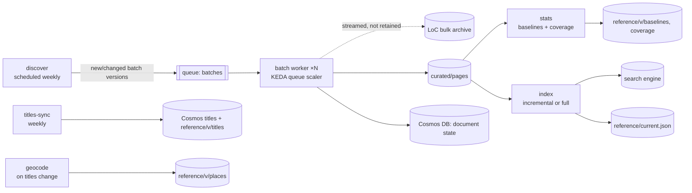

# 04: Data Sources & Ingestion

## 4.1 Source landscape (as of September 2026)

The legacy crawler targeted `chroniclingamerica.loc.gov` JSON endpoints (`/batches/…json`, `/lccn/{sn}/{date}/ed-{n}.json`, `/…/ocr.txt`, `/lccn/{sn}.json`). **Those endpoints are gone.** On **4 August 2025** the Library of Congress moved Chronicling America onto loc.gov. The legacy domain now permanently redirects there, and the collection is reachable **only through the loc.gov API**. Since then LoC has launched a **Chronicling America Datasets portal** with batch data and **bulk OCR downloads for 3,000+ batches and 23M+ pages**. It is also re-OCRing pre-2012 content with its open-source **NDNP-Open-OCR** pipeline (Tesseract with layout detection; 425k+ pages reprocessed as of August 2026).

| Source | What we take | Access pattern | Notes |
|--------|--------------|----------------|-------|
| **Chronicling America Datasets portal** (`loc.gov/collections/chronicling-america/datasets`) | Batch list and versions; **bulk OCR text** per batch | Bulk download, rate-limited (historically 10 bulk requests per 10 min per IP) | **Primary corpus source.** One archive per batch is far cheaper for LoC and for us than per-page fetches. |
| **loc.gov JSON API** (`?fo=json`) | **Title metadata** (LCCN, title, place, county, state, language, ethnicity, dates); page `resource` URLs; small top-ups | Paginated JSON; requests limited; searches over 100k results must be split by facets | Used for reference data and for reconciling page URLs. Not used to pull text for the bulk corpus. |
| **NDNP-Open-OCR outputs** | Replacement OCR for reprocessed pages | Show up as new batch versions / dataset updates | Triggers re-ingestion of affected pages (§4.7). |
| **USGS GNIS Domestic Names** (public domain) + **Census TIGER** county/state shapes | Coordinates for places of publication; county centroids as fallback; state polygons | One-time download, refreshed yearly | Replaces the legacy Google Places geocoding and its committed key. |
| **Legacy `town_ref.csv`** | 1,795 LCCN → city/state/lat/lon rows | One-time | **Cross-check only** for geocoding QA. |
| *American Stories* (Dell et al., Harvard; Hugging Face) | Article-level segmentation of ~20M scans, 438M articles, 1774–1963 | Parquet download | **Phase 3** option for article-level results and reprint detection (F-33/F-34). |
| *Mirrors* (e.g. the `biglam/chronicling-america-bulk-ocr` bucket on Hugging Face) | Same bulk OCR | S3-style bulk | Optional **backfill accelerator** to reduce load on LoC. Check provenance and checksums against LoC manifests before use. |

**Good-citizen policy:** identify ourselves with a descriptive User-Agent and contact address; prefer bulk over per-page requests; schedule off-peak; back off exponentially on 429/5xx; never parallelize beyond published limits; cache everything in our lake so we fetch each object **once**.

## 4.2 Canonical identifiers

- **Page key** (human-readable and stable): `{lccn}/{yyyy-mm-dd}/ed-{n}/seq-{n}`, e.g. `sn84026749/1896-07-10/ed-1/seq-1`. This is the same tuple the legacy code used (`sn, date, ed, seq`) and the one LoC uses for resource paths.
- **Doc id** (engine key): the page key itself, with `/` replaced by `_` (e.g. `sn84026749_1896-07-10_ed-1_seq-1`). It is **collision-free by construction**, reversible, and uses only characters valid in AI Search keys (letters, digits, `_`, `-`). A 64-bit hash was rejected: at 23M pages the chance of at least one collision is ~1.4×10⁻⁵, and a collision would silently merge two pages and break exact counts.
- **Place id**: `P` + a stable integer assigned once and never reused (e.g. `P00412`). Ids stay stable across reference snapshots; the registry is carried forward from one `reference/{index_version}/places` snapshot to the next. One place can serve many titles, since cities had several papers.
- **Index version**: `pages-v{YYYYMMDD}-{n}`. It is recorded in `reference/current.json` and appears in every API ETag.

## 4.3 Data lake layout (ADLS Gen2, one storage account)

```
raw/                                   (lean profile: NOT retained; LoC is the source of record)
  loc-api/titles/{date}/…json.zst       raw title metadata snapshots only (small)
curated/                               (Cool; the system of record; versioned + soft delete)
  pages/year={YYYY}/batch={batch}/part-{nnnn}.parquet
reference/                             (Hot; small; loaded by API; IMMUTABLE per index version)
  {index_version}/
    titles.parquet      titles.json.zst
    places.parquet      places.geojson.zst
    baselines_place_day.parquet         pages published per (place_id, date)
    baselines_title_month.parquet
    coverage_state_year.parquet
    manifest.json                       { index_version, files: [{path, sha256, bytes}], built_from: {titles_snapshot, curated_partitions} }
  overrides/places.csv                  hand-curated geocoding fixes (also in git)
  current.json                          { index_version, backend, index_name, index_uri, reference_manifest: "{index_version}/manifest.json", previous_version, published_at }
(document state, meaning per-title, per-batch, per-issue and per-index-run status, lives in Cosmos DB, not here; see 05 §5.9.1)
cache/{index_version}/                 (Hot) persistent API response cache, zstd JSON keyed by canonical-query hash
qw-index/                              (Hot; Quickwit splits + file-backed metastore)
```

### 4.3.1 Curated page schema (Parquet, zstd)

| Column | Type | Notes |
|--------|------|-------|
| `doc_id` | string | `page_key` with `/`→`_` (unique) |
| `page_key` | string | `lccn/date/ed-n/seq-n` |
| `lccn` | string | |
| `date` | date32 | Publication date. Pre-1970 dates are normal; ~1756 onward. |
| `year`, `month` | int16, int8 | Denormalized for partition pruning |
| `edition`, `seq` | int16 | |
| `front_page` | bool | `seq == 1` |

Curated rows hold only **immutable page facts**. Title-derived attributes (`place_id`, `state`, `language`) are **not stored here**. The `index` and `stats` jobs join them from the versioned titles snapshot, so a corrected title record never leaves stale copies in the system of record.
| `batch`, `batch_version` | string, int16 | Provenance |
| `ocr_source` | enum | `ndnp-original` \| `ndnp-open-ocr` |
| `text_status` | enum | `ok` \| `short` \| `empty` (§4.5) |
| `text` | large_string (nullable) | Normalized OCR text (§4.5); null unless `text_status = ok` |
| `text_chars`, `word_count` | int32 | QA and baselines |
| `text_sha256` | fixed_binary(32) | Change detection |
| `resource_url` | string | Canonical loc.gov page URL |
| `ingested_at` | timestamp | |

**Size estimate.** The legacy sample of 1879 *Daily Review* (Towanda, PA) pages averages about **10.6 KB** of OCR text per page. Later eight-column broadsheets carry 2–5× more. We plan for **20–35 KB per page average × ~23M pages ≈ 450–800 GB of raw text**, or about **150–300 GB as zstd Parquet**. This is validated in Spike S-1 ([10](10-roadmap-and-risks.md)).

## 4.4 Pipeline

All stages are subcommands of one Rust binary (`usnm-ingest`), packaged as one container image. **Weekly incremental** work runs as **Azure Container Apps Jobs**. The **initial backfill and full re-indexes** run the same image on **ACI Spot container groups** (preview) created by a launcher (see [08 §8.4](08-azure-infrastructure.md#84-compute-sizing-notes)). Work is split into **one queue message per batch version** (about 3,000 batches), so it parallelizes naturally and retries are idempotent.



| Stage | Trigger | Does | Idempotency |
|-------|---------|------|-------------|
| `discover` | Cron (weekly) + manual | Lists batches and versions from the Datasets portal; upserts `batches` items in Cosmos; enqueues work | Enqueue only if the Cosmos status ≠ curated for that version |
| `batch` | Queue | Streams the bulk OCR for the batch (checksum verified; not retained); parses per-page text; normalizes; writes curated Parquet (~256 MB row groups); updates the manifest | Claims the batch with a conditional Cosmos patch (lease + ETag); output path is deterministic per batch/version; writes to a temp path and renames; records sha256, pages and issue items in Cosmos |
| `titles-sync` | Cron (weekly) | Pulls title records from the loc.gov API; snapshots to `raw/`; builds `reference/titles` | Snapshot by date |
| `geocode` | When titles change | Resolves place of publication → GNIS feature (county-aware), else county centroid, else state centroid; applies `overrides/places.csv`; writes `reference/places` with a `precision` flag | Deterministic |
| `stats` | After batches are curated | Aggregates baselines (pages per place/day and per title/month) and coverage (state/year) from curated Parquet joined with the titles snapshot, using DataFusion or Polars. Writes a **new** `reference/{index_version}/` snapshot (never overwrites) | Full recompute (cheap: one scan of the ids and dates columns) |
| `index` | After stats, or manual | Takes the Cosmos `ops/quickwit-writer` lease (the single metastore writer). Streams curated rows with `text_status = ok` changed since the last `index_version`, joined with the titles snapshot for `place_id`/`state`/`language`. A full rebuild writes a new index. Publishes by writing `current.json` last, naming the index and its reference snapshot | Deterministic `doc_id` (the page key) makes upserts and deletes exact; delete-then-append by batch on Quickwit |

**Throughput plan for the initial backfill.** 23M pages at a conservative 2,000 pages/s per indexer is about 3.2 hours of pure indexing per indexer. In practice LoC download politeness dominates (days, not hours), which is why the curated lake matters: **after the first backfill we never re-download to re-index.** If the mirror is validated, the backfill can pull from it instead. On **ACI Spot**, 8 workers × 2 vCPU for ~4 days cost about $20–25. Evictions only delay the work, because each queue message (one batch) is idempotent and reappears after its visibility timeout.

## 4.5 Text normalization (applied at curation time)

1. Unicode NFC; strip control characters; turn the long s `ſ` into `s`; normalize ligatures (`fi` → `fi`).
2. **Rejoin line-break hyphenation**: `indus-\ntry` → `industry`, but only when the joined token is alphabetic. This substantially improves phrase recall on OCR text.
3. Collapse runs of whitespace; keep paragraph breaks as `\n`.
4. **Keep every digitized page as a curated row**, even when the normalized text is empty or shorter than 20 characters. Such rows get `text_status = empty | short` and a null `text`. They are **excluded from the search index only**; baselines and coverage count them, so relative frequencies and the "no digitized newspapers" layer stay correct. (The legacy code dropped them entirely.)
5. Keep the text case-sensitive in storage; lowercasing and ASCII folding happen in the engine's analyzer.

## 4.6 Geography

- **Unit:** a title's **place of publication**, as recorded by LoC (city, county, state). All pages of a title inherit its place. Titles that moved have date ranges for their place in `titles.places[]`; when there are more than one, the page's date selects the right one.
- **Resolution order:** (1) manual override → (2) GNIS populated place matched on normalized name + state (+ county to break ties) → (3) Census county centroid → (4) state centroid. Each place stores `precision ∈ {city, county, state}` and the UI shows lower precision with a hollow marker.
- **QA:** diff against legacy `town_ref.csv`, flag any place that is more than 25 km from the legacy coordinates for review, and have CI check that every title with pages resolves to a place.
- **Historical context:** territories (e.g. Dakota Territory, Indian Territory) keep their historical label in `titles`. Historical state and territory boundary overlays are F-32 (Phase 3).

## 4.7 Updates, reprocessing and re-indexing

| Change | Detection | Action |
|--------|-----------|--------|
| **New batch** | `discover` finds an unseen batch | Curate → incremental index (append) → recompute stats → bump `index_version` minor |
| **New batch version** (e.g. `_ver02`, or NDNP-Open-OCR reprocessing) | Version increment or dataset update | Curate the new version; pages whose `text_sha256` changed are **replaced**: AI Search upserts by `doc_id`; Quickwit runs a delete task for `batch:{batch}` followed by re-ingest. Bump `index_version`. |
| **Title metadata change** (e.g. corrected place) | `titles-sync` diff (recorded on the Cosmos `titles` item) | Build a new reference snapshot (places, baselines, coverage). Re-index the affected titles' pages, which picks up the new `place_id`/`state`/`language` via the join, then publish a new `index_version`. No re-curation is needed because curated rows carry no title-derived fields. |
| **Analyzer or schema change** | Code change | **Full rebuild** into a new index from curated Parquet, then flip `current.json` atomically. Keep the previous index for 7 days for rollback. |

The API re-reads `reference/current.json` every 10 minutes and loads the reference snapshot it names, verifying checksums. Snapshots are immutable and kept for at least the current and previous versions (7 days minimum), so **rolling back `current.json` restores the exact index + reference pair** that was published together. Because `index_version` is part of every cache key, caches never mix versions.
