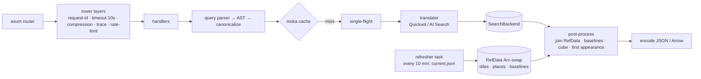

# 06: API Design (Rust)

## 6.1 Should the API be written in Rust?

### What the API actually does

1. Parses and validates a small query language into an AST, then compiles it to the backend DSL.
2. Makes one to three HTTP calls to the search engine and waits for them (I/O-bound).
3. Post-processes aggregation responses: joins with in-memory reference data (~5k titles, ~3k places, ~4M baseline rows), computes relative frequencies, first appearance and a sparse cube, and encodes JSON or Arrow. This is **CPU-bound and allocation-heavy for large results**: up to about 3,000 places × 360 buckets.
4. Caches, rate-limits and emits telemetry.

### Evaluation

| Criterion | Rust (axum) | .NET 10 (ASP.NET Core, Native AOT) | Go | Python (FastAPI) | Node/TS (Fastify) |
|-----------|-------------|-------------------------------------|----|------------------|-------------------|
| Cold start (scale-from-zero) | **~10–50 ms**, ~15 MB static image | ~50–150 ms AOT (JIT build: 0.5–1 s+) | ~20–50 ms | 1–3 s | 0.3–1 s |
| Idle memory | **~10–30 MB** | ~40–80 MB AOT | ~15–30 MB | ~80–150 MB | ~60–120 MB |
| p99 under load | Excellent (no GC) | Very good | Very good (GC pauses small) | Fair | Good |
| Aggregation post-processing | Excellent | Excellent | Very good | Poor without NumPy | Fair |
| Azure SDK maturity | **GA May 2026**: Core, Identity, Key Vault, Blob, Queues. Cosmos in beta (0.37). **No AI Search SDK**, so REST. | Best in class | Good | Excellent | Excellent |
| Search engine affinity | Quickwit and Tantivy are Rust; shared types possible | – | – | – | – |
| Maintainer pool | Smaller | Large | Large | Largest | Largest |
| Memory safety / supply chain | Excellent; `cargo-deny`, `cargo-audit` | Good | Good | Fair | Fair (npm) |

**Why cost follows from the language here:** Container Apps Consumption bills per vCPU-second and GiB-second, at an **active** rate while a replica serves requests and a much lower **idle** rate otherwise. A Rust replica that needs 0.25 vCPU / 0.5 GiB and starts in milliseconds can be the smallest billable size and scale to zero in non-production environments without users seeing a cold start. The same service on a JIT runtime would need more memory and would usually be pinned warm.

### Decision

**Yes, use Rust** for the API and the ingest CLI ([ADR-0004](adr/0004-rust-api.md)). The gaps in the Azure Rust SDK don't matter here:

- **Blob / Identity:** the API needs only Get Blob and a create-only Put Blob, so it calls the Blob REST API over `reqwest` with an Entra ID bearer token from the Container Apps managed identity endpoint (the `usnm-store` crate, ~300 lines). The GA crates (`azure_identity`, `azure_storage_blob`) remain an option if more of the API is needed. The app reaches Blob Storage through a private endpoint; account keys and SAS are never used.
- **AI Search** (if chosen): a thin REST client (~300 lines) over `reqwest`, with a bearer token from `azure_identity` (scope `https://search.azure.com/.default`). The REST API is versioned and stable.
- **Quickwit:** its REST/ES-compatible API over `reqwest`, with shared serde types.
- **Telemetry:** OpenTelemetry OTLP → **Container Apps managed OpenTelemetry agent** → Application Insights. No Azure-specific Rust exporter needed.

**The hedge:** the API is small (roughly 3–5k lines) and fully specified by an OpenAPI document and golden tests. If maintainers change and Rust becomes a barrier, rewriting it in .NET Native AOT is a bounded job of a few weeks.

## 6.2 Crates and libraries

| Concern | Choice |
|---------|--------|
| HTTP server | `axum` 0.8 + `tokio` + `tower` / `tower-http` (compression, timeouts, CORS off, request-id, trace) |
| HTTP client | `reqwest` (rustls, HTTP/2, connection pooling) |
| Serialization | `serde`, `serde_json`; **Arrow IPC** (`arrow-ipc`) for large cubes when `?format=arrow` |
| Query parsing | Handwritten recursive-descent parser (`winnow`), fuzz-tested with `cargo-fuzz` |
| Caching | `moka` (async, size-bounded, TTL) in process, plus a **persistent Blob cache** (`cache/{index_version}/`, zstd JSON) for expensive aggregates |
| Reference data | `arrow`/`parquet` readers at startup; `ahash` maps; loaded as `Arc<RefData>` and hot-swapped with `arc-swap` |
| Rate limiting | `governor` (per-client-IP token bucket, keyed on a salted hash). With no WAF on the lean profile, this and `maxReplicas: 2` are the abuse controls |
| OpenAPI | `utoipa` (types → OpenAPI 3.1); Scalar or Redoc docs served at `/v1/docs` |
| Config | `figment` (env + file); 12-factor |
| Telemetry | `tracing`, `tracing-opentelemetry`, `opentelemetry-otlp` |
| Azure | Blob REST + managed identity tokens over `reqwest` (`usnm-store`); `azure_identity` / `azure_storage_blob` if more is needed |
| Testing | `insta` (golden snapshots), `wiremock` (backend fakes), `proptest` (parser), `testcontainers` (Quickwit) |
| Lint / supply chain | `clippy -D warnings`, `rustfmt`, `cargo-deny` (licenses/advisories), `cargo-audit`, SBOM via `cargo-cyclonedx` |

## 6.3 API contract (v1)

Principles:

- **All reads are GET** with canonical query strings, so browsers (and any future CDN) can cache them. The one POST, `/v1/beacon`, takes the site's page views and changes nothing the API serves (§6.3.7).
- **Base URL:** `https://api.usnewsmap.com/v1/…`. The site calls the same routes on its own origin (`https://usnewsmap.com/v1/…`), because the API app serves it ([ADR-0010](adr/0010-site-served-by-the-api.md)). The routes are also mounted at `/api/v1/…` for clients of that earlier prefix.
- **Responses are immutable per `index_version`.**
- **No cookies and no sessions.**
- **Public, read-only.** Anonymous use is limited by rate; researchers can get a higher-limit key later.

### 6.3.1 Common query parameters

| Param | Type | Example | Notes |
|-------|------|---------|-------|
| `q` | string (≤ 256 chars) | `"cross of gold"` | Parsed per §6.4 |
| `mode` | enum `phrase\|all\|any\|near` | `phrase` | Default `phrase` if quoted, else `all` |
| `near` | int 1–20 | `5` | Used when `mode=near` |
| `fuzzy` | int 0–2 | `1` | OCR tolerance |
| `from`, `to` | ISO date | `1896-06-01` | Clamped to the corpus bounds |
| `state` | CSV of USPS codes | `GA,SC` | |
| `lccn` | CSV | `sn84026749` | |
| `lang` | CSV ISO 639-2 | `eng,ger` | |
| `front` | bool | `true` | Front pages only |
| `bucket` | enum `auto\|year\|month\|week\|day` | `week` | See [05 §5.7](05-search-and-storage.md#57-aggregation-strategy) |

The API **canonicalizes** parameters (sorted, defaults made explicit, dates normalized) and returns `Content-Location` with the canonical URL. The SPA always requests canonical URLs so the cache hit rate is as high as possible.

### 6.3.2 Endpoints

| Method & path | Purpose | Cache |
|---------------|---------|-------|
| `GET /v1/meta` | `index_version`, corpus bounds, doc count, backend capabilities, build time | 5 min |
| `GET /v1/aggregate` | Q1: totals, national series, per-place cube, first appearance | 1 day (+ `index_version`) |
| `GET /v1/hits` | Q2: page hits for `place` or `lccn`, sorted by date, with snippets; cursor pagination | 1 day |
| `GET /v1/compare` | Up to 4 queries (`q1…q4`); national series for each + per-place totals (no cube) | 1 day |
| `GET /v1/pages/{doc_id}` | Page metadata + LoC links | 30 days |
| `GET /v1/titles`, `GET /v1/titles/{lccn}` | Title metadata + coverage summary | 1 day |
| `GET /v1/places` | All places (GeoJSON) with precision and title counts | 1 day |
| `GET /v1/coverage?from&to&bucket` | Pages published per state/place per bucket (the "no data" layer) | 1 day |
| `GET /v1/export/aggregate.csv` | Same as `/aggregate` as tidy CSV (`place_id,lat,lon,bucket_start,hits,baseline,rel`) | 1 day |
| `GET /v1/export/hits.csv` | Hits (≤ 10,000 rows) with page keys and LoC URLs | 1 day |
| `GET /v1/docs`, `GET /v1/openapi.json` | API documentation | 1 day |
| `GET /v1/status` | Pipeline status for the public `/status` page: backfill, indexing, titles catalog (§6.3.6) | 30 s |
| `POST /v1/beacon` | One page view from the site, forwarded to Application Insights; answers 204 (§6.3.7) | none |
| `GET /healthz`, `GET /readyz` | Liveness; readiness (reference data loaded, backend reachable, and after a start the cache warm-up finished or its 2-minute cap passed, §6.6) | none |

### 6.3.3 `GET /v1/aggregate` response

```jsonc
{
  "index_version": "pages-v20261001-1",
  "query": { "canonical": "q=%22cross+of+gold%22&mode=phrase&from=1896-06-01&to=1896-12-31&bucket=week", "ast": "…" },
  "bucket": { "unit": "week", "origin": "1896-06-01", "count": 31 },
  "total": { "hits": 18234, "places": 1187, "titles": 1402, "baseline_pages": 912345 },
  "series": {                      // national, one entry per bucket (dense)
    "hits":     [12, 40, 3871, 2210, …],
    "baseline": [28011, 28190, 28877, …]
  },
  "places": {                      // columnar arrays, one entry per place with ≥1 hit
    "id":    ["P00412", "P00087", …],
    "hits":  [612, 598, …],
    "first_day": [71990, 71991, …]   // days since 1700-01-01
  },
  "cube": {                        // sparse COO triplets: (place index, bucket index, hits)
    "p": [0, 0, 1, …],
    "b": [4, 5, 4, …],
    "h": [120, 88, 97, …],
    "baseline_ref": "/v1/coverage?from=1896-06-01&to=1896-12-31&bucket=week&v=pages-v20261001-1"
  },
  "truncated": false,
  "timing_ms": { "backend": 412, "total": 455 }
}
```

- Place coordinates and names are **not** repeated here. The SPA loads `/v1/places` once (CDN-cached, ~150 KB compressed) and joins by id.
- The cube is sparse, so size scales with non-zero cells. The worst realistic case (a common term, ~3,000 places × 211 yearly buckets) is about **633k triplets**: ~9–10 MB of JSON (~2–3 MB gzip) or ~5 MB as Arrow (~1.5–2.5 MB compressed). Above a hard cap of 700k cells, the API steps to a coarser bucket. Large cubes are computed as sharded sub-queries so they stay within the engine's bucket limit ([05 §5.7](05-search-and-storage.md#57-aggregation-strategy)). The SPA requests Arrow when the expected cube is large. `?format=arrow` returns `application/vnd.apache.arrow.stream`.

### 6.3.4 `GET /v1/hits` response

```jsonc
{
  "index_version": "pages-v20261001-1",
  "place": { "id": "P00412", "name": "Chicago", "state": "IL" },
  "total": 612,
  "items": [
    {
      "doc_id": "sn84031492_1896-07-10_ed-1_seq-1",
      "date": "1896-07-10",
      "lccn": "sn84031492",
      "title": "The Chicago Eagle",
      "edition": 1, "seq": 1, "front_page": true,
      "snippets": ["…you shall not crucify mankind upon a <mark>cross of gold</mark>…"],
      "links": {
        "viewer": "https://www.loc.gov/resource/sn84031492/1896-07-10/ed-1/?sp=1&q=cross+of+gold",
        "pdf": "…",                   // from curated resource metadata when available
        "ocr_text": "…"
      }
    }
  ],
  "next_cursor": "eyJkIjo3MTk5NSwiaWQiOiJzbjg0MDMxNDkyXzE4OTYtMDctMTBfZWQtMV9zZXEtMSJ9"   // opaque (date, doc_id) search_after
}
```

Snippets are HTML-escaped server-side, and only `<mark>` is allowed. LoC viewer URLs follow the loc.gov resource pattern. The legacy `chroniclingamerica.loc.gov/lccn/…` form is kept only as a fallback, because LoC redirects it.

### 6.3.5 Errors

This is RFC 9457 `application/problem+json`, with `type` values such as `/errors/query-syntax`, `/errors/query-too-broad`, `/errors/rate-limited`, `/errors/backend-timeout`, plus a `hint` field. Syntax errors return **400** with a caret position, broad queries **422**, backend timeouts **503** with `Retry-After`, and rate limits **429**. `POST /v1/beacon` adds `/errors/bad-beacon` (**400**), `/errors/too-large` (**413**) and `/errors/unsupported-media-type` (**415**).

### 6.3.6 `GET /v1/status`

The data behind the public status page (`/status` on the site). No sign-in, like every other route, and it goes through the same rate limiter. The response is JSON with `schema: 1`:

| Field | From | Contents |
|-------|------|----------|
| `generated_at`, `stale`, `error`, `pipeline` | the API | When the document was built; `stale: true` with a sanitized `error` if the latest read of the pipeline state failed and an earlier reading is shown; `pipeline.read_at` is when that reading was taken |
| `published` | the reference data the API serves | Version, `published_at`, pages, titles, places, bounds, the index set (base + deltas, `deltas` of `max_deltas` = 8) and, when the snapshot manifest records it, the number of batches |
| `backfill` | Cosmos `batches`, `ops/loc-bulk-pacer` | Batches by status, in progress (live lease) and stopped (expired lease), retrying, percent curated, pages curated; batches curated per hour for 48 h, the rate over the last 12 h and an ETA; whether LoC downloads are throttled and until when; batches in progress, failed (up to 100) and the 20 most recently curated |
| `indexing` | Cosmos `index_runs`, `ops/current`, `ops/quickwit-writer`, `ops/release-progress` | The 20 most recent index runs (version, full or delta, status, batches, docs, pages, start, publish, duration, sanitized error), the writer lock, and a running release's progress (docs sent of expected, MB sent), which the release writes every 30 s |
| `titles` | `catalog/titles.json`, `catalog/places.json`, Cosmos `batches`, the snapshot manifest | Catalog size; titles in curated batches that the catalog lacks (they wait for `titles-sync`) and the batches held back for them; curated batches not yet published, and how many of those the next release can take |

Sections that need Cosmos are `{"available": false, "reason": …}` when the API has no pipeline state configured (the fixtures, CI, local development without `USNM_STATE_FILE`) or its first read fails; `published` always works.

**Cost and caching.** Each API replica recomputes the document at most once per 60 s (`USNM_STATUS_REFRESH_SECS`), whatever the traffic; with the production cap of 2 replicas, that is at most two refreshes a minute. Concurrent requests share one computation, and a request that arrives during a refresh gets the previous document instead of waiting. Each refresh runs three Cosmos queries, one per container, projecting only the fields shown (never a batch's part list or a run's batch list), and logs the request units they cost. The client retries 429s for 10 s at most, and a refresh that takes over 20 s counts as failed. Browsers may cache the response for 30 s (`Cache-Control: public, max-age=30`).

**What it never shows.** Worker ids appear only as their last six characters. Error text is sanitized before it leaves the API: URLs other than `loc.gov` ones, Azure hostnames, this deployment's resource names, IP addresses, GUIDs, email addresses and worker ids are replaced with placeholders, and each error is cut to 200 characters. There is no query text in it, because the pipeline has none.

### 6.3.7 `POST /v1/beacon`

The site's page views (07 §7.8). The browser can't send to Application Insights itself: the component has local auth disabled and accepts only Entra tokens (ADR-0009). So the site posts each page view here, and the API forwards it with its own managed identity, the same way it sends its traces and metrics (`crates/usnm-telemetry/src/pageviews.rs`). The route goes through the same per-client rate limiter as the others (§6.2) and answers **204** with `Cache-Control: no-store`.

**Request.** `Content-Type` is `text/plain` (what `navigator.sendBeacon` sends for a string) or `application/json`; anything else is **415**. The body is at most 2,048 bytes (**413** over that, whether or not `Content-Length` says so) and is one JSON object:

| Field | Required | Rule |
|-------|----------|------|
| `route` | yes | One of the app's page names (`web/src/route.ts`): `search`, `status`, `privacy`, `not-found`. Never a path |
| `title` | no | At most 100 characters, no control characters |
| `referrer_origin` | no | Empty (sent as `direct`), `internal`, or an http(s) origin: scheme, host and optional port, lowercased, at most 253 characters. A path, query, fragment or user part is refused. The site's own host and its subdomains become `internal` |
| `utm_source`, `utm_medium`, `utm_campaign` | no | Lowercased, at most 64 characters, no control characters; empty ones are dropped |

Any other field, a duplicate field, or a body that isn't an object is **400** `/errors/bad-beacon`. A page view can't carry a search because there is no field for the query or the page's address. A test posts search text every way it could be smuggled in and checks it is refused and never exported (`crates/usnm-api/tests/beacon.rs`).

**Not forwarded** (still 204): a request with `DNT: 1` or `Sec-GPC: 1`; an `Origin` that isn't the site (`https://{USNM_SITE_HOST}` or `USNM_ALLOWED_ORIGINS`); a user agent that is empty, doesn't start with `Mozilla/`, or names a crawler, link preview, monitor, script library or headless browser; and every page view when Application Insights isn't configured. Each outcome is counted in `api.beacons` (08 §8.1.2).

**Forwarded** as one `Microsoft.ApplicationInsights.PageView` envelope (`AppPageViews`), batched for up to 5 s or 100 page views:

| Envelope field | Value |
|----------------|-------|
| `name` | The route |
| `url` | `https://{USNM_SITE_HOST}` plus the route's path (`/`, `/status`, `/privacy`); none for `not-found` |
| `properties` | `referrer_origin` (`direct`, `internal` or the origin), `utm_*` when present, `title` when present, `device_type` (`desktop`, `mobile` or `tablet`) and `browser` (`Chrome`, `Safari`, `Firefox`, `Edge`, `Opera`, `Samsung Internet` or `Other`), both worked out from `User-Agent` in the API |
| `tags` | `ai.cloud.role: usnm-web`, `ai.internal.sdkVersion`, and `ai.location.ip`: the client address, taken from `X-Forwarded-For` as the rate limiter takes it |

Ingestion derives the city, region and country from `ai.location.ip` and stores `0.0.0.0` in `ClientIP`, because the component keeps IP masking on (`DisableIpMasking: false`). The address goes nowhere else, neither into `properties` nor into the API's logs, and the raw user agent is neither forwarded nor logged. Nothing from the body is logged; a failed upload is logged as a count only.

## 6.4 Query language and validation

```
query     := or_expr
or_expr   := and_expr ( "OR" and_expr )*
and_expr  := unary ( ["AND"] unary )*
unary     := "-" primary | primary
primary   := PHRASE [ "~" INT ]
           | TERM [ "~" ("1" | "2") | "*" ]     (* fuzzy distance OR prefix, never both; prefix needs ≥ 3 chars *)
           | "(" query ")"
PHRASE    := '"' TERM ( TERM )* '"'
TERM      := letter ( letter | digit | "'" )*
```

- **Limits:** ≤ 12 terms, ≤ 4 OR branches, prefix length ≥ 3, fuzzy distance ≤ 2, slop ≤ 20, no leading wildcards, no field syntax (`field:`), and no engine local-params. This removes the legacy Solr injection risk structurally, because only the AST reaches the translator.
- **UI modes** (`mode=phrase|all|any|near`) are sugar that builds the same AST.
- **Normalization** mirrors the index analyzer (lowercase, ASCII fold, `ſ`→`s`), so the query and the index agree.
- The parser is property-tested (`proptest`) and fuzzed in CI.

## 6.5 Caching

The lean profile has no edge CDN in front of the API, so the API caches in three layers:

| Layer | Key | TTL | Notes |
|-------|-----|-----|-------|
| Browser | URL | `max-age=86400` + `ETag` for versioned URLs; `max-age=300` for unversioned | URLs carry `v={index_version}` and the API rejects mismatched `v` (see below), so versioned URLs are immutable |
| API in-process (moka) | `(index_version, canonical query)` | 24 h, size-bounded (~256 MB) | Coalesces concurrent identical requests (single-flight) |
| **API persistent (Blob)** | `cache/{index_version}/{sha256(canonical)}.json.zst` | Lifetime of the index version | Written for responses that took over 500 ms to compute. Read-through on moka misses (~20–60 ms). Survives restarts and scale-to-zero in dev. Old version prefixes are deleted by lifecycle rule after 14 days |
| *(Growth profile)* Front Door | Canonical URL | `s-maxage=86400` | No purges needed because URLs change with `index_version` |

**Version rollover.** Responses carry `ETag: "{index_version}:{hash}"`, and every URL a response links to (such as `baseline_ref`) carries the same `v`. The SPA fetches `/v1/meta` (5-minute TTL) at startup and appends `&v={index_version}` to API requests.

**`v` is validated, never ignored.** The API only answers a request whose `v` names the version it is serving:

- `v` = current version → normal response, cacheable (`max-age=86400`).
- `v` missing → served from the current version with `Cache-Control: max-age=300` and a `Content-Location` naming the versioned URL.
- `v` ≠ current (stale tab, old link, or a rollback) → **`307` redirect** to the same canonical query with the current `v`, marked `Cache-Control: no-store`. The SPA then refreshes `/v1/meta` and its other version-scoped data. A stale URL is therefore never answered with, or cached as, data from a different snapshot.
- The Blob cache is keyed by the **serving** version (`cache/{index_version}/…`), so its entries can't cross versions either.
- Each version names an immutable set of sealed Quickwit indexes, and the API queries exactly that set ([08 §8.4.1](08-azure-infrastructure.md#841-quickwit-metastore-one-writer-many-readers)). The results for a given `v` therefore can't change while it's being served.

**Pre-warming.** Before a replica serves a version, at start and before a reload swaps one in, the API warms its caches with what the home page loads first: `/v1/places`, and each example search in `web/src/examples.json` (the web app's example list, compiled into the API) with the coverage cube its response links to. The requests go through the same handlers as a visitor's, pinned to the new version, so the in-process and Blob entries have the keys the web app will ask for. They skip the Blob read so that Quickwit's caches warm too, and slow results are still written to Blob for replicas that start later. Queries run one at a time, each allowed 60 s (`USNM_PREWARM_QUERY_SECS`; Quickwit's own 30 s limit per call still applies), within 5 minutes for the run (`USNM_PREWARM_BUDGET_SECS`). A warm-up that fails or runs out of time is logged and never blocks the version. A visitor whose request matches a warm-up query still running shares its result but waits no longer than a visitor's own limit: the request timeout plus 2 s for a Blob cache read. Warming the most frequent recent queries is not built yet. Index versions are published at most **weekly** to keep the cache hit rate high.

## 6.6 Service internals



- **Startup:** read `reference/current.json`, load the reference data, start listening, and warm the caches (§6.5). `/readyz` fails until the warm-up ends or 2 minutes pass (`USNM_READY_CAP_SECS`), whichever is first; past the cap the replica reports ready (and logs that) while the warm-up continues. The container's startup probe allows 480 s for loading and warming.
- **Hot reload:** a background task polls `current.json` every 10 minutes. When `index_version` changes, it loads the new reference data into a fresh snapshot, warms the caches for it (§6.5) while the old version keeps serving, then swaps it in atomically. In-flight requests finish on the old snapshot.
- **Concurrency:** one tokio runtime; each request fans out to at most 3 concurrent backend calls; a global semaphore caps backend concurrency so a spike can't overwhelm the searcher.
- **Resources:** the `api` container is 0.25 vCPU / 0.5 GiB, sharing a replica with the `quickwit` sidecar (1 vCPU / 2 GiB) and reaching it on `localhost`. KEDA HTTP scaler on concurrent requests; min 1 / max 2 replicas in production, min 0 elsewhere.

## 6.7 Testing strategy

| Level | What |
|-------|------|
| Unit | Parser (proptest + fuzz), translators (golden `insta` snapshots per backend), normalization math, cube encoding |
| Contract | OpenAPI checked against handler types in CI (`utoipa`); SPA TypeScript types generated from `openapi.json` |
| Integration | `testcontainers` Quickwit + a 10k-page fixture corpus: count correctness against a brute-force DataFusion scan |
| Load | k6 scripts with the benchmark query set against staging; publish p95/p99 in the PR |
| Synthetic | App Insights availability tests on `/readyz` and an example search, every 5 minutes from 3 regions |

## 6.8 Search log

Every search a visitor runs on the site is kept, indefinitely and without anything that identifies or links a person ([ADR-0012](adr/0012-anonymous-search-log.md)). As built in `crates/usnm-api/src/searchlog.rs`:

- **Where it's counted.** `/v1/aggregate`, which the site requests once per search, records a search when it answers 200, whether the body came from a cache or was computed. The coverage and hits requests that follow aren't counted, nor are errors, `v` redirects (the redirected request counts), health probes or the cache warm-up (§6.5), which calls the handler code without the recording step.
- **Not recorded:** `DNT: 1` or `Sec-GPC: 1`; a user agent the page-view check (§6.3.7) calls a crawler, script or headless browser; and a request not from the site's own pages: an `Origin` other than `https://{USNM_SITE_HOST}`, a `Sec-Fetch-Site` other than `same-origin`, or neither header. Each outcome is counted in `api.search_log` (08 §8.1.2).
- **The record** is one JSON line, and nothing else is stored with it:

  ```json
  {"v":1,"day":"2026-09-29","source":"api","q":"Cross of Gold","query":"\"cross of gold\"","mode":"phrase","near":null,"fuzzy":0,"from":"1896-06-01","to":"1896-12-31","state":["GA","SC"],"lccn":[],"lang":[],"front":false,"bucket":"week","pages":1234,"index_version":"pages-v20260929-3"}
  ```

  `q` is the text as submitted, trimmed, with whitespace and control characters folded to single spaces and at most 256 characters; `query` is the canonical query (§6.3.1) the search ran; `from` and `to` are after clamping to the corpus; `pages` is `total.hits`; `day` is the UTC day, the only time kept. Imports (below) have `"source":"import"`, the canonical query as `q`, and `null` for `mode`, `pages` and `index_version`.
- **Writing.** The handler queues the record without waiting (1,024 slots; a full queue drops it). A background task writes each day's records, shuffled, as one new blob, `staging/{day}/{32 random hex digits}.jsonl`, created with `If-None-Match: *`, every 5 minutes (`USNM_SEARCH_LOG_FLUSH_SECS`), when 2,000 are waiting, and at shutdown (at most 10 s after the requests drain). A failed write is retried at the next flush under the same name, so a write that succeeded without the API seeing the response is stored once; at most 20,000 records wait. Records for a day that aren't staged 45 minutes after it ends are dropped and counted as lost. An hour after each UTC day ends, a replica lists that day's batches, shuffles all of their lines together and writes `days/{day}.jsonl` create-only; whichever replica gets there first writes it. Staged batches expire 7 days after they're written. `USNM_SEARCH_LOG_URL` names the container (`https://{account}.blob.core.windows.net/searches`); unset, nothing is recorded.
- **Logging.** Neither the queue nor the writer logs search text. A failed write logs `search log write failed` with the error (the blob path and HTTP status) and the number of records; a failed day file logs the day.
- **Reading.** `scripts/searches.sh <env> [days]` (09 §9.4.2). `scripts/import-search-log.py <env>` imports the searches that were in the Quickwit log before this existed.
