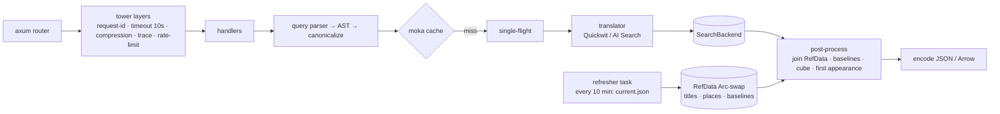

# 06: API Design (Rust)

## 6.1 Should the API be written in Rust?

### What the API actually does

1. Parses and validates a small query language into an AST, then compiles it to the backend DSL.
2. Makes one to three HTTP calls to the search engine and waits for them (I/O-bound).
3. Post-processes aggregation responses: joins with in-memory reference data (~5k titles, ~3k places, ~4M baseline rows), computes relative frequencies, first appearance and a sparse cube, and encodes JSON or Arrow. This is **CPU-bound and allocation-heavy for large results**: up to about 3,000 places × 360 buckets.
4. Caches, rate-limits and emits telemetry.

### Evaluation

| Criterion | Rust (axum) | .NET 10 (ASP.NET Core, Native AOT) | Go | Python (FastAPI) | Node/TS (Fastify) |
|-----------|-------------|-------------------------------------|----|------------------|-------------------|
| Cold start (scale-from-zero) | **~10–50 ms**, ~15 MB static image | ~50–150 ms AOT (JIT build: 0.5–1 s+) | ~20–50 ms | 1–3 s | 0.3–1 s |
| Idle memory | **~10–30 MB** | ~40–80 MB AOT | ~15–30 MB | ~80–150 MB | ~60–120 MB |
| p99 under load | Excellent (no GC) | Very good | Very good (GC pauses small) | Fair | Good |
| Aggregation post-processing | Excellent | Excellent | Very good | Poor without NumPy | Fair |
| Azure SDK maturity | **GA May 2026**: Core, Identity, Key Vault, Blob, Queues. Cosmos in beta (0.37). **No AI Search SDK**, so REST. | Best in class | Good | Excellent | Excellent |
| Search engine affinity | Quickwit and Tantivy are Rust; shared types possible | – | – | – | – |
| Maintainer pool | Smaller | Large | Large | Largest | Largest |
| Memory safety / supply chain | Excellent; `cargo-deny`, `cargo-audit` | Good | Good | Fair | Fair (npm) |

**Why cost follows from the language here:** Container Apps Consumption bills per vCPU-second and GiB-second, at an **active** rate while a replica serves requests and a much lower **idle** rate otherwise. A Rust replica that needs 0.25 vCPU / 0.5 GiB and starts in milliseconds can be the smallest billable size and scale to zero in non-production environments without users seeing a cold start. The same service on a JIT runtime would need more memory and would usually be pinned warm.

### Decision

**Yes, use Rust** for the API and the ingest CLI ([ADR-0004](adr/0004-rust-api.md)). The gaps in the Azure Rust SDK don't matter here:

- **Blob / Identity:** GA crates (`azure_identity`, `azure_storage_blob`). The app reaches Blob Storage through a private endpoint using its managed identity.
- **AI Search** (if chosen): a thin REST client (~300 lines) over `reqwest`, with a bearer token from `azure_identity` (scope `https://search.azure.com/.default`). The REST API is versioned and stable.
- **Quickwit:** its REST/ES-compatible API over `reqwest`, with shared serde types.
- **Telemetry:** OpenTelemetry OTLP → **Container Apps managed OpenTelemetry agent** → Application Insights. No Azure-specific Rust exporter needed.

**The hedge:** the API is small (roughly 3–5k lines) and fully specified by an OpenAPI document and golden tests. If maintainers change and Rust becomes a barrier, rewriting it in .NET Native AOT is a bounded job of a few weeks.

## 6.2 Crates and libraries

| Concern | Choice |
|---------|--------|
| HTTP server | `axum` 0.8 + `tokio` + `tower` / `tower-http` (compression, timeouts, CORS off, request-id, trace) |
| HTTP client | `reqwest` (rustls, HTTP/2, connection pooling) |
| Serialization | `serde`, `serde_json`; **Arrow IPC** (`arrow-ipc`) for large cubes when `?format=arrow` |
| Query parsing | Handwritten recursive-descent parser (`winnow`), fuzz-tested with `cargo-fuzz` |
| Caching | `moka` (async, size-bounded, TTL) in process, plus a **persistent Blob cache** (`cache/{index_version}/`, zstd JSON) for expensive aggregates |
| Reference data | `arrow`/`parquet` readers at startup; `ahash` maps; loaded as `Arc<RefData>` and hot-swapped with `arc-swap` |
| Rate limiting | `governor` (per-client-IP token bucket, keyed on a salted hash). With no WAF on the lean profile, this and `maxReplicas: 2` are the abuse controls |
| OpenAPI | `utoipa` (types → OpenAPI 3.1); Scalar or Redoc docs served at `/v1/docs` |
| Config | `figment` (env + file); 12-factor |
| Telemetry | `tracing`, `tracing-opentelemetry`, `opentelemetry-otlp` |
| Azure | `azure_identity`, `azure_storage_blob` |
| Testing | `insta` (golden snapshots), `wiremock` (backend fakes), `proptest` (parser), `testcontainers` (Quickwit) |
| Lint / supply chain | `clippy -D warnings`, `rustfmt`, `cargo-deny` (licenses/advisories), `cargo-audit`, SBOM via `cargo-cyclonedx` |

## 6.3 API contract (v1)

Principles:

- **All reads are GET** with canonical query strings, so browsers (and any future CDN) can cache them.
- **Base URL:** `https://api.usnewsmap.com/v1/…`. The same routes are also mounted at `/api/v1/…`, so that linking the app to SWA Standard (same-origin `/api/*`) works without code changes.
- **Responses are immutable per `index_version`.**
- **No cookies and no sessions.**
- **Public, read-only.** Anonymous use is limited by rate; researchers can get a higher-limit key later.

### 6.3.1 Common query parameters

| Param | Type | Example | Notes |
|-------|------|---------|-------|
| `q` | string (≤ 256 chars) | `"cross of gold"` | Parsed per §6.4 |
| `mode` | enum `phrase\|all\|any\|near` | `phrase` | Default `phrase` if quoted, else `all` |
| `near` | int 1–20 | `5` | Used when `mode=near` |
| `fuzzy` | int 0–2 | `1` | OCR tolerance |
| `from`, `to` | ISO date | `1896-06-01` | Clamped to the corpus bounds |
| `state` | CSV of USPS codes | `GA,SC` | |
| `lccn` | CSV | `sn84026749` | |
| `lang` | CSV ISO 639-2 | `eng,ger` | |
| `front` | bool | `true` | Front pages only |
| `bucket` | enum `auto\|year\|month\|week\|day` | `week` | See [05 §5.7](05-search-and-storage.md#57-aggregation-strategy) |

The API **canonicalizes** parameters (sorted, defaults made explicit, dates normalized) and returns `Content-Location` with the canonical URL. The SPA always requests canonical URLs so the cache hit rate is as high as possible.

### 6.3.2 Endpoints

| Method & path | Purpose | Cache |
|---------------|---------|-------|
| `GET /v1/meta` | `index_version`, corpus bounds, doc count, backend capabilities, build time | 5 min |
| `GET /v1/aggregate` | Q1: totals, national series, per-place cube, first appearance | 1 day (+ `index_version`) |
| `GET /v1/hits` | Q2: page hits for `place` or `lccn`, sorted by date, with snippets; cursor pagination | 1 day |
| `GET /v1/compare` | Up to 4 queries (`q1…q4`); national series for each + per-place totals (no cube) | 1 day |
| `GET /v1/pages/{doc_id}` | Page metadata + LoC links | 30 days |
| `GET /v1/titles`, `GET /v1/titles/{lccn}` | Title metadata + coverage summary | 1 day |
| `GET /v1/places` | All places (GeoJSON) with precision and title counts | 1 day |
| `GET /v1/coverage?from&to&bucket` | Pages published per state/place per bucket (the "no data" layer) | 1 day |
| `GET /v1/export/aggregate.csv` | Same as `/aggregate` as tidy CSV (`place_id,lat,lon,bucket_start,hits,baseline,rel`) | 1 day |
| `GET /v1/export/hits.csv` | Hits (≤ 10,000 rows) with page keys and LoC URLs | 1 day |
| `GET /v1/docs`, `GET /v1/openapi.json` | API documentation | 1 day |
| `GET /healthz`, `GET /readyz` | Liveness; readiness (reference data loaded, backend reachable) | none |

### 6.3.3 `GET /v1/aggregate` response

```jsonc
{
  "index_version": "pages-v20261001-1",
  "query": { "canonical": "q=%22cross+of+gold%22&mode=phrase&from=1896-06-01&to=1896-12-31&bucket=week", "ast": "…" },
  "bucket": { "unit": "week", "origin": "1896-06-01", "count": 31 },
  "total": { "hits": 18234, "places": 1187, "titles": 1402, "baseline_pages": 912345 },
  "series": {                      // national, one entry per bucket (dense)
    "hits":     [12, 40, 3871, 2210, …],
    "baseline": [28011, 28190, 28877, …]
  },
  "places": {                      // columnar arrays, one entry per place with ≥1 hit
    "id":    ["P00412", "P00087", …],
    "hits":  [612, 598, …],
    "first_day": [71990, 71991, …]   // days since 1700-01-01
  },
  "cube": {                        // sparse COO triplets: (place index, bucket index, hits)
    "p": [0, 0, 1, …],
    "b": [4, 5, 4, …],
    "h": [120, 88, 97, …],
    "baseline_ref": "/v1/coverage?from=1896-06-01&to=1896-12-31&bucket=week&v=pages-v20261001-1"
  },
  "truncated": false,
  "timing_ms": { "backend": 412, "total": 455 }
}
```

- Place coordinates and names are **not** repeated here. The SPA loads `/v1/places` once (CDN-cached, ~150 KB compressed) and joins by id.
- The cube is sparse, so size scales with non-zero cells. The worst realistic case (a common term, ~3,000 places × 211 yearly buckets) is about **633k triplets**: ~9–10 MB of JSON (~2–3 MB gzip) or ~5 MB as Arrow (~1.5–2.5 MB compressed). Above a hard cap of 700k cells, the API steps to a coarser bucket. The SPA requests Arrow when the expected cube is large. `?format=arrow` returns `application/vnd.apache.arrow.stream`.

### 6.3.4 `GET /v1/hits` response

```jsonc
{
  "index_version": "pages-v20261001-1",
  "place": { "id": "P00412", "name": "Chicago", "state": "IL" },
  "total": 612,
  "items": [
    {
      "doc_id": "sn84031492_1896-07-10_ed-1_seq-1",
      "date": "1896-07-10",
      "lccn": "sn84031492",
      "title": "The Chicago Eagle",
      "edition": 1, "seq": 1, "front_page": true,
      "snippets": ["…you shall not crucify mankind upon a <mark>cross of gold</mark>…"],
      "links": {
        "viewer": "https://www.loc.gov/resource/sn84031492/1896-07-10/ed-1/?sp=1&q=cross+of+gold",
        "pdf": "…",                   // from curated resource metadata when available
        "ocr_text": "…"
      }
    }
  ],
  "next_cursor": "eyJkIjo3MTk5NSwiaWQiOiJzbjg0MDMxNDkyXzE4OTYtMDctMTBfZWQtMV9zZXEtMSJ9"   // opaque (date, doc_id) search_after
}
```

Snippets are HTML-escaped server-side, and only `<mark>` is allowed. LoC viewer URLs follow the loc.gov resource pattern. The legacy `chroniclingamerica.loc.gov/lccn/…` form is kept only as a fallback, because LoC redirects it.

### 6.3.5 Errors

This is RFC 9457 `application/problem+json`, with `type` values such as `/errors/query-syntax`, `/errors/query-too-broad`, `/errors/rate-limited`, `/errors/backend-timeout`, plus a `hint` field. Syntax errors return **400** with a caret position, broad queries **422**, backend timeouts **503** with `Retry-After`, and rate limits **429**.

## 6.4 Query language and validation

```
query     := or_expr
or_expr   := and_expr ( "OR" and_expr )*
and_expr  := unary ( ["AND"] unary )*
unary     := "-" primary | primary
primary   := PHRASE [ "~" INT ]
           | TERM [ "~" ("1" | "2") | "*" ]     (* fuzzy distance OR prefix, never both; prefix needs ≥ 3 chars *)
           | "(" query ")"
PHRASE    := '"' TERM ( TERM )* '"'
TERM      := letter ( letter | digit | "'" )*
```

- **Limits:** ≤ 12 terms, ≤ 4 OR branches, prefix length ≥ 3, fuzzy distance ≤ 2, slop ≤ 20, no leading wildcards, no field syntax (`field:`), and no engine local-params. This removes the legacy Solr injection risk structurally, because only the AST reaches the translator.
- **UI modes** (`mode=phrase|all|any|near`) are sugar that builds the same AST.
- **Normalization** mirrors the index analyzer (lowercase, ASCII fold, `ſ`→`s`), so the query and the index agree.
- The parser is property-tested (`proptest`) and fuzzed in CI.

## 6.5 Caching

The lean profile has no edge CDN in front of the API, so the API caches in three layers:

| Layer | Key | TTL | Notes |
|-------|-----|-----|-------|
| Browser | URL | `max-age=86400` + `ETag` for versioned URLs; `max-age=300` for unversioned | URLs carry `v={index_version}` and the API rejects mismatched `v` (see below), so versioned URLs are immutable |
| API in-process (moka) | `(index_version, canonical query)` | 24 h, size-bounded (~256 MB) | Coalesces concurrent identical requests (single-flight) |
| **API persistent (Blob)** | `cache/{index_version}/{sha256(canonical)}.json.zst` | Lifetime of the index version | Written for responses that took over 500 ms to compute. Read-through on moka misses (~20–60 ms). Survives restarts and scale-to-zero in dev. Old version prefixes are deleted by lifecycle rule after 14 days |
| *(Growth profile)* Front Door | Canonical URL | `s-maxage=86400` | No purges needed because URLs change with `index_version` |

**Version rollover.** Responses carry `ETag: "{index_version}:{hash}"`, and every URL a response links to (such as `baseline_ref`) carries the same `v`. The SPA fetches `/v1/meta` (5-minute TTL) at startup and appends `&v={index_version}` to API requests.

**`v` is validated, never ignored.** The API only answers a request whose `v` names the version it is serving:

- `v` = current version → normal response, cacheable (`max-age=86400`).
- `v` missing → served from the current version with `Cache-Control: max-age=300` and a `Content-Location` naming the versioned URL.
- `v` ≠ current (stale tab, old link, or a rollback) → **`307` redirect** to the same canonical query with the current `v`, marked `Cache-Control: no-store`. The SPA then refreshes `/v1/meta` and its other version-scoped data. A stale URL is therefore never answered with, or cached as, data from a different snapshot.
- The Blob cache is keyed by the **serving** version (`cache/{index_version}/…`), so its entries can't cross versions either.

**Pre-warming.** After each index publish, a job requests the example searches and the top 200 queries from the previous 30 days (from aggregated, anonymous telemetry). The results land in the Blob cache, so they are warm even after a replica restart. Index versions are published at most **weekly** to keep the cache hit rate high.

## 6.6 Service internals



- **Startup:** read `reference/current.json`, load reference Parquet (~40–80 MB in memory including baselines), warm the connection pool, then become ready.
- **Hot reload:** a background task polls `current.json`. When `index_version` changes, it loads the new reference data into a fresh `Arc<RefData>` and swaps it atomically. In-flight requests finish on the old snapshot.
- **Concurrency:** one tokio runtime; each request fans out to at most 3 concurrent backend calls; a global semaphore caps backend concurrency so a spike can't overwhelm the searcher.
- **Resources:** the `api` container is 0.25 vCPU / 0.5 GiB, sharing a replica with the `quickwit` sidecar (1 vCPU / 2 GiB) and reaching it on `localhost`. KEDA HTTP scaler on concurrent requests; min 1 / max 2 replicas in production, min 0 elsewhere.

## 6.7 Testing strategy

| Level | What |
|-------|------|
| Unit | Parser (proptest + fuzz), translators (golden `insta` snapshots per backend), normalization math, cube encoding |
| Contract | OpenAPI checked against handler types in CI (`utoipa`); SPA TypeScript types generated from `openapi.json` |
| Integration | `testcontainers` Quickwit + a 10k-page fixture corpus: count correctness against a brute-force DataFusion scan |
| Load | k6 scripts with the benchmark query set against staging; publish p95/p99 in the PR |
| Synthetic | App Insights availability tests on `/readyz` and an example search, every 5 minutes from 3 regions |
