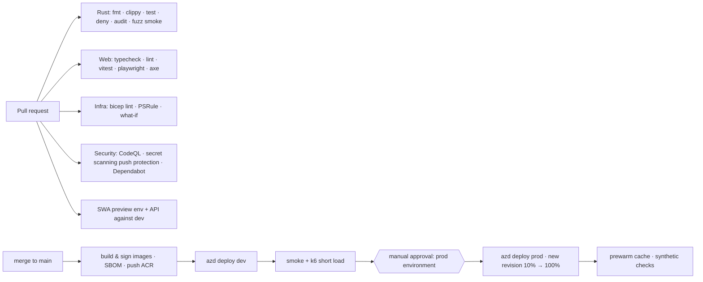

# 08: Azure Infrastructure & Delivery

## 8.1 Resource inventory (production)

> **No IaaS.** Every resource below is PaaS or SaaS. The inventory has no Virtual Machines, VM Scale Sets, AKS clusters or Batch pools, and none may be added ([ADR-0005](adr/0005-sustainability-constraints.md)). Container Apps "Dedicated" workload profiles are Microsoft-managed capacity inside Container Apps. We never see or patch the underlying hosts.

One subscription (ideally owned by a sponsoring institution, see [ADR-0005](adr/0005-sustainability-constraints.md)), one region (**East US 2** or **Central US**: both have the higher-capacity AI Search partitions if we switch to Option A, and are close to the LoC and US audience). Resource group `rg-usnm-prod`:

| Resource | SKU / config | Purpose |
|----------|--------------|---------|
| **Front Door** `afd-usnm` | Standard | Custom domains `usnewsmap.com` / `www`; managed TLS; routes; caching; WAF policy with **custom rate-limit rules** (managed rule sets require Premium; not needed at launch) |
| **Static Web App** `swa-usnm` | Free → Standard if we need private endpoints or an SLA | SPA hosting and PR preview environments |
| **Container Apps environment** `cae-usnm` | Consumption (+ optional Dedicated D4 workload profile for the searcher, see §8.4) | Hosts the API, the search engine, and jobs; Log Analytics integration; managed OTel agent → App Insights |
| Container App `ca-usnm-api` | 0.5 vCPU / 1 GiB; min 1, max 10; HTTP scaler | Rust API; ingress **internal to the environment + Front Door origin** (restricted by the `X-Azure-FDID` header and the service-tag IP restriction) |
| Container App `ca-usnm-search` | 4 vCPU / 8 GiB; min 1, max 4 | Quickwit searcher + metastore (file-backed on Blob); **internal ingress only** |
| Container Apps Jobs `job-ingest-*` | Scheduled / event-driven (KEDA Azure Queue scaler) | discover, batch, titles-sync, geocode, stats, index, prewarm |
| **Storage account** `stusnmdata` | StorageV2, **HNS enabled (ADLS Gen2)**, ZRS for `curated/`, `reference/`, `qw-index/`; lifecycle rules for `raw/` (Cool at 30 d, Cold at 90 d) | Data lake, index splits, queues |
| **Storage account** `stusnmtiles` | StorageV2, LRS, static content | PMTiles basemap, served through Front Door |
| **Container Registry** `acrusnm` | Basic | Images (`usnm-api`, `usnm-ingest`, `quickwit` pinned mirror) |
| **Key Vault** `kv-usnm` | Standard, RBAC mode | Only for a future API-key signing secret and third-party tokens; managed identities remove most secrets |
| **Log Analytics** `log-usnm` + **Application Insights** `appi-usnm` | Pay-as-you-go, **daily cap** set, 30-day retention | Telemetry |
| **Action Group** + **Budget** | – | Alerts; cost budget at 50/80/100% of $500 |
| *(Option A only)* **Azure AI Search** `srch-usnm` | L1, 1 partition × 1–2 replicas | Managed search backend alternative |

## 8.2 Identity and access (managed identities everywhere)

| Principal | Type | Role assignments (scope) |
|-----------|------|--------------------------|
| `id-usnm-api` (user-assigned) | MI | `Storage Blob Data Reader` (`reference/`); *(Option A)* `Search Index Data Reader` |
| `id-usnm-search` | MI | `Storage Blob Data Contributor` (`qw-index/`) |
| `id-usnm-ingest` | MI | `Storage Blob Data Contributor` (`raw/`, `curated/`, `reference/`, `manifests/`); `Storage Queue Data Contributor`; *(Option A)* `Search Index Data Contributor` |
| All container apps | MI | `AcrPull` on `acrusnm` |
| GitHub Actions (`usnewsmap.com` repo, `main` branch + `prod` environment) | **OIDC federated credential** on an app registration | `Contributor` on `rg-usnm-*` + `User Access Administrator` constrained by a condition to the roles above (for Bicep role assignments) |
| Maintainers | Entra users / group `grp-usnm-maintainers` | `Reader` by default; **PIM just-in-time** `Contributor` where the tenant licensing allows it |

No storage account keys or SAS tokens in app config: `allowSharedKeyAccess=false` on the data account. Quickwit authenticates to Azure Blob using the storage credentials it supports; S-2 confirms that managed identity / workload identity works with the pinned version, and the fallback is a **user-delegation SAS** minted at startup by a sidecar, never an account key.

## 8.3 Networking

- **Launch posture (simple and cheap):** a public Container Apps environment. The API app accepts traffic **only from Front Door** (the `AzureFrontDoor.Backend` service tag IP restriction plus an `X-Azure-FDID` header check in the API). The search app has **internal ingress only** and is reachable only by the API inside the environment.
- The data storage account uses **firewall allow-lists**: the Container Apps environment's outbound IPs (Consumption) plus trusted Azure services. Public blob access is disabled.
- **Hardening path (if a sponsor requires it):** a VNet-integrated Container Apps environment, **private endpoints** for Storage/ACR/Key Vault (and AI Search), and Front Door **Premium** with Private Link to the origins. This costs roughly an extra $300–400 per month, so it is deferred.

## 8.4 Compute sizing notes

- **API:** 0.5 vCPU / 1 GiB handles hundreds of requests per second of cached responses and dozens of uncached ones. The bottleneck is the search engine.
- **Search (Quickwit):** start on **Consumption 4 vCPU / 8 GiB**, min 1 replica. It stays on Container Apps in every scenario; there is no VM or AKS fallback. Watch the split-cache hit ratio and p95. If ephemeral disk limits hurt cache effectiveness, move this app to a **Dedicated D4/D8 workload profile** (larger local disk; still fully managed PaaS with no VM). The decision point is Spike S-2 plus the first month of production metrics.
- **Ingest jobs:** 2 vCPU / 4 GiB per replica, parallelism ≤ 8 for batch workers (bounded by LoC politeness, not CPU), and 4 vCPU / 8 GiB for the indexer.

## 8.5 Infrastructure as code

- **Bicep** modules under `infra/` with **Azure Developer CLI (`azd`)** for environment management and a one-command `azd up`.
- Modules: `frontdoor`, `staticwebapp`, `containerapps-env`, `containerapp`, `job`, `storage`, `acr`, `keyvault`, `monitoring`, `budget`, `rbac`, *(optional)* `aisearch`.
- **Parameters per environment**: `dev` (scale to zero, LRS, small sample corpus of ~1M pages), `prod`.
- Lint with `bicep lint` plus PSRule for Azure in CI; `what-if` output posted to the PR for any change under `infra/`.
- Policy: deny public blob access, require HTTPS/TLS 1.2+, require diagnostic settings, allowed locations, and a built-in **"Not allowed resource types"** assignment that blocks `Microsoft.Compute/virtualMachines`, `virtualMachineScaleSets`, `Microsoft.ContainerService/managedClusters` and `Microsoft.Batch/batchAccounts` on the project resource groups, so VMs can't creep in.

## 8.6 CI/CD (GitHub Actions)

- **Container Apps revisions** for blue/green: a new revision receives 10% of traffic until synthetic checks pass, then 100%. Rolling back means shifting traffic to the previous revision.
- **Images:** pinned base `gcr.io/distroless/cc-debian12` (or `scratch` with a musl static build) for the API; the Quickwit image is pinned by digest and mirrored into ACR.
- **Data pipeline deploys** are separate from app deploys. A new `index_version` is published by the `index` job and picked up by the API's refresher, not by redeploying.

## 8.7 Environments

| Env | Corpus | Scale | Cost target |
|-----|--------|-------|-------------|
| `dev` | 1M-page sample (ten diverse years) | API min 0; search min 0 (accepts cold start); no Front Door (SWA preview + direct API) | ≤ $40/mo |
| `prod` | Full | As in §8.1 | ≤ $500/mo |
| *Local* | 10k-page fixture | `docker compose` (Quickwit + API + Azurite) | $0 |

## 8.8 Domain and DNS

- Move the `usnewsmap.com` registration to an account the project controls, with auto-renew and at least 2 admins. This was one of the legacy single points of failure.
- Host DNS in **Azure DNS**: apex `usnewsmap.com` as an alias record to Front Door, and `www` → apex redirect. Add `CAA` records for DigiCert (Front Door managed certificates).
- Keep `/loc_api/*` returning **410 Gone** with a link to the new API docs (old clients may still call it), and redirect legacy query URLs where they can be mapped.
