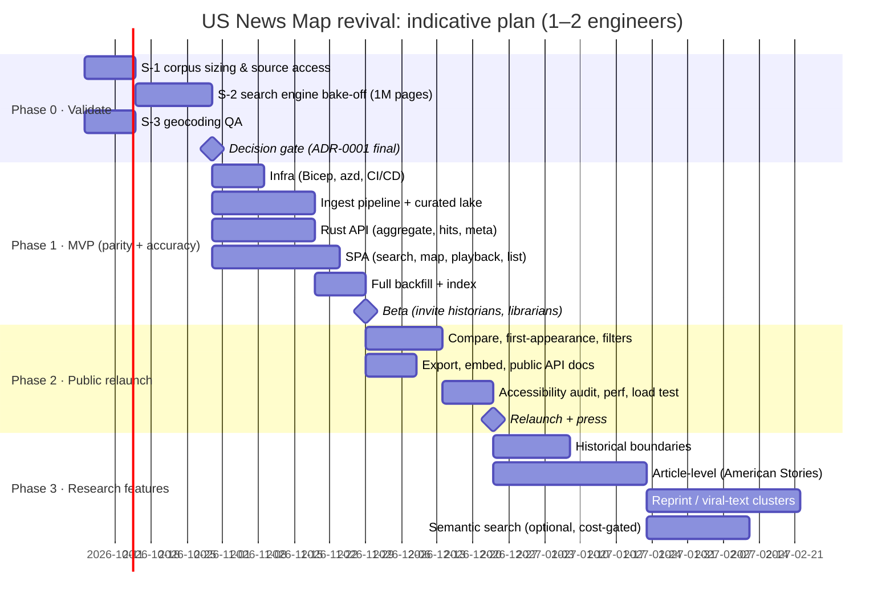

# 10: Roadmap, Risks & Open Questions

## 10.1 Phased delivery

### Phase exit criteria

| Phase | Exit criteria |
|-------|---------------|
| **0 Validate** | Corpus size known within ±15%; search backend chosen from S-2 data; geocoding ≥ 98% of titles at city precision, with the rest at county precision; bulk-download rate plan agreed with LoC's published limits |
| **1 MVP** | F-01…F-08, F-20, F-22, F-25 (state/title), F-27 shipped; counts equal a brute-force scan on the golden set; p95 targets met; cost < $80 in staging projections |
| **2 Relaunch** | F-09, F-21, F-23, F-24, F-26, F-28, F-29, F-30 shipped; WCAG 2.2 AA audit passed; runbooks rehearsed (full re-index, rollback) |
| **3 Research** | Each feature has its own proposal and cost check before build |

## 10.2 Validation spikes

| ID | Question | Method | Output |
|----|----------|--------|--------|
| **S-1** | How big is the corpus really (pages, text bytes, languages)? Which bulk endpoints and formats exist, and what are the rate limits? | Download 20 batches across eras; measure; read the Datasets portal docs; email `ndnptech@loc.gov` about bulk etiquette | Sizing sheet; updated [04](04-data-sources-and-ingestion.md). **Done** (§4.1.1): 2,997 batches, 23.7M pages, 2.47 TB of archives, a machine-readable batch list with checksums; ~22 h of curation with 8 workers |
| **S-2** | Quickwit vs Azure AI Search on our query shape | 1M-page sample in both; benchmark set ([05 §5.8](05-search-and-storage.md#58-benchmark-query-set-spike-s-2)); verify pre-1970 timestamps, fuzzy, slop, snippets, multi-index search and aggregations across a base + up to 8 sealed deltas, nested-aggregation memory and latency at `aggregation_bucket_limit: 200000` / `aggregation_memory_limit: 768MB` with place-shard splitting, managed-identity Blob auth in Quickwit, and split-cache behavior on Container Apps | Benchmark report; final [ADR-0001](adr/0001-search-engine.md). **Done:** correctness on the fixtures (dates, slop, snippets, sorting, multi-index search, sharded aggregations; fuzzy unsupported), the polling read-only searcher, and the auth design. See [05 §5.5.1](05-search-and-storage.md#551-quickwit-index-config-validated-in-s-2) and [08 §8.2](08-azure-infrastructure.md#82-identity-and-access-managed-identities-everywhere). **Open:** the 1M-page benchmark and auth against a real account |
| **S-3** | Geocoding quality from LoC metadata + GNIS | Resolve all titles; diff against legacy `town_ref.csv`; manually review outliers | `catalog/overrides/places.json` (in git); precision stats |
| **S-4** | Playback performance on low-end devices | Synthetic worst-case cube (3,000 × 211) on a low-end Android device and an older iPhone | Adjust the budget or thin the cube |

## 10.3 Risk register

| # | Risk | Likelihood | Impact | Mitigation | Owner |
|---|------|-----------|--------|-----------|-------|
| R-1 | **Sustainability again**: the maintainer leaves and the bills lapse | Med | High | < $80/mo (fits a personal card or a small departmental budget); IaC; runbooks; institutional sponsor owns the subscription and domain; ≥ 2 admins; handover runbook ([ADR-0005](adr/0005-sustainability-constraints.md)) | Owner |
| R-2 | Quickwit fails S-2 (latency on high-frequency terms, pre-1970 dates, cache limits) | Med | Med | Integer bucket fields; Dedicated workload profile; fallback to Elastic on Azure or AI Search via the `SearchBackend` trait | Eng |
| R-3 | AI Search chosen, but budget can't sustain ~$3–6k/mo | Med (if chosen) | High | Only choose A with committed multi-year funding; otherwise B | Owner |
| R-4 | LoC changes bulk formats or endpoints again (as in 2025) | Med | Med | The curated lake decouples the site from the source, so the site keeps serving; a parser schema check in `discover`; follow the NDNP news feed | Eng |
| R-5 | Bulk download throttled; backfill slow. Archives not in LoC's CDN cache downloaded at 0.3–1.2 MB/s in the September 2026 trial (04 §4.1.2) | High | Med | Measure a cache-miss download from Azure before the backfill; start early; respect limits; validated mirror as accelerator; the backfill is one-time | Eng |
| R-6 | Quickwit project cadence slows after the acquisition | Low–Med | Med | Apache-2.0; pin versions; Tantivy maintained independently; backend abstraction | Eng |
| R-7 | Abuse or bot traffic causes cost spikes or slowness | Med | Med | Replica cap (bounds cost); API rate limits; caches; budget alerts; add Front Door (growth profile) or a free external CDN if abuse persists | Eng |
| R-12 | **ACI Spot is a preview** (no SLA, 3 regions, may change or be withdrawn) | Med | Low | Only offline jobs use it; the same image runs on regular ACI or on a Batch Spot pool; the work is idempotent and resumable | Eng |
| R-13 | **Lean searcher too slow** for high-frequency terms | Med | Med | Blob cache + pre-warm; relaxed SLO for that class; the 2 vCPU / 4 GiB lever (+$15–30; exceeds $80 together with private networking) | Eng |
| R-14 | **Public-access window left open** after a failed backfill | Low | Med | Hourly in-VNet `network-guard` job closes it; alert on any `publicNetworkAccess` change; access still requires Entra tokens (keys disabled by policy) | Eng |
| R-15 | Quickwit 0.9 has no fuzzy term queries, so F-21 (OCR-tolerant matching) can't be passed through (S-2) | High (confirmed) | Med | The API refuses fuzzy queries on Quickwit rather than miscount. Planned: expand a fuzzy term in the API into an `OR` of up to N real index terms within edit distance 1–2, using a term dictionary (FST) built with each index version; or wait for upstream support | Eng |
| R-16 | The full index build runs past the ingest job's 24 h `replicaTimeout`, which has no retry. The single-node writer ingests at most 20 MB/s per shard; the trial built ~560 pages/s on 8 laptop cores (04 §4.1.2) | Med | Med | Measure the build rate on the job's 2 vCPU with a large batch set; if needed, raise the job's CPU or timeout for the backfill, or build the base in parts | Eng |
| R-8 | OCR quality misleads users (false negatives) | High | Med | OCR-tolerant mode; "pages containing" wording; improved NDNP-Open-OCR re-ingestion; methodology page | Product |
| R-9 | Geographic misattribution (titles that moved; county-level fallbacks) | Med | Low | Precision flags; date-ranged places; overrides reviewed in PRs | Eng |
| R-10 | Rust maintainer pool is thin | Low–Med | Med | Small, well-tested API; OpenAPI contract; documented rewrite path ([ADR-0004](adr/0004-rust-api.md)) | Owner |
| R-11 | Legacy secrets in the public legacy repo are still valid | Unknown | Med | **Revoke the Google Places key and Mapbox token now**; history rewrite optional (the keys are already exposed, so revocation is what matters) | Owner |

## 10.4 Open questions for the owner

1. **Funding and sponsor.** Is there an institution (UGA Libraries / eHistory, GTRI, a state newspaper project, LoC Labs) willing to own the subscription? This decides Option A vs B and the handover story.
2. **Speed vs budget.** At the $80 ceiling, Quickwit on a 1–2 vCPU sidecar is the only search option; managed AI Search (~$2–6k/mo) is out of reach. Are slower uncached searches for very common words (5–15 s) acceptable, or should the searcher start at 2 vCPU / 4 GiB? With private networking (~$17/mo, [ADR-0008](adr/0008-private-networking.md)) the 2 vCPU option puts a typical month at ~$87–102, over $80. The choices are: raise the ceiling to ~$100; keep private networking and the 1 vCPU searcher (~$72); or trade private endpoints for search speed.
3. **Branding and credits.** Keep the "US News Map" name and credit the original GTRI and eHistory team and Prof. Saunt? Contact them for endorsement and redirect permissions?
4. **Domain.** Confirm control of `usnewsmap.com` (the registrar account), and whether `usnewsmap.net` (used for legacy Solr hosts) is still held.
5. **Legacy repo.** Archive `tgoodyear/usnewsmap` with a README pointing to the new project, after revoking the exposed keys.
6. **Scope of the public API.** Anonymous-only with fair-use limits, or issue keys to researchers for higher limits?
7. **Analytics.** Is App Insights custom-event analytics enough, or is a privacy-friendly product analytics tool wanted?

## 10.5 Definition of done for relaunch

- [ ] All P0 features live; counts verified against brute force on the golden set
- [ ] SLOs met for 14 consecutive days in beta
- [ ] Cost < $80 per month for 2 consecutive months (actual)
- [ ] Runbooks rehearsed: full re-index, index rollback, app rollback, handover dry run
- [ ] Accessibility audit (WCAG 2.2 AA) passed
- [ ] Legacy keys revoked; secret scanning and push protection on
- [ ] About, methodology, privacy and API docs pages published
