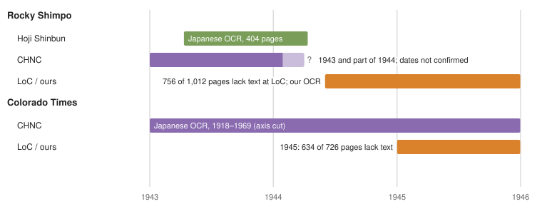
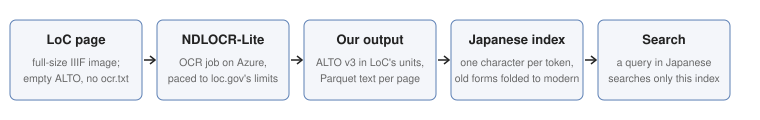
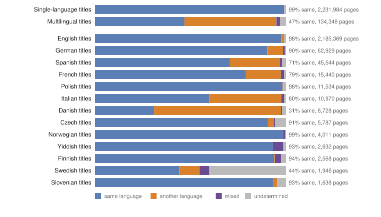
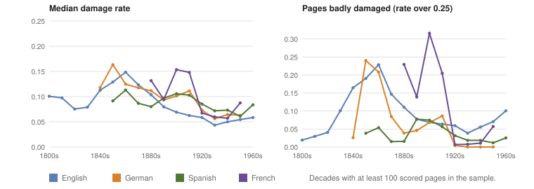

# Summary

- **LoC has no searchable Japanese text for these papers.** The Japanese pages of the WWII camp newspapers and of Denver's *Rocky Shimpo* and *Colorado Times* arrive from the Library of Congress with no text, or with garbled Latin characters. LoC's files show that the original OCR (ABBYY 8) ran in Japanese on these pages and returned no words (116 of 124 sampled pages; the other 8 were run as English). About 9,330 pages across 23 titles have no text.
- **We read them ourselves.** NDLOCR-Lite, the National Diet Library's open OCR engine, scored best of the engines we tested. Our job has read 11,018 of the 11,058 target pages (the targets also include pages whose LoC text is empty, short or garbled, which is why there are more than 9,330). The first 10,414 become searchable on usnewsmap.com with the index version now being built.
- **For most of these pages we found no Japanese text anywhere else, but the sites likeliest to hold the camp papers could not be searched yet.** We checked other collections that hold these papers:
  - *Rocky Shimpo*: Hoji Shinbun (Hoover Institution) has Japanese OCR for April 1943 to April 1944. Colorado Historic Newspapers has Japanese OCR for 1943 and part of 1944; where its run ends is not yet checked. LoC's run, and so ours, covers June 1944 to December 1945, so ours is new unless CHNC's run goes past June 1944.
  - *Colorado Times*: Colorado Historic Newspapers already has Japanese OCR, including 1945, so ours is a second reading, useful for comparison.
  - *Camp newspapers*: no Japanese OCR in any collection we could check. The sites most likely to have them (Densho, Utah Digital Newspapers, Wyoming Newspapers and others in the table) could not be searched automatically and are still to be checked by hand.
- **LoC's OCR in the other languages, from a 2% sample.** We sampled 474,541 of 23.7 million pages. Among English, German, Spanish and French, damage is highest in English pages from the 1840s to the 1880s, German pages before 1920 and French pages from the 1900s and 1910s, and lower from the 1920s on. In titles with several catalog languages, only 46.5% of pages are in the first-listed one.

# The gap at LoC

Chronicling America lists 27 titles as Japanese. They are mostly the newspapers of the WWII incarceration camps (*Minidoka Irrigator*, *Manzanar Free Press*, the Japanese edition of the *Heart Mountain Sentinel*, *Poston Chronicle*, *Gila News-Courier*, *Topaz Times*, *Granada Pioneer*, *Tulean Dispatch*, *Rohwer Outpost*, *Newell Star* and others) plus two Denver papers, *Rocky Shimpo* and *Colorado Times*. The page images are fine: LoC serves them at full scan resolution through IIIF (all but 14 pages, which have no image at LoC). The text is missing:

- **In the bulk OCR archives**, a Japanese page has an empty ALTO `ocr.xml` and no `ocr.txt`. In one batch, `dlc_ballston_ver01`, 2,433 of 5,791 pages are like that.
- **On loc.gov**, the page viewer shows "NO TEXT AVAILABLE FOR THIS PAGE", and full-text searches across Chronicling America for 年, 日本 and 真珠湾 return no pages.
- **LoC's files record what was run.** The empty ALTO keeps its processing settings. All 124 pages we sampled record `Engine:Abbyy8`: 116 with `Lang:ja` and `Word Count:0`; the other 8 were run as English, which is where the garbled Latin text comes from. The Japanese OCR was run and read nothing.
- **The gap dates from 2014.** Four of the six batches with these papers were ingested in December 2014 and the other two in June 2026. All six were rebuilt in June 2026 and still have no Japanese text. NDNP's technical guidelines have listed Japanese as a supported full-text language since at least the 2016–18 edition.

Comparing LoC's per-title page counts, which include pages without text, with the pages that have text gives the size of the gap: about 9,330 Japanese pages across 23 titles. Every other non-English language we checked has its text (German, Spanish, French, Polish, Yiddish, Russian, Serbian, Czech, Hebrew).

# What other collections hold

We searched other collections for Japanese OCR of the same papers. Where a site allowed it, the test was to find the title, search it for a common word (日本, "Japan") and for exact lines from LoC's pages, and compare the dates covered.

| Collection | Holds | Japanese OCR | What it means for our OCR |
|---|---|---|---|
| Hoji Shinbun Digital Collection (Hoover Institution) | *Rocky Shimpo* 1943-04-12 to 1944-04-12 (101 issues, 404 pages); camp magazines and directories; not *Colorado Times*, not the camp newspapers | Yes, for what it holds | No overlap: LoC's *Rocky Shimpo* starts 1944-06-02 |
| Colorado Historic Newspapers (CHNC) | *Rocky Shimpo* 1943–1944; *Colorado Times* 1918–1969 | Yes (日本: 620 results in *Rocky Shimpo*, 72,008 in *Colorado Times*) | *Colorado Times* 1945 is already OCR'd there; CHNC's last *Rocky Shimpo* date is not yet confirmed |
| National Diet Library Digital Collections | One *Minidoka Irrigator* issue, English | No | None |
| Internet Archive | *Rohwer Outpost*, 115 items, 1942–44 | No (English OCR only) | None |
| HathiTrust | No records for these titles | n/a | None |
| Densho Digital Repository | Camp newspapers, all ten camps | Unknown (not searchable automatically) | To check by hand |
| Utah Digital Newspapers | *Topaz Times*, about 470 issues | Unknown (not searchable automatically) | To check by hand |
| Wyoming Newspapers | *Heart Mountain Sentinel*, reportedly the Japanese edition too | Unknown (not searchable automatically) | To check by hand |
| Arizona Memory Project / ASU, CDNC / Calisphere, CRL | Possibly *Poston*, *Gila*, *Tule Lake*, *Manzanar* (unconfirmed) | Unknown (not searchable automatically) | To check by hand |

By paper:

- **Rocky Shimpo** is split in time. Hoji holds April 1943 to April 1944 with Japanese OCR, and CHNC holds 1943 and at least part of 1944; LoC holds June 1944 to December 1945 with no Japanese text. Hoji's run ends 1944-04-12 and LoC's starts 1944-06-02. Of the collections we checked, our OCR of LoC's 756 pages without text is the only Japanese text for those 19 months, unless CHNC's run extends past June 1944.
- **Colorado Times** is the one paper where our text duplicates existing work: CHNC has Japanese OCR across 1918–1969. An exact line from the 1945-08-14 issue (皆様お馴染の三光樓) found nothing on CHNC, probably because the two OCR readings differ, which makes the pair useful for comparing quality.
- **The camp newspapers** are not in Hoji, which instead holds camp literary magazines and directories (*Dotō* and *Gyōen* from Tule Lake, an Amache directory) that LoC doesn't have. We found no Japanese OCR of the camp newspapers anywhere we could search. The sites likeliest to have it could not be checked automatically.

# Our OCR

**Choosing an engine.** We cut 23 reference regions from 124 sampled Japanese pages of 17 titles (1942–45), split between the typeset Denver papers and the camp papers (mostly hand-lettered mimeograph), and scored each engine by bigram F1, the overlap of adjacent character pairs between the engine's text and the reference, which measures whether the words are there, as search needs. NDLOCR-Lite (CC BY 4.0, runs on CPU) scored highest overall, 77% against Azure's 61%, and beat Azure Document Intelligence on 19 of the 23 crops. We also tried LoC's reprocessing pipeline, NDNP-Open-OCR (commit `cbe0ca5`). It is set up for English only, so it read every page as English. With Japanese Tesseract models it reached 24%, and with NDLOCR-Lite swapped in as its engine (our local prototype, not proposed upstream) 67%. The pipeline runs on full pages, and scoring only the text inside each crop costs it some points against the crop-only scores (#128).

**The job.** For each issue with target pages, the job downloads the full-resolution images from loc.gov, runs NDLOCR-Lite, and writes the text twice: as ALTO in the same units as LoC's empty files, so it could stand in for them, and as one row per page for our index. It paces itself to loc.gov's limits. Targets are the pages LoC ships without text plus pages whose LoC text is empty, short or garbled: 11,058 pages in 3,421 issues.

**Where it stands (6 October 2026).**

- **Read:** 11,018 of 11,058 target pages.
- **Not read:** the other 40 pages. 14 of them have no image at LoC. The job writes an issue only when every page in it is read, so pages that share an issue with them are held back too.
- **Search:** the index version being built now includes the 10,414 pages read before it started; the other 604 follow with the next release. A search in Japanese script searches only these pages, with old character forms matched to modern ones (戰 finds 戦).

# LoC's OCR in other languages

**How we measured.** On 6 October 2026 we took a fixed 2% sample of the pages in our published index (version `pages-v20261003-1`): 474,541 of 23.7 million pages, from all 2,989 batches. The 485 sampled pages of titles that list Japanese were counted but not scored. For each page the audit does two things.

- **It finds the page's own language.** The candidates are the title's catalog languages plus English. The page's language is the one whose 100 most frequent words make up the largest share of the page's words. A page is *undetermined* when it has too few of those words or two languages come out too close. It is *mixed* when stretches of it fall clearly to two different languages.
- **It measures damage in that language.** Of all occurrences of the language's 20 most common words, the damage rate is the share that come out one OCR edit wrong, such as "tbe", "tlie" or "aud" for "the" and "and". Misreadings that are real words don't count. We call a page *damaged* above 0.1 and *badly damaged* above 0.25. Even good text scores above zero: the lowest median for a large language and decade is 0.043 (English, 1930s).

**Page language against catalog language.** Chronicling America catalogs languages per title, so every page of a title gets the same language. On the sample:

- **Single-language titles:** 99.2% of pages are in the title's language. Almost all the rest are undetermined (0.7%), and only 0.03% are in another language. For these titles English is the only other candidate (none for English-only titles), so this mainly counts pages that are not undetermined.
- **Multilingual titles:** 46.5% of pages are in the first-listed language. Another 48.8% are in a different listed language or English.

Some of the largest groups of pages in a language other than the title's first:

- English pages in titles that list Spanish first: 2,421 sampled pages, 27% of those titles' pages.
- English pages in titles that list Danish first: 1,153, 67% of their pages.
- English pages in titles that list German first: 1,058, 8%.
- Spanish pages in titles that list Italian first: 795, 35%.
- Pages of titles that list English first and another language as well: 1,742 in Yiddish, 1,235 in German, 1,033 in Polish and 900 in Serbian.

Hawaiian, Choctaw, Dakota, Navajo and Cherokee titles show as English or undetermined (3 of 6 Cherokee pages come out mixed Cherokee and English). The audit has no word lists for those languages, so it cannot detect them, and these results show that gap. Overall, 3.8% of sampled pages with text are not clearly in their title's first language: 2.8% are in another language, 0.8% are undetermined and 0.15% are mixed. If the sample holds, that is roughly 900,000 pages, about 700,000 of them in another language or mixed.

**Damage by language and decade.** Detected languages with 1,000 or more scored pages:

| Detected language | Scored pages | Median damage | Damaged (over 0.1) | Badly damaged (over 0.25) |
|---|---|---|---|---|
| English | 433,278 | 0.071 | 35% | 8.1% |
| German | 12,736 | 0.104 | 53% | 7.1% |
| Spanish | 7,607 | 0.084 | 35% | 4.0% |
| Polish | 3,305 | 0.176 | 87% | 16.2% |
| French | 2,639 | 0.075 | 36% | 10.3% |
| Italian | 1,706 | 0.115 | 60% | 3.8% |
| Czech | 1,090 | 0.213 | 96% | 39.7% |
| Norwegian | 1,002 | 0.085 | 32% | 3.2% |

Polish and Czech score high in every decade, as do Finnish (0.193), Lithuanian (0.172), Slovak (0.187) and Russian (0.242). Our unchecked explanation: in these heavily inflected languages many real word forms one edit from a common word are outside the 5,000 most frequent words the audit treats as real, so they count as damage. Compare them only with themselves over time.

By decade:

- **English:** damage peaks in the 1860s (median 0.149; 70% of pages damaged, 23% badly) and falls steadily to 0.043 in the 1930s.
- **German:** damage stays at 0.09 to 0.16 from the 1850s through the 1910s, with 47% to 83% of pages damaged. It then drops to 0.073 in the 1920s and 0.056 in the 1930s. That timing fits German-language papers moving from Fraktur to roman type around the First World War, but we have not checked the typefaces.
- **French:** damage is high in the 1900s and 1910s (about 0.15, with 21% to 32% badly damaged).

**Most damaged titles and batches.** These are the titles with the highest median damage, among titles with at least 50 scored pages:

| Title | Place | Language | Scored pages | Median damage |
|---|---|---|---|---|
| *Nebraska Staats-Zeitung* | Nebraska City and Lincoln, Neb. | German | 56 | 0.61 |
| *Corpus Christi Caller and Daily Herald* | Corpus Christi, Tex. | English | 152 | 0.54 |
| *The Corpus Christi Caller* | Corpus Christi, Tex. | English | 168 | 0.46 |
| *The Texas Republican* | Marshall, Tex. | English | 71 | 0.46 |
| *The Waco Daily Examiner* | Waco, Tex. | English | 179 | 0.45 |
| *Virginia Gazette* | Williamsburg, Va. | English | 118 | 0.43 |
| *Richmonder Anzeiger* | Richmond, Va. | German | 83 | 0.42 |
| *The Evening Herald* | Albuquerque, N.M. | English | 448 | 0.39 |
| *Telegram-Herald* | Grand Rapids, Mich. | English | 266 | 0.38 |
| *Amarillo Daily News* | Amarillo, Tex. | English | 294 | 0.38 |

The five batches with the highest median damage are `nn_kant_ver01`, `txdn_japan_ver01`, `nn_carson_ver02`, `txdn_kilo_ver02` and `nn_bentham_ver01`. Each has a median damage of 0.47 to 0.52, and 84% to 100% of their scored pages are badly damaged. All 230 scored pages of `txdn_japan_ver01` are English; the name is LoC's batch name, not a language.

The titles with the most undetermined pages are:

- *America* (Cleveland; English and Romanian): 86%
- *Skaffaren* (Swedish): 79%
- *Amerikai Magyar Hirlap* (Hungarian and English): 72%
- *Minnesota Stats Tidning* (English and Swedish): 67%

Across all titles that list Swedish or Hungarian first, 41% and 36% of pages with text are undetermined. We have not checked why. Damaged text, short pages, or text split between the listed languages can each leave a page undetermined.

**What it suggests for usnewsmap.com.**

- **Tag page language only where it differs from the title's first language.** That is about 3% of pages, those in another language or mixed. As far as the audit can tell, the title's language stays right for 99% of pages in single-language titles. Languages the audit has no word list for keep their title language.
- **Pilot a German re-OCR with a Fraktur model.** German pages from the 1850s to the 1910s are an estimated 580,000 pages at full scale. Score a sample the same way before and after.
- **Re-OCR the worst batches whole.** The five batches above are the starting point.

# Caveats

- **The accuracy figures are agreement with a machine reference.** The reference transcriptions were machine-made and one was checked against its scan. The ranking between engines is better established than any one percentage. A Japanese reader should review a sample of the crops and of NDLOCR-Lite's output.
- **Camp papers are harder for every engine.** They are mostly hand-lettered mimeograph, and NDLOCR-Lite scores 72% on them against 83% on typeset pages.
- **Other collections were checked only by searching their public websites,** and the coverage table reflects what those sites showed on 4 and 5 October 2026. Absence of a search hit is not proof of absence.
- **The OCR audit is a 2% sample.** Per-title figures need at least 50 scored pages. The damage rule catches only one-edit misreadings of common words, so it undercounts heavier errors, and even good text scores above zero. The audit only considers a title's catalog languages plus English, so it cannot find pages in a language the catalog leaves out. Yiddish pages and Serbian pages (all in Cyrillic) were not scored for damage, because the audit has no word list for Yiddish or for Serbian in Cyrillic. Hawaiian, Choctaw, Dakota, Navajo and Cherokee have no word lists either, so their pages come out as English, scored against English, or undetermined.

# Open questions

1. **CHNC's last *Rocky Shimpo* issue.** If it is before June 1944, our *Rocky Shimpo* text is new throughout.
2. **Densho, Utah Digital Newspapers, Wyoming Newspapers and the other sites in the table,** checked by hand: search 日本 within each camp title.
3. **A quality comparison with CHNC** on the same *Colorado Times* 1945 pages.
4. **A Japanese reader's review** of the reference crops and a sample of our OCR.
5. **Typefaces of the damaged German pages:** how many of the German pages from the 1850s to the 1910s are Fraktur, and how much a Fraktur model recovers.

# Sources

- Progress on 6 October 2026: the usnewsmap.com status API (`https://api.usnewsmap.com/v1/status`, section `ocr_ja`: 11,018 of 11,058 pages read). The 10,414 pages in the index being built are those the job had written when the build read the OCR output, at 6:21 AM ET on 6 October, as recorded in [#187](https://github.com/tgoodyear/usnewsmap.com/pull/187).
- usnewsmap.com issues [#128](https://github.com/tgoodyear/usnewsmap.com/issues/128) (OCR), [#135](https://github.com/tgoodyear/usnewsmap.com/issues/135) (the gap and other collections) and the technical note *Japanese pages: OCR of the pages LoC ships without text* (`docs/notes/2026-10-05-japanese-ocr.md`).
- Library of Congress, [Japanese-American Internment Camp Newspapers](https://www.loc.gov/collections/japanese-american-internment-camp-newspapers/about-this-collection/); NDNP Technical Guidelines [2025–27](https://loc.gov/ndnp/guidelines/NDNP_202527TechNotes.pdf) and [2016–18](https://loc.gov/ndnp/guidelines/archive/NDNP_201618TechNotes.pdf); [NDNP-Open-OCR](https://github.com/LibraryOfCongress/ndnp-open-ocr).
- [Hoji Shinbun Digital Collection](https://hojishinbun.hoover.org/), Hoover Institution; [Colorado Historic Newspapers](https://www.coloradohistoricnewspapers.org/).
- [NDLOCR-Lite](https://github.com/ndl-lab/ndlocr-lite), National Diet Library.
- OCR quality audit: `ja-ocr/quality.py` (metric v2) in the usnewsmap.com repository, run 6 October 2026 on index version `pages-v20261003-1`. Its table rows are in `data/ocr-quality-v2.jsonl` next to this report.
