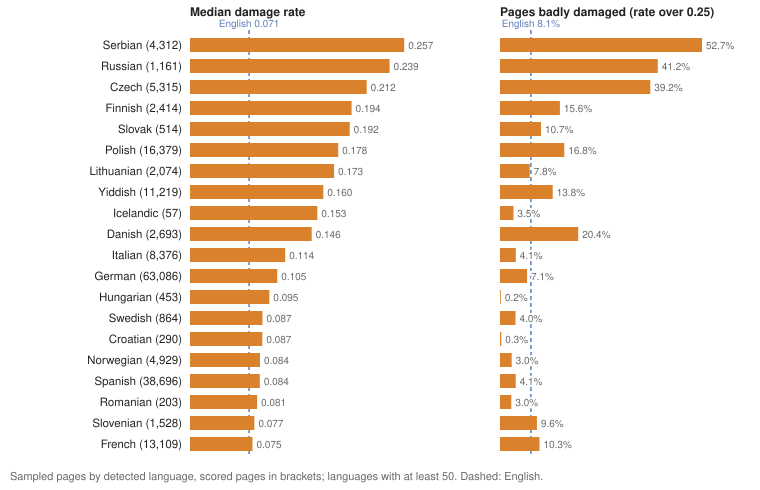
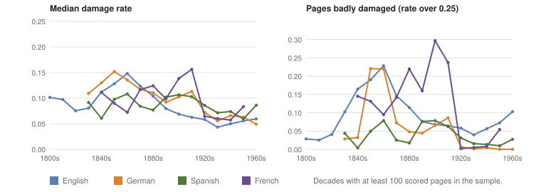
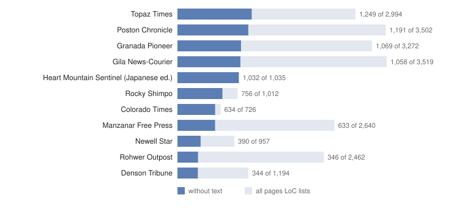
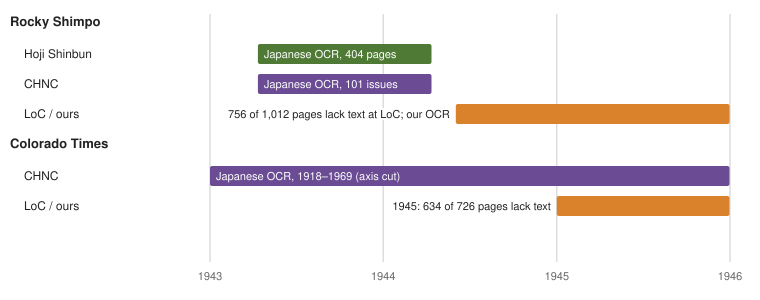

This report grew out of an earlier one on Japanese-language newspapers (merged in #195, in `docs/reports/2026-10-japanese-newspapers`, now renamed to this directory). The Japanese material is now one section among the others.

# Summary

The live index, version `pages-v20261006-2` (published 7 October 2026), holds 23,765,561 pages from 4,691 titles. Chronicling America catalogs languages per title, and its titles list 29 languages. Titles that list English hold 22.8 million pages; the other 28 languages range from German's 693,713 pages to Creek's 4. Every language except Japanese is searched in LoC's OCR. LoC has no Japanese text for these papers, so Japanese is searched in our own OCR. A 10% sample of LoC's OCR (2,371,337 pages) finds the most damage in Serbian, Russian and Czech, in German before the 1920s and in English from the 1840s to the 1880s. Part of the high scores for Polish, Czech, Slovak, Serbian, Russian, Finnish, Lithuanian and Yiddish may come from the way the audit counts damage, which a hand check would settle. The five indigenous languages have no word list and aren't scored. The titles cataloged as Hawaiian are English-language papers, and the one Hebrew title's Hebrew-script text looks like Yiddish.

| Language | Pages | Titles | Text from | Damage: median; badly damaged | Search | Status |
|----------|---------|-----|--------------|------------|----------------|------------------------|
| English | 22,787,429 | 4,515 | LoC; American Stories being added | 0.071; 8.1% | Standard | Worst 1840s to 1880s; five batches almost all badly damaged |
| German | 693,713 | 108 | LoC | 0.105; 7.1% | Standard | High damage 1850s to 1910s; Fraktur pilot proposed |
| Spanish | 648,027 | 88 | LoC | 0.084; 4.1% | Standard | 26% of pages in Spanish titles are English |
| French | 201,287 | 49 | LoC | 0.075; 10.3% | Standard | High damage in the 1900s and 1910s |
| Polish | 169,132 | 21 | LoC | 0.178; 16.8% | Standard | High in every decade; hand check |
| Italian | 136,111 | 23 | LoC | 0.114; 4.1% | Standard | 35% of pages in Italian titles are Spanish |
| Yiddish | 132,828 | 6 | LoC | 0.160; 13.8% | Hebrew script; old and modern spellings are different words | Word list may not fit older spelling |
| Danish | 87,917 | 4 | LoC | 0.146; 20.4% | Standard | 67% of pages in Danish titles are English; high damage 1880s to 1910s |
| Czech | 61,929 | 10 | LoC | 0.212; 39.2% | Standard | High, falling over time; hand check |
| Norwegian | 49,414 | 9 | LoC | 0.084; 3.0% | Standard | Low damage in every decade |
| Serbian | 48,710 | 1 | LoC | 0.257; 52.7% | Cyrillic and Latin spellings are different words | Highest damage; hand check |
| Japanese | 32,213 | 27 | Ours (NDLOCR-Lite); LoC has none | Not scored | Own index, by character | 10,305 pages searchable; more with the next release |
| Finnish | 26,353 | 3 | LoC | 0.194; 15.6% | Standard | High in every decade; hand check |
| Hawaiian | 24,846 | 6 | LoC | 1 page, in a French title | Standard | The titles are English-language papers |
| Swedish | 23,217 | 8 | LoC | 0.087; 4.0% | Standard | 40% of pages undetermined |
| Lithuanian | 20,554 | 4 | LoC | 0.173; 7.8% | Standard | High in every decade |
| Slovenian | 16,236 | 4 | LoC | 0.077; 9.6% | Standard | Low damage; one bad title |
| Hungarian | 13,442 | 3 | LoC | 0.095; 0.2% | Standard | 44% of pages undetermined |
| Russian | 11,930 | 5 | LoC | 0.240; 41.2% | Cyrillic | High damage; hand check |
| Croatian | 9,331 | 3 | LoC | 0.087; 0.3% | Standard | 41% of pages undetermined |
| Romanian | 9,287 | 2 | LoC | 0.081; 3.0% | Standard | Many pages undetermined |
| Choctaw | 9,114 | 2 | LoC | No word list | Standard | Sampled pages read as English |
| Slovak | 5,190 | 1 | LoC | 0.192; 10.7% | Standard | High, like Czech |
| Dakota | 4,049 | 2 | LoC | No word list | Standard | Dakota text present; unchecked |
| Navajo | 1,295 | 1 | LoC | No word list | Standard | Navajo text present; unchecked |
| Icelandic | 540 | 1 | LoC | 0.153; 3.5% (57 pages) | Standard | Small sample |
| Cherokee | 324 | 2 | LoC, including the syllabary | No word list | Syllabary searchable | Unchecked; another collection has more pages |
| Hebrew | 128 | 1 | LoC | 0.947 (5 pages) | Hebrew script | The text looks like Yiddish; to check |
| Creek | 4 | 1 | LoC | Not in the sample | Standard | Unchecked |

Pages and titles count the titles that list the language, from `/v1/meta`. A title in several languages counts under each, so the column adds up to more than the index. Damage is for LoC's OCR, from the 10% audit, on sampled pages detected in that language: a page of a Spanish title found to be in English counts as English. "Badly damaged" means a damage rate over 0.25. "Standard" search means words are lowercased and accents folded (zeleznice finds železnice), with no stemming, so each inflected form is its own word.

# How the numbers are made

**The audit.** We scored a fixed 10% sample of the pages in index version `pages-v20261003-1`: 2,371,337 of 23.7 million pages, from all 2,989 batches, on 7 October 2026. The 2,426 sampled pages of titles that list Japanese were counted but not scored. For each page the audit does two things.

- **It finds the page's own language.** The candidates are the title's catalog languages plus English. The page's language is the one whose 100 most frequent words make up the largest share of the page's words. A page is *undetermined* when it has too few of those words or two languages come out too close. It is *mixed* when stretches of it fall clearly to two different languages. A page mostly in another script (Hebrew, Cyrillic, Cherokee) takes the title's language in that script.
- **It measures damage in that language.** Of all occurrences of the language's 20 most common words, the damage rate is the share that come out one OCR edit wrong, such as "tbe", "tlie" or "aud" for "the" and "and". A misreading counts only when it isn't itself among the language's 5,000 most frequent words. We call a page *damaged* above 0.1 and *badly damaged* above 0.25. Even good text scores above zero: the lowest median for any language and decade with 100 or more scored pages is 0.043 (English, 1930s).

The word lists come from wordfreq, except Yiddish (from Yiddish Wikipedia and Wikisource) and Hawaiian (from the Hawaiian Corpus Project), which wordfreq doesn't cover. Serbian and Croatian share wordfreq's Serbo-Croatian list, and Serbian pages in Cyrillic are scored letter for letter in Latin script. Cherokee, Choctaw, Dakota and Navajo have no list. A 2% sample run the day before, whose pages are all in the 10% sample and which was scored before the Yiddish, Hawaiian and Cyrillic Serbian lists were added, agreed to within a tenth of a percentage point for English and German overall, and within half a point for each decade of English from the 1860s to the 1950s.

**Limits of the metric.** In heavily inflected languages many real word forms are one edit from a common word and outside the 5,000 most frequent forms, so they count as damage. That would raise the scores for Polish, Czech, Slovak, Serbian, Russian, Finnish and Lithuanian. This is our explanation, and it is unchecked. Slovenian (0.077) and Croatian (0.087) are inflected too and score low, so inflection can't be the whole story. Compare these languages with themselves over time, not with English.

**Catalog language and page language.** Chronicling America catalogs languages per title, so every page of a title gets the same languages. On the sample:

- **Single-language titles:** 99.3% of pages are in the title's language. Almost all the rest are undetermined (0.7%), and only 0.03% are in another language. For these titles English is the only other candidate (none for English-only titles), so the 99.3% mostly measures how many pages the audit could place.
- **Multilingual titles:** 46.8% of pages are in the first-listed language and 48.3% in a different listed language or English.

Overall, 3.7% of sampled pages with text are not clearly in their title's first language: 2.8% are in another language, 0.8% are undetermined and 0.16% are mixed. If the sample holds, that is about 880,000 pages, 700,000 of them in another language or mixed. The site's language filter works from the catalog, so `lang=spa` also returns the English pages of Spanish titles. The index has no page-level language yet.

**Search.** One analyzer serves every language except Japanese: Unicode word splitting, lowercasing and ASCII folding, with no stemming and no stop words. Accents don't matter (`železnice` and `zeleznice` both find 2,129 pages in Czech titles), but every inflected form is a separate word, and scripts are not folded into each other: in the Serbian title, `Србија` finds 5,832 pages and `Srbija` 37. Japanese has its own index (see Japanese). The example counts in this report are from `/v1/aggregate` on `pages-v20261006-2` on 7 October 2026.

# Languages one by one

Median damage by decade, for decades with at least 100 scored pages in the sample:

| Detected language | 1840s | 1850s | 1860s | 1870s | 1880s | 1890s | 1900s | 1910s | 1920s | 1930s | 1940s | 1950s |
|---|---|---|---|---|---|---|---|---|---|---|---|---|
| English | 0.11 | 0.13 | 0.15 | 0.12 | 0.10 | 0.08 | 0.07 | 0.06 | 0.06 | 0.04 | 0.05 | 0.06 |
| German | 0.13 | 0.15 | 0.14 | 0.12 | 0.11 | 0.09 | 0.10 | 0.11 | 0.07 | 0.06 | 0.07 | 0.06 |
| Spanish | 0.06 | 0.10 | 0.11 | 0.08 | 0.08 | 0.10 | 0.11 | 0.10 | 0.09 | 0.07 | 0.07 | 0.06 |
| French | 0.11 | 0.09 | 0.07 | 0.12 | 0.12 | 0.10 | 0.14 | 0.16 | 0.06 | 0.06 | 0.06 | 0.08 |
| Polish |  |  |  |  | 0.22 | 0.18 | 0.18 | 0.17 | 0.19 | 0.17 |  |  |
| Italian |  |  |  |  |  | 0.15 | 0.12 | 0.13 | 0.07 | 0.06 | 0.07 | 0.06 |
| Yiddish |  |  |  |  |  |  |  | 0.18 | 0.16 | 0.16 | 0.17 | 0.13 |
| Danish |  |  |  | 0.11 | 0.18 | 0.22 | 0.15 | 0.16 | 0.07 |  |  |  |
| Czech |  |  |  | 0.30 |  | 0.32 | 0.27 | 0.22 | 0.19 | 0.16 | 0.18 |  |
| Norwegian |  |  |  | 0.08 | 0.08 | 0.09 | 0.08 | 0.08 | 0.08 |  |  |  |
| Serbian |  |  |  |  |  |  |  | 0.27 | 0.28 | 0.30 | 0.24 | 0.18 |
| Finnish |  |  |  |  |  |  |  | 0.19 | 0.22 | 0.19 | 0.18 | 0.19 |
| Swedish |  |  |  |  |  |  | 0.09 | 0.09 | 0.10 |  |  |  |
| Lithuanian |  |  |  |  |  |  |  | 0.17 | 0.19 |  | 0.15 |  |
| Slovenian |  |  |  |  |  |  |  | 0.10 | 0.07 |  | 0.07 |  |
| Hungarian |  |  |  |  |  |  |  |  |  | 0.09 | 0.09 |  |
| Russian |  |  |  |  |  |  |  |  | 0.25 | 0.23 |  |  |
| Croatian |  |  |  |  |  |  |  |  |  |  |  | 0.09 |
| Slovak |  |  |  |  |  |  |  |  | 0.20 | 0.18 |  |  |

German, French, Italian and Danish all drop sharply between the 1910s and the 1920s. Polish, Finnish, Yiddish and Serbian don't.

## English

The 4,515 titles that list English hold 22,787,429 pages. In the sample, 2,166,233 pages are English: median damage 0.071, 35% damaged and 8.1% badly damaged. Damage peaks in the 1860s (median 0.148; 70% of pages damaged, 23% badly) and falls steadily to 0.043 in the 1930s. In titles that list English first, 97.8% of sampled pages are English and 0.7% undetermined. Most of the rest are pages of titles that list English first and another language as well: 8,763 sampled pages in Yiddish, 6,227 in German, 5,050 in Polish and 4,312 in Serbian.

These are the titles with the highest median damage among all titles with at least 50 scored pages. All but the first are English:

| Title | Place | Language | Scored pages | Median damage |
|---|---|---|---|---|
| *Nebraska Staats-Zeitung* | Nebraska City and Lincoln, Neb. | German | 292 | 0.62 |
| *Corpus Christi Caller and Daily Herald* | Corpus Christi, Tex. | English | 714 | 0.55 |
| *The Daily Wabash Express* | Terre Haute, Ind. | English | 191 | 0.54 |
| *Council Bluffs Bugle* | Council Bluffs, Iowa | English | 140 | 0.51 |
| *The Spirit of the Age* | Woodstock, Vt. | English | 61 | 0.51 |
| *Weekly Council Bluffs Bugle* | Council Bluffs, Iowa | English | 58 | 0.49 |
| *True American* | New Orleans, La. | English | 146 | 0.48 |
| *The Texas Republican* | Marshall, Tex. | English | 384 | 0.48 |
| *Brownlow's Knoxville Whig, and Rebel Ventilator* | Knoxville, Tenn. | English | 76 | 0.47 |
| *The Corpus Christi Caller* | Corpus Christi, Tex. | English | 799 | 0.46 |

The five batches with the highest median damage are `nn_kant_ver01`, `txdn_japan_ver01`, `nn_bentham_ver01`, `nn_carson_ver02` and `kyu_frenchie_ver02`. Each has a median damage of 0.46 to 0.52, and 88% to 99.8% of their scored pages are badly damaged. All of their scored pages are English; `txdn_japan_ver01` is LoC's batch name, not a language. All five were among the ten highest in the 2% sample.

### American Stories text

American Stories (Dell and others, 2023) re-read about 20 million Chronicling America scans from a 2022 snapshot with a layout model and its own OCR engine, EfficientOCR. It covers English only ("We do not process foreign language newspapers") and skips ads, tables and regions its classifier marks illegible. We compared it with LoC's text on the audit's sample of English titles for 1865 and 1925 (#205):

| | 1865 | 1925 |
|---|---|---|
| Sampled English pages with an American Stories scan | 81% | 47% |
| Median damage, LoC | 0.160 | 0.054 |
| Median damage, American Stories | 0.069 | 0.026 |
| Badly damaged, LoC | 26.2% | 2.8% |
| Badly damaged, American Stories | 4.9% | 1.4% |
| Pages added per search term when either text may match (median) | about +15% | about +5% |

Its text alone would lose hits, probably mostly in ads, so it goes into the index beside LoC's text, not in place of it: one document per page, and a page counts once whichever text matches. We read by hand 230 matches that only American Stories' text produced: 91% were right, and 98.5% leaving out "radio", where most samples were "Colorado" or "El Dorado" split around "RADIO" (#218). The search side (#220), the ingest side (#222) and a badge saying which OCR a match came from (#226) are merged behind a setting. All 180 years of its text were written to our store by 7 October (about 15 million pages), and a full rebuild with it started that evening; it publishes about 9 October. Why only 47% of 1925's sampled pages have a scan is unchecked; one guess is batches LoC added after 2022.

## German

The 108 titles that list German hold 693,713 pages. In the sample, 63,086 pages are German: median damage 0.105, 53% damaged and 7.1% badly damaged. In titles that list German first, 90.3% of pages are German, 8.3% English, 0.8% mixed and 0.6% undetermined. Another 6,227 German pages sit in titles that list English first.

Damage stays at 0.09 to 0.15 from the 1840s through the 1910s, with 46% to 78% of pages damaged each decade and 22% badly damaged in the 1850s and 1860s. It drops to 0.072 in the 1920s and 0.056 in the 1930s. The worst German titles are the *Nebraska Staats-Zeitung* (0.62, the highest of any title, with 99% of 292 pages badly damaged), the *Richmonder Anzeiger* (0.43), the *Osage County Volksblatt* and *Hermanner Volksblatt* in Missouri (both 0.30) and the *Tennessee Staatszeitung* (0.28). The Louisville *Omnibus* has the largest share of undetermined pages of any title: 94% of 111.

Search works as for English: `eisenbahn` finds 165,186 pages in 96 German titles.

### Fraktur

Our hypothesis is that much of the damage before the 1920s comes from Fraktur, the blackletter type common in 19th-century German printing, and that LoC's OCR read it poorly. The drop in the 1920s would then reflect the papers' move to roman type around the First World War. We have not checked the typeface of a single sampled page, so both parts are unconfirmed. Danish damage has the same shape (0.22 in the 1890s, 0.066 in the 1920s on 153 pages).

German pages from the 1850s to the 1910s are 57,580 of the sampled pages, so about 580,000 pages in the index. The plan:

1. **Confirm the typeface.** Run Tesseract's Fraktur German model (`deu_latf`) and its roman German model (`deu`) on a sample of about 1,000 pages across the 1850s to the 1910s, fetching LoC's IIIF images as the Japanese job does. Whichever model reads a page better indicates its typeface.
2. **Use the same run as the pilot.** Score the Fraktur output with the damage metric against LoC's text for the same pages. Check about 20 pages by hand for character error rate. Try one or two open Fraktur models trained on historical German (for example models listed by the OCR-D project) against Tesseract's.
3. **Decide with numbers.** Bring the measured gain, the time per page and the cost before deciding on the roughly 580,000 pages.
4. **Ship it like our Japanese OCR and American Stories.** Our text is indexed beside LoC's, one document per page, with a badge saying which OCR a match came from.
5. **Include Danish, Finnish and Lithuanian pages** in the sample, since blackletter type was also used to print those languages (to confirm on our pages).

American Stories won't help here, because its OCR is English-only.

## Spanish

The 88 titles that list Spanish hold 648,027 pages. In the sample, 38,696 pages are Spanish: median damage 0.084, 36% damaged and 4.1% badly damaged. Damage is near 0.10 in the 1850s and 1860s and again from the 1890s to the 1910s, when 51% to 55% of pages are damaged, and lowest in the 1950s (0.059).

In titles that list Spanish first, 70.8% of pages are Spanish and 26.2% English (11,919 sampled pages), so a search filtered to Spanish also covers many English pages. Several New Mexico titles have many undetermined pages: *La Revista de Taos* (44% of 351), *La Voz del Pueblo* (33%) and *El Independiente* (30%). `ferrocarril` finds 36,158 pages in 59 Spanish titles.

## French

The 49 titles that list French hold 201,287 pages. In the sample, 13,109 pages are French: median damage 0.075, 36% damaged and 10.3% badly damaged. Damage is high in the 1900s and 1910s (0.138 and 0.156, with 30% and 24% badly damaged) and falls to 0.065 in the 1920s, with almost no badly damaged pages. The audit's tables don't split decades by title, so which titles carry the damage of the 1900s and 1910s is unchecked.

In titles that list French first, 79.1% of pages are French and 18.2% English. `chemin de fer` finds 14,299 pages in 37 French titles.

## Italian

The 23 titles that list Italian hold 136,111 pages. In the sample, 8,376 pages are Italian: median damage 0.114, 60% damaged and 4.1% badly damaged. Damage is 0.12 to 0.15 from the 1890s to the 1910s and 0.06 to 0.07 from the 1920s on.

In titles that list Italian first, only 59.9% of pages are Italian; 35.5% are Spanish (3,893 sampled pages) and 2.3% English. Tampa has four titles that list Italian, but which titles hold the Spanish pages is unchecked. `ferrovia` finds 10,235 pages in 21 Italian titles.

## Polish

The 21 titles that list Polish hold 169,132 pages. In the sample, 16,379 pages are Polish: 11,329 in titles that list Polish first and 5,050 in titles that list English first. Median damage is 0.178, with 88% damaged and 16.8% badly damaged. It stays between 0.17 and 0.22 in every decade from the 1880s to the 1930s, with no drop after 1920. In titles that list Polish first, 98.2% of pages are Polish.

For Polish the open question is how much of the score is real damage and how much is inflected word forms counted as damage (see How the numbers are made). `kolej` finds 14,065 pages in 21 Polish titles.

## Yiddish

The six titles that list Yiddish, five in New York and one in Providence, hold 132,828 pages. In the sample, 11,219 pages are Yiddish, 8,763 of them in titles that list English first (in the *Yidishes Tageblat*, 2,046 of 3,173 sampled pages are Yiddish). Median damage is 0.160, with 91% damaged and 13.8% badly damaged. It stays between 0.155 and 0.176 from the 1910s through the 1940s, then is 0.131 in the 1950s. In titles that list Yiddish first, 93.3% of pages are Yiddish and 5.4% mixed with English.

The Yiddish word list is mostly modern spelling, and American Yiddish papers before the 1930s often spelled words the older, German-influenced way (דיא for די), so some real words may score as damage. That is unchecked, and the scores don't drop after the 1920s. Search treats the spellings as different words: די finds 119,663 pages in Yiddish titles and דיא 19,201.

## Hebrew

One title lists Hebrew: the *Rhode Island Israelite* (Providence), 128 pages, cataloged as English and Hebrew. The audit found 5 sampled pages mostly in Hebrew script and scored all of them badly damaged (median 0.947). The audit gives a Hebrew-script page the title's Hebrew-script language, here Hebrew. The search snippets we read from this title are Yiddish in the older spelling (דיא, אונד, האט ער ניט), and the other Providence title, *Der Izraelit* (from 1895), is cataloged as Yiddish. If the pages are Yiddish, the 0.947 is Yiddish text scored against a Hebrew word list, not garbled OCR. We read two snippets, not the five sampled pages, so this needs a look.

## Danish, Norwegian, Swedish and Icelandic

**Danish.** Four titles, 87,917 pages, in St. Paul, Minn., St. Paul, Neb. (*Stjernen*), Christiansted in the Virgin Islands, and Neenah, Wis. In titles that list Danish first, only 30.9% of sampled pages are Danish and 66.8% English (5,827 pages); which titles hold the English pages is unchecked. The 2,693 Danish pages have median damage 0.146, with 64% damaged and 20.4% badly damaged. Damage rises from 0.108 in the 1870s to 0.221 in the 1890s, stays near 0.155 in the 1900s and 1910s, and is 0.066 in the 1920s, the same shape as German. *Stjernen* has median damage 0.28, with 68% of 274 pages badly damaged. `hvad` finds 18,089 pages in all four titles.

**Norwegian.** Nine titles, 49,414 pages, in Minnesota, Iowa and South Dakota. 98.6% of sampled pages in titles that list Norwegian first are Norwegian. The 4,929 Norwegian pages have median damage 0.084 (31% damaged, 3.0% badly), between 0.076 and 0.094 in every decade from the 1870s to the 1920s. The one bad title is the *Sisseton Posten* (Effington, S.D.), at 0.27. `jernbane` finds 11,365 pages in the nine titles.

**Swedish.** Eight titles, 23,217 pages, in Minneapolis, St. Paul and Red Wing, Minn., and Sioux City, Iowa. In titles that list Swedish first, 44.0% of sampled pages are Swedish, 40.1% undetermined, 10.7% English and 5.1% mixed. The undetermined pages are concentrated in one family of titles: *Skaffaren och Minnesota Stats Tidning* (88% of its sampled pages), *Skaffaren* in St. Paul (81%) and in Red Wing (79%), and *Minnesota Stats Tidning* (81% and 50%). *Svenska Monitoren* (Sioux City) has 12%. The cause is unchecked: heavy damage, short pages or text split between Swedish and English can each leave a page undetermined. The 864 pages the audit could place have median damage 0.087 (4.0% badly). `järnväg` finds 239 pages.

**Icelandic.** One title, *Vínland* (Minneota, Minn.), 540 pages. All 57 sampled pages are Icelandic, with median damage 0.153 and 3.5% badly damaged, a small sample. Accent folding helps here: `Ameríku` finds 108 pages, including pages where the word reads "Ameriku".

## Finnish

Three titles, 26,353 pages, in Astoria, Ore., New York Mills, Minn., and Ironwood, Mich. In titles that list Finnish first, 94.0% of sampled pages are Finnish. The 2,414 Finnish pages have median damage 0.194, with 98% damaged and 15.6% badly damaged, and the median stays between 0.18 and 0.22 in every decade from the 1910s to the 1960s. Finnish marks case with endings, so the inflection effect described above could be large. `rautatie` finds 1,106 pages, and each case form of the word needs its own search.

## Czech, Slovak, Slovenian, Croatian, Serbian and Russian

**Czech.** Ten titles, 61,929 pages, in Chicago, Cleveland, Baltimore, Omaha, St. Paul and Tabor, S.D. In titles that list Czech first, 90.6% of sampled pages are Czech, 5.6% undetermined and 3.3% English. The 5,315 Czech pages have median damage 0.212, with 96% damaged and 39.2% badly damaged. Unlike Polish, the median falls over time, from 0.30 to 0.32 in the 1870s and 1890s to 0.16 in the 1930s. The worst title is *Pokrok Západu* (Omaha), with median 0.36 and 79% of 1,901 scored pages badly damaged; the batch `nbu_goldenalexanders_ver01`, whose scored pages are Czech, ranks 21st of all batches by median damage (0.37). A search snippet from the 1870s shows real damage around a correctly read word ("ziVtaia v«\*ti«\*kvi ... železnice").

**Slovak.** One title, the *Youngstownské Slovenské Noviny* (Youngstown, Ohio), 5,190 pages, cataloged English first. Its 514 sampled Slovak pages have median damage 0.192 (0.197 in the 1920s, 0.177 in the 1930s) and 10.7% badly damaged.

**Slovenian.** Four titles, 16,236 pages, in Chicago, Cleveland and Duluth. In titles that list Slovenian first, 93.3% of pages are Slovenian and 4.5% undetermined. The 1,528 Slovenian pages have median damage 0.077 and 9.6% badly damaged, most of them in the 1910s (25% badly damaged that decade). One title accounts for much of it: *Narodni Vestnik* (Duluth), median 0.37, with 79% of 169 pages badly damaged.

**Croatian.** Three titles, 9,331 pages. In titles that list Croatian first, 52.2% of sampled pages are Croatian and 41.4% undetermined, almost all in *Zajedničar* (Allegheny, Pa.). The 290 Croatian pages, all but two from the 1940s and 1950s, have median damage 0.087 and almost none badly damaged.

**Serbian.** One title, the *Amerikanski Srbobran* (Pittsburgh), 48,710 pages, cataloged English first. Its 4,312 sampled Serbian pages have the highest damage of any language: median 0.257, 99% damaged and 52.7% badly damaged, between 0.24 and 0.30 in each decade from the 1910s to the 1940s and 0.18 in the 1950s. Croatian is scored against the same word list and comes out at 0.087, so the list alone doesn't explain the Serbian score. The Cyrillic OCR itself and the letter-for-letter conversion to Latin are the candidates, unchecked. Search needs the script the page uses (see Search above); the earliest page with the Latin `Srbija` is from 1924.

**Russian.** Five titles, 11,930 pages, four in Chicago and one in New York. All 1,067 sampled pages of titles that list Russian first are Russian. The 1,161 Russian pages have median damage 0.240, with 99.9% damaged and 41.2% badly damaged (0.254 in the 1920s, with 52% badly damaged, and 0.232 in the 1930s). `Америка` finds 1,702 pages; the Latin `Amerika` finds none.

## Lithuanian, Hungarian and Romanian

**Lithuanian.** Four titles, 20,554 pages, in Chicago and Cleveland. In titles that list Lithuanian first, 99.3% of sampled pages are Lithuanian. The 2,074 Lithuanian pages (839 of them in titles that list English first) have median damage 0.173, with 95% damaged and 7.8% badly damaged: 0.174 in the 1910s, 0.194 in the 1920s and 0.145 in the 1940s. `geležinkelis` finds 302 pages.

**Hungarian.** Three titles, 13,442 pages, in Toledo and Youngstown, Ohio. In titles that list Hungarian first, 35.3% of sampled pages are Hungarian, 43.7% undetermined, 10.8% English and 10.1% mixed. Most of the undetermined pages are in the *Amerikai Magyar Hirlap* (Youngstown): 76% of its 722. The 453 Hungarian pages the audit could place, all from the 1920s to the 1950s, have median damage 0.095 and almost none badly damaged. `vasút` finds 114 pages.

**Romanian.** Two titles, 9,287 pages: *America* (Cleveland, cataloged English and Romanian) and *Românul American* (Detroit). *Românul American*'s sampled pages are 50.1% Romanian, 22.6% English, 18.7% undetermined and 8.5% mixed. *America* has 83% of 568 sampled pages undetermined. The 203 Romanian pages have median damage 0.081 and 3.0% badly damaged.

## Japanese

Chronicling America lists 27 titles as Japanese, 32,213 pages including the English pages of bilingual titles. They are mostly the newspapers of the WWII incarceration camps (*Minidoka Irrigator*, *Manzanar Free Press*, the Japanese edition of the *Heart Mountain Sentinel*, *Poston Chronicle*, *Gila News-Courier*, *Topaz Times*, *Granada Pioneer*, *Tulean Dispatch*, *Rohwer Outpost*, *Newell Star* and others) plus two Denver papers, *Rocky Shimpo* and *Colorado Times*. The audit doesn't score them.

### The gap at LoC

The page images are fine: LoC serves them at full scan resolution through IIIF (all but 14 pages). The Japanese text is missing.

- In the bulk OCR archives, a Japanese page has an empty ALTO `ocr.xml` and no `ocr.txt`. In one batch, `dlc_ballston_ver01`, 2,433 of 5,791 pages are like that.
- On loc.gov, the page viewer shows "NO TEXT AVAILABLE FOR THIS PAGE", and full-text searches across Chronicling America for 年, 日本 and 真珠湾 return no pages.
- The empty ALTO records what was run. All 124 pages we sampled record `Engine:Abbyy8`: 116 with `Lang:ja` and `Word Count:0`; the other 8 were run as English, which is where the garbled Latin text on some pages comes from.
- Four of the six batches with these papers were ingested in December 2014 and the other two in June 2026. All six were rebuilt in June 2026 and still have no Japanese text. NDNP's technical guidelines have listed Japanese as a supported full-text language since at least the 2016–18 edition.

Comparing LoC's per-title page counts, which include pages without text, with the pages that have text gives about 9,330 Japanese pages across 23 titles with no text. Every other non-English language we checked has its text (German, Spanish, French, Polish, Yiddish, Russian, Serbian, Czech, Hebrew).

### What other collections hold

We looked for Japanese text of the same papers in other online collections on 4, 5 and 7 October 2026. Where a site allowed it, we found the title, searched it for a common word (日本, "Japan") and for exact lines from LoC's pages, and compared the dates covered. Several large sites answer automated requests with a bot challenge or disallow them in robots.txt. We did not try to get past either, so for those sites the table rests on their own descriptions and on web search results, and the Japanese text column says "unknown".

| Collection | Holds | Japanese text a search can find | What it means for our OCR |
|---|---|---|---|
| Hoji Shinbun Digital Collection (Hoover Institution) | *Rocky Shimpo* 1943-04-12 to 1944-04-12 (101 issues, 404 pages); camp magazines and directories; not *Colorado Times*, not the camp newspapers | Yes, for what it holds | No overlap: LoC's *Rocky Shimpo* starts 1944-06-02 |
| Colorado Historic Newspapers (CHNC) | *Rocky Shimpo* 1943-04-12 to 1944-04-12 (101 issues); *Colorado Times* 1918-02-07 to 1969-02-10 (9,973 issues); *Granada Pioneer* and five other Amache titles | Yes for *Rocky Shimpo* (日本: 620 results) and *Colorado Times* (72,008); unknown for *Granada Pioneer* (robots.txt disallows automated access) | No overlap for *Rocky Shimpo*; *Colorado Times* 1945 is already OCR'd there |
| Densho Digital Repository | Runs of the main camp papers, for example *Poston Chronicle* (670 objects), *Heart Mountain Sentinel* (480), *Gila News-Courier* (436), *Topaz Times* (433), *Tulean Dispatch* (421), *Manzanar Free Press* (405), *Granada Pioneer* (339), *Minidoka Irrigator* (179) | Unknown (bot challenge). Densho's published search code indexes catalog fields, not page text | Probably none; to check by hand |
| Utah Digital Newspapers | *Topaz Times* | Unknown (bot challenge) | To check by hand |
| Wyoming Newspapers | *Heart Mountain Sentinel*, English edition (issues from 1943 to 1945 seen); no sign of the Japanese edition | Unknown (robots.txt disallows automated access) | To check by hand |
| ASU Library | *Poston Chronicle* including the Japanese edition; *Gila News-Courier*. OCR'd with Adobe Acrobat, language not stated | Unknown (bot challenge) | To check by hand |
| Gale, *Japanese-American Relocation Camp Newspapers* | 25 camp titles, images from LoC | Unknown (subscription) | Unknown |
| WOU Repository (Western Oregon University) | 238 camp newspaper issues, among them 13 Japanese sections of *Gila News-Courier*, 4 of *Poston Chronicle*, one Japanese *Heart Mountain Sentinel*, and *Topaz Times* 1942-09-17 to 1943-07-24 | No: image-only PDFs; 日本 finds 0 | None |
| Internet Archive | *Rohwer Outpost*, 115 items, 1942-10-24 to 1944-01-29; 3 *Manzanar Free Press* items | No: English OCR only; 日本 finds 0 in *Rohwer Outpost* | None |
| Calisphere (Occidental College collection) | One item each for eight camp titles | Unknown (bot challenge) | Unknown |
| UA Little Rock Center for Arkansas History and Culture; Arkansas State Archives | *Rohwer Outpost*, *Denson Tribune*, *Communiqué* on paper; *Denson Tribune* on microfilm | No digital copies found | None |
| National Diet Library Digital Collections | One *Minidoka Irrigator* issue, English | No | None |
| HathiTrust | No records for these titles | n/a | None |

We found no camp newspapers on the California Digital Newspaper Collection, the Arizona Memory Project, the Center for Research Libraries or the Japanese American National Museum's site, but none of the four could be searched automatically. University of Washington Digital Collections has only two maps reprinted from the *Minidoka Irrigator*.

By paper:

- ***Rocky Shimpo*** is split in time. Hoji and CHNC each hold April 12, 1943 to April 12, 1944 (101 issues) with Japanese OCR; LoC holds June 2, 1944 to December 31, 1945 with no Japanese text. Of the collections we checked, our OCR of LoC's 756 pages without text is the only Japanese text for those 19 months.
- ***Colorado Times*** is the one paper where our text duplicates existing work: CHNC has Japanese OCR across 1918–1969. An exact line from the 1945-08-14 issue (皆様お馴染の三光樓) found nothing on CHNC, probably because the two OCR readings differ, which makes the pair useful for comparing quality.
- **The camp newspapers** are not in Hoji, which instead holds camp literary magazines and directories (*Dotō* and *Gyōen* from Tule Lake, an Amache directory) that LoC doesn't have. None of the collections we could search has Japanese text of a camp newspaper. The Internet Archive's *Rohwer Outpost* has English OCR only (no Japanese characters in 108 of its text files), and WOU's issues, including its Japanese sections, are scans with no text layer (none in 44 sampled PDFs). The largest runs, at Densho, Utah Digital Newspapers, Wyoming Newspapers (English edition), CHNC (*Granada Pioneer*) and ASU, could not be searched automatically. Densho's published site code searches catalog fields such as title and description, so a word printed on a newspaper page would not match there even if Densho had OCR'd it. That comes from the code; we did not test it on the live site.

### Our OCR

**Choosing an engine.** We cut 23 reference regions from 124 sampled Japanese pages of 17 titles (1942–45), split between the typeset Denver papers and the camp papers (mostly hand-lettered mimeograph). We scored each engine by bigram F1, the overlap of adjacent character pairs between the engine's text and the reference, which measures whether the words are there, as search needs. NDLOCR-Lite, the National Diet Library's open engine (CC BY 4.0, runs on CPU), scored highest overall, 77% against Azure Document Intelligence's 61%, and beat Azure on 19 of the 23 crops. LoC's reprocessing pipeline, NDNP-Open-OCR (commit `cbe0ca5`), is set up for English only and read every page as English. With Japanese Tesseract models it reached 24%, and with NDLOCR-Lite swapped in as its engine (our local prototype, not proposed upstream) 67%. The pipeline runs on full pages, and scoring only the text inside each crop costs it some points (#128).

**The job.** For each issue with target pages, the job downloads the full-resolution images from loc.gov, runs NDLOCR-Lite, and writes the text twice: as ALTO in the same units as LoC's empty files, so it could stand in for them, and as one row per page for our index. It paces itself to loc.gov's limits. Targets are the pages LoC ships without text plus pages whose LoC text is empty, short or garbled: 11,058 pages in 3,421 issues.

**Where it stands (7 October 2026).**

- **Read:** 11,018 of the 11,058 target pages. Of the other 40, 14 have no image at LoC; the job writes an issue only when every page in it is read, so pages that share an issue with them are held back too.
- **Searchable:** the live version `pages-v20261006-2` has a Japanese index of 10,305 pages (`/v1/meta`). The release read 10,414 OCR'd pages when it started; why 109 fewer are in the index is unchecked. The pages read after that go out with the next release.
- **Search:** a query in Japanese script searches only these pages, one character per token, with old character forms matched to modern ones (戰 finds 戦). 日本 finds 6,269 pages in 21 titles and 真珠湾 443.

## Hawaiian

Six titles list Hawaiian, 24,846 pages: the *Polynesian*, *The Pacific Commercial Advertiser* and *Hawaii Holomua* in Honolulu, the *Hilo Tribune*, *The Garden Island* (Lihue) and *The Maui News* (Wailuku). They are English-language papers. Of the 1,415 sampled pages of titles that list Hawaiian first, 98.7% are English and about 1% mix in Hawaiian; none is in Hawaiian alone. Some Hawaiian text is there to search: `ke aupuni` finds 100 pages in five of the titles, the earliest in the *Polynesian* in 1844.

## Indigenous languages

Cherokee, Choctaw, Dakota, Navajo and Creek have no word lists, so the audit cannot score them or see their text. Pages of these titles come out as English, undetermined or, for the Cherokee syllabary, mixed. A page shown as English may also carry text in the title's language.

### Cherokee

Two titles, the *Cherokee Phoenix* and its successor the *Cherokee Phoenix, and Indians' Advocate* (New Echota, Ga.): 324 pages in 82 issues, 1828-03-06 to 1833-10-19. LoC's OCR has the Cherokee syllabary as Unicode, and search finds it: ᏣᎳᎩ finds 122 pages, ᏣᎳᎩ ᏧᎴᎯᏌᏅᎯ 61, ᏥᏌ 38 and ᎠᏂᏣᎳᎩ 21. English searches work as well: `removal` finds 109 pages and `new echota` 111. Of 33 sampled pages, 27 show as English and 6 as English mixed with Cherokee.

Georgia Historic Newspapers holds both titles from February 1828 to May 1834, 1,023 pages. Its extra pages, about 700, have English OCR only: all 124 of its pages that match ᏣᎳᎩ fall on LoC's 82 issues. Its page and OCR views sit behind a Cloudflare challenge, and its robots.txt disallows `/data/` and `.txt` and `.xml` files, so we have not compared texts.

New Echota was mapped 84 km from New Echota, near Johns Creek in Fulton County, because the first title's LoC record carries the point of a different New Town. A place override fixes it (#223, #224), and the site moves the point with the next release.

### Choctaw, Dakota, Navajo and Creek

- **Choctaw:** 9,114 pages in 2 titles, the *De Queen Bee* (De Queen, Ark.) and *The Indian Journal* (Muskogee, Okla., 4 pages). 883 of 884 sampled pages show as English. Three Choctaw words we tried (`chahta`, `chihowa`, `yakni`) find no pages, so whether these pages carry any Choctaw is unknown.
- **Dakota:** 4,049 pages in 2 titles, *The Oglala Light* (Pine Ridge, S.D.) and *Dakota Tawaxitku Kin, or the Dakota Friend* (St. Paul, Minn.). 87.2% of 398 sampled pages show as English and 12.8% undetermined. Dakota text is in LoC's OCR: `wakantanka` finds 34 pages in both titles, the earliest in 1850.
- **Navajo:** 1,295 pages in 1 title, *Adahooniłigii* (Phoenix, from 1943). 72.6% of 113 sampled pages show as English and 27.4% undetermined. Navajo text is there too: `diné` finds 902 pages and `naabeehó` 728.
- **Creek:** 4 pages of *The Indian Journal*, none in the sample.

For all five the status is unknown. The next step is a look at a few pages of each: how much of the text is in the language, and how well LoC's OCR read it.

# Priorities

1. **German Fraktur pilot**, with Danish, Finnish and Lithuanian pages in the sample (see Fraktur). It covers the most pages: about 580,000 German pages from the 1850s to the 1910s.
2. **Hand check of Czech, Serbian, Russian and Polish**, about 20 pages each, counting real OCR errors against the words the audit flags, to separate real damage from the metric's inflection effect. Finnish, Lithuanian, Slovak and Yiddish could be added at little cost. For Serbian, compare with Croatian, which uses the same word list and scores low.
3. **The Hebrew pages:** read the five sampled pages and, if they are Yiddish, score them with the Yiddish list.
4. **Page-level language** where it differs from the title's first language: about 3% of pages, in another language or mixed. In single-language titles the audit found almost no pages (0.03%) in another language. Languages without a word list keep their title language.
5. **Undetermined pages** in the Swedish, Hungarian, Croatian and Romanian titles: find out why so many of their pages can't be placed (19% to 44% by language, 83% in *America*).
6. **The worst English batches:** count how many of their pages American Stories covers before planning a re-OCR.
7. **Japanese:** the hand checks of the sites we could not search, a comparison with CHNC's *Colorado Times*, a Japanese reader's review, and the 109 pages missing from the index (see Open questions).
8. **Indigenous languages:** a look at a few pages of each title, Cherokee first.

# Caveats

- **The OCR audit is a 10% sample** of `pages-v20261003-1`; page and title counts are from `pages-v20261006-2`. Per-title figures need at least 50 sampled pages: scored pages for damage, pages with text for the undetermined list. The damage rule catches only one-edit misreadings of common words, so it undercounts heavier errors, and even good text scores above zero. The audit only considers a title's catalog languages plus English, so it cannot find pages in a language the catalog leaves out. The Yiddish and Hawaiian lists are our own, from open corpora; how well they suit 19th- and early 20th-century print is unchecked.
- **Damage and page counts group pages differently.** Damage is by the language the audit detects on a page; page and title counts are by the languages a title lists.
- **The Japanese accuracy figures are agreement with a machine reference.** The reference transcriptions were machine-made and one was checked against its scan. The ranking between engines is better established than any one percentage. Camp papers are harder for every engine: NDLOCR-Lite scores 72% on them against 83% on typeset pages.
- **Other collections were checked only by searching their public websites,** and the coverage table reflects what those sites showed on 4, 5 and 7 October 2026. A search that finds nothing doesn't show that a site lacks the text.
- **Example search counts** are page counts on `pages-v20261006-2` on 7 October 2026. They will change with new batches and with American Stories' text.

# Open questions

1. **Japanese text at the sites we could not search,** checked by hand in a browser: search 日本 within *Topaz Times* on Utah Digital Newspapers, *Granada Pioneer* on CHNC, *Heart Mountain Sentinel* on Wyoming Newspapers (and see whether it has the Japanese edition), ASU's Japanese *Poston Chronicle*, and one Densho camp paper.
2. **A quality comparison with CHNC** on the same *Colorado Times* 1945 pages.
3. **A Japanese reader's review** of the reference crops and a sample of our OCR.
4. **The Japanese index count:** the release read 10,414 pages, and the index has 10,305.
5. **Typefaces of the damaged German pages:** how many are Fraktur, and how much a Fraktur model recovers.
6. **Which titles hold the English pages** of the Danish titles and the Spanish pages of the Italian titles.
7. **Why American Stories covers only 47% of 1925's sampled pages.**

# Sources

- Index contents: the usnewsmap.com API on 7 October 2026, all on `pages-v20261006-2`: `/v1/meta` (index version, pages, titles and `languages`), `/v1/places` (places per language), and `/v1/aggregate` and `/v1/hits` with `lang` (example counts and title names). Search analyzer: `infra/quickwit/pages-index.yaml` and design document 05 §5.
- OCR quality audit: `ja-ocr/quality.py` (metric v2) in the usnewsmap.com repository, run on index version `pages-v20261003-1` at 10% on 7 October 2026 (code at commit `480f8e4`) and at 2% on 6 October 2026 (before the Yiddish, Hawaiian and Cyrillic Serbian word lists were added). Its table rows are in `data/ocr-quality-v2-10pct.jsonl` and `data/ocr-quality-v2-2pct.jsonl` next to this report. Word lists: [wordfreq](https://github.com/rspeer/wordfreq); for Yiddish, Yiddish Wikipedia and Wikisource (CC BY-SA 4.0); for Hawaiian, the [Hawaiian Corpus Project](https://github.com/dohliam/hawaiian-corpus) (CC0); see `ja-ocr/wordlists/README.md`.
- American Stories: Dell and others, [American Stories: A Large-Scale Structured Text Dataset of Historical U.S. Newspapers](https://arxiv.org/abs/2308.12477) (2023), and the [dataset](https://huggingface.co/datasets/dell-research-harvard/AmericanStories) (CC BY 4.0); usnewsmap.com [#205](https://github.com/tgoodyear/usnewsmap.com/issues/205) (the 1865 and 1925 measurement, 7 October 2026) and [#218](https://github.com/tgoodyear/usnewsmap.com/issues/218) (the plan, the precision check and the rebuild estimate), with pull requests #220, #222 and #226.
- Fraktur plan: Tesseract's trained models ([tessdata_best](https://github.com/tesseract-ocr/tessdata_best): `deu_latf`, `deu`); the [OCR-D](https://ocr-d.de/) project.
- Cherokee: Georgia Historic Newspapers, title and issue pages for the [*Cherokee Phoenix*](https://gahistoricnewspapers.galileo.usg.edu/lccn/sn83020866/) and the [*Cherokee Phoenix, and Indians' Advocate*](https://gahistoricnewspapers.galileo.usg.edu/lccn/sn83020874/), and its [robots.txt](https://gahistoricnewspapers.galileo.usg.edu/robots.txt), 7 October 2026; usnewsmap.com [#223](https://github.com/tgoodyear/usnewsmap.com/issues/223) and [#224](https://github.com/tgoodyear/usnewsmap.com/pull/224).
- Japanese OCR progress: the usnewsmap.com status API (`https://api.usnewsmap.com/v1/status`, section `ocr_ja`: 11,018 of 11,058 pages read). The 10,414 pages the release read are those the job had written at 6:21 AM ET on 6 October, as recorded in [#187](https://github.com/tgoodyear/usnewsmap.com/pull/187). The Japanese search counts are also recorded in #200.
- usnewsmap.com issues [#128](https://github.com/tgoodyear/usnewsmap.com/issues/128) (OCR), [#135](https://github.com/tgoodyear/usnewsmap.com/issues/135) (the gap and other collections) and the technical note *Japanese pages: OCR of the pages LoC ships without text* (`docs/notes/2026-10-05-japanese-ocr.md`).
- Library of Congress, [Japanese-American Internment Camp Newspapers](https://www.loc.gov/collections/japanese-american-internment-camp-newspapers/about-this-collection/); NDNP Technical Guidelines [2025–27](https://loc.gov/ndnp/guidelines/NDNP_202527TechNotes.pdf) and [2016–18](https://loc.gov/ndnp/guidelines/archive/NDNP_201618TechNotes.pdf); [NDNP-Open-OCR](https://github.com/LibraryOfCongress/ndnp-open-ocr).
- [Hoji Shinbun Digital Collection](https://hojishinbun.hoover.org/), Hoover Institution; [Colorado Historic Newspapers](https://www.coloradohistoricnewspapers.org/). CHNC's holdings: Colorado State Library, [CHNC: The Largest Digital Collection of Colorado-based Japanese American Newspapers](https://www.coloradovirtuallibrary.org/csl-news/chnc-the-largest-digital-collection-of-colorado-based-japanese-american-newspapers/) (8 November 2023; *Rocky Shimpo* 101 issues, 1943-04-12 to 1944-04-12; *Colorado Times* 9,973 issues) and [A Window to History: News from Amache](https://www.coloradovirtuallibrary.org/digital-colorado/colorado-historic-newspapers-collection/a-window-to-history-news-from-amache-colorados-japanese-internment-camp/) (the six Amache titles). CHNC's own title page for *Rocky Shimpo* gives the same dates in web search results; its robots.txt disallows automated access, so we did not fetch it. The Hoji and CHNC search counts are from checks by hand on 5 October 2026 (#135).
- Densho Digital Repository collections [ddr-densho-145](https://ddr.densho.org/ddr-densho-145/) (*Poston Chronicle*), [97](https://ddr.densho.org/ddr-densho-97/) (*Heart Mountain Sentinel*), [141](https://ddr.densho.org/ddr-densho-141/) (*Gila News-Courier*), [142](https://ddr.densho.org/ddr-densho-142/) (*Topaz Times*), [65](https://ddr.densho.org/ddr-densho-65/) (*Tulean Dispatch*), [125](https://ddr.densho.org/ddr-densho-125/) (*Manzanar Free Press*), [147](https://ddr.densho.org/ddr-densho-147/) (*Granada Pioneer*) and [119](https://ddr.densho.org/ddr-densho-119/) (*Minidoka Irrigator*). The object counts are from web search results of these pages on 7 October 2026, because the site answers automated requests with a Cloudflare challenge. Search fields: [densho/ddr-public](https://github.com/densho/ddr-public), `ddrpublic/ui/models.py`, `SEARCH_INCLUDE_FIELDS`, at commit `b19efae` (25 August 2026).
- WOU Repository, Western Oregon University: item set 11 through the Omeka S API (`https://wou.omeka.net/api/items?item_set_id=11`, 238 items); full-text search for 日本 (`https://wou.omeka.net/api/items?item_set_id=11&fulltext_search=日本`) returns 0 items, and "Topaz" returns items. We ran `pdftotext` on 44 of its PDFs (all 34 tagged Japanese outside *Topaz Times*, and 10 *Topaz Times*); none has a text layer.
- Internet Archive: collection [`rohweroutpost`](https://archive.org/details/rohweroutpost); full-text search for 日本 within it (`https://archive.org/services/search/beta/page_production/?user_query=日本&page_type=collection_details&page_target=rohweroutpost&service_backend=fts`) returns 0, and "Rohwer" returns 113. We read 108 of its 115 OCR text files (7 returned server errors) and found no Japanese characters.
- ASU News, [ASU archivist makes Japanese Internment Camp Collection digitally accessible](https://news.asu.edu/20170608-solutions-asu-archivist-makes-japanese-internment-camp-collection-digitally-accessible) (8 June 2017).
- Gale, [Japanese-American Relocation Camp Newspapers: Perspectives on Day-to-Day Life](https://www.gale.com/product-catalog/263564); its content source is given as the Library of Congress by the [Hawaii State Public Library System](https://www.librarieshawaii.org/database/japanese-american-relocation-camp-newspapers-perspectives-on-day-to-day-life/).
- UA Little Rock Center for Arkansas History and Culture, finding aid UALR.MS.0043, *Japanese American Relocation Center newspapers, 1942-1945* (2.0 linear feet), from the CONTENTdm API (`https://arstudies.contentdm.oclc.org/digital/bl/dmwebservices/index.php?q=dmGetItemInfo/findingaids/5917/json`); the Arkansas State Archives' microfilm inventory entry for the *Denson Tribune* (`digitalheritage.arkansas.gov/inventories-microfilm-newspapers/376/`, seen in web search results; the host did not resolve on 7 October 2026).
- Sites checked on 7 October 2026 that answered automated requests with a challenge or disallow them in robots.txt: Utah Digital Newspapers (HTTP 418 challenge), Wyoming Newspapers and the California Digital Newspaper Collection (robots.txt), ASU's PRISM repository and the Arizona Memory Project (challenge), Calisphere and the Online Archive of California (AWS WAF challenge), the Center for Research Libraries (`dds.crl.edu` robots.txt), and Hoji Shinbun (challenge). The Japanese American National Museum's collections site returned HTTP 522. University of Washington Digital Collections: CONTENTdm API title search for "minidoka irrigator", 2 results, both maps.
- [NDLOCR-Lite](https://github.com/ndl-lab/ndlocr-lite), National Diet Library.
